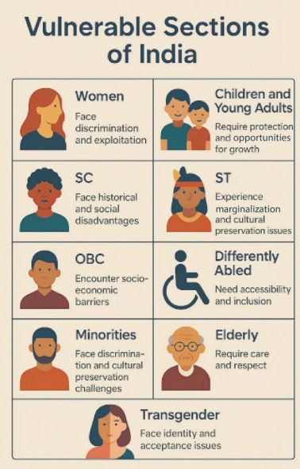
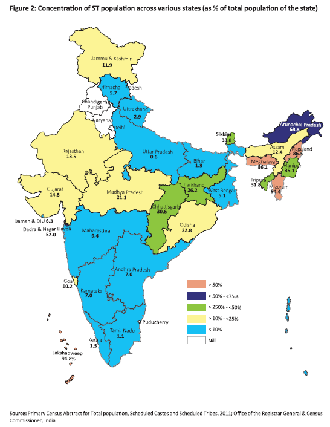
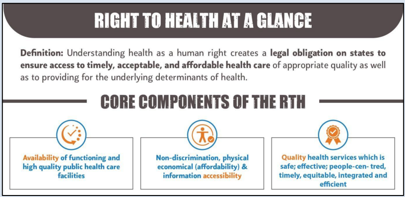
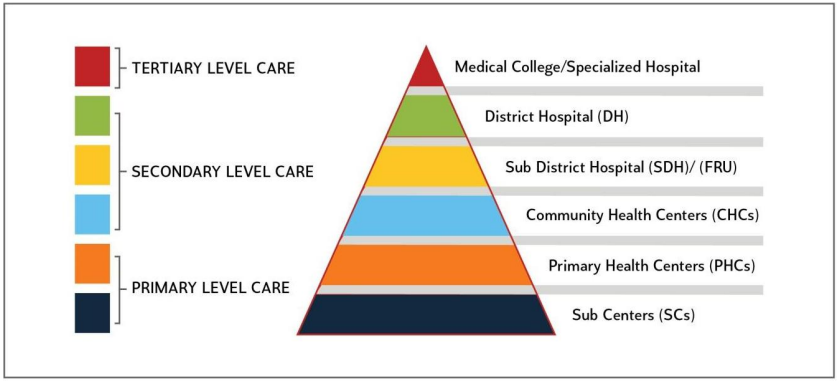
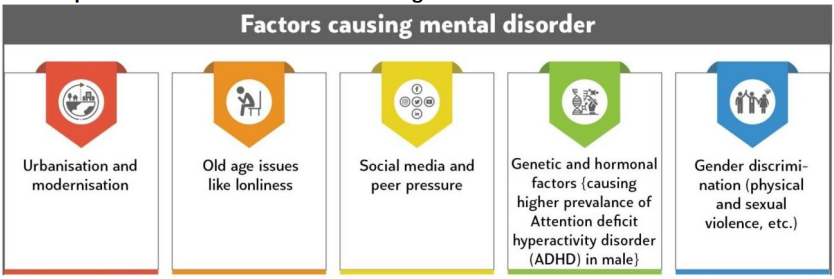
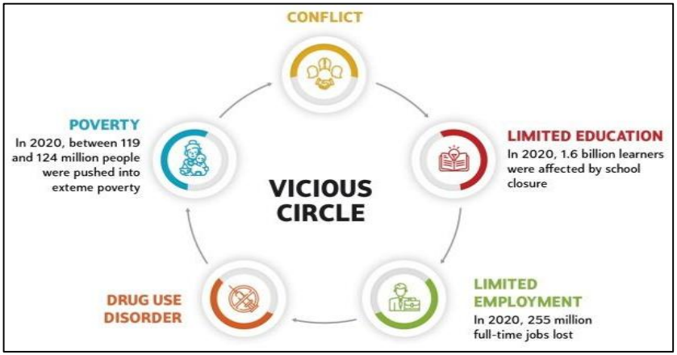

<h1 style="background-color:#1a2530; color:#ffffff; padding:14px 20px; border-radius:8px; font-size:1.15em; letter-spacing:0.5px; text-align:center;">UNIT 1: VULNERABLE SECTIONS AND WELFARE SCHEMES FOR THEIR PROTECTION</h1>

<h2 style="background-color:#2c3e50; color:#ffffff; padding:10px 16px; border-radius:6px; margin-top:20px;">1. Vulnerable Sections in India</h2>

<b>Overview</b>
<ul style="margin:6px 0 0 0; padding-left:20px;">
<li>Groups facing higher risks and disadvantages due to socio-economic, cultural, and environmental factors.</li>
<li>Experience systemic exclusion, marginalization, and inequitable access to resources, rights, and opportunities.</li>
<li>Vulnerability driven by intersectionality of factors — economic status, gender, caste, disability, age, ethnicity.</li>
<li>Typically lack power to influence social, political, and economic decisions.</li>
<li>Subject to discrimination, neglect, or abuse.</li>
</ul>

<table style="border-collapse:separate; border-spacing:0; background-color:#f5efe0; border:1px solid #d8cfae; border-radius:8px; overflow:hidden; width:100%; box-sizing:border-box;">
<tr>
<td style="padding:16px; vertical-align:top; width:300px;">

</td>
<td style="padding:16px; vertical-align:top;">

<b>Women</b> — face discrimination and exploitation

<b>Children and Young Adults</b> — require protection and opportunities for growth

<b>SC</b> — face historical and social disadvantages

<b>ST</b> — experience marginalization and cultural preservation issues

<b>OBC</b> — encounter socio-economic barriers

<b>Differently Abled</b> — need accessibility and inclusion

<b>Minorities</b> — face discrimination and cultural preservation challenges

<b>Elderly</b> — require care and respect

<b>Transgender</b> — face identity and acceptance issues

</td>
</tr>
</table>

<b>Rationale of Welfare Schemes for Vulnerable Sections</b>

<b>Constitutional Basis</b>

<ul style="margin:2px 0 0 0; padding-left:20px;">
<li>The Preamble of the Constitution promotes justice, equality, and dignity.</li>
<li>Fundamental Rights protect and promote the idea of equality, the right to live with dignity, and rights against untouchability and exploitation.</li>
<li>Directive Principles emphasize the state's responsibility for citizens' welfare, helping India become a Welfare State.</li>
</ul>

<b>Economic Reasons</b>

<ul style="margin:2px 0 0 0; padding-left:20px;">
<li>The idea of inclusive growth is considered vital for sustained economic progress of any nation.</li>
<li>Welfare schemes for vulnerable sections help reduce poverty, support the labor force, and facilitate active participation of vulnerable groups in economic development.</li>
</ul>

<b>Nation Building</b>

<ul style="margin:2px 0 0 0; padding-left:20px;">
<li>Excluding vulnerable groups leads to social resentment and inequality, hindering nation-building efforts.</li>
<li>Ensuring equitable access improves societal harmony, fostering a sense of unity and inclusion.</li>
</ul>

<h3 style="background-color:#4a6b7c; color:#ffffff; padding:8px 16px; border-radius:6px; margin-top:24px;">1.1. Women in India</h3>

<b>Overview</b>
<ul style="margin:6px 0 0 0; padding-left:20px;">
<li>Women face systemic disadvantages from socio-cultural, economic, and political factors.</li>
<li>Vulnerability is structured — rooted in imperfect or unjust societal systems.</li>
<li>Face significant barriers in access to education, economic independence, legal justice, and healthcare.</li>
</ul>

<b>Key Data Regarding Women's Vulnerabilities</b>

<b>Health &amp; Social Vulnerabilities</b>

<table style="width:100%; border-collapse:collapse; background-color:#fffaf2; border-radius:4px; overflow:hidden;">
<tr style="background-color:#c0392b; color:#ffffff;">
<th style="padding:6px 10px; text-align:left;">Indicator</th>
<th style="padding:6px 10px; text-align:left;">Key Data</th>
</tr>
<tr style="background-color:#fffaf2;">
<td style="padding:6px 10px;"><b>Child Marriage</b> 2023–24</td>
<td style="padding:6px 10px;">20.1% of women aged 20–24 married before the legal age of 18 (down from 23.3% in NFHS-5)</td>
</tr>
<tr style="background-color:#f2e6d3;">
<td style="padding:6px 10px;"><b>Sex Ratio at Birth</b> 2018–20</td>
<td style="padding:6px 10px;">907 female births per 1,000 male births — persistence of son preference</td>
</tr>
<tr style="background-color:#fffaf2;">
<td style="padding:6px 10px;"><b>Maternal Mortality Ratio</b> 2018–20</td>
<td style="padding:6px 10px;">97 deaths per 100,000 live births (SDG benchmark: 70)</td>
</tr>
<tr style="background-color:#f2e6d3;">
<td style="padding:6px 10px;"><b>Malnutrition</b> 2019–21</td>
<td style="padding:6px 10px;">18.7% of women aged 15–49 have below-normal BMI</td>
</tr>
<tr style="background-color:#fffaf2;">
<td style="padding:6px 10px;"><b>Health Awareness</b> 2019–21</td>
<td style="padding:6px 10px;">~21.6% of women have comprehensive knowledge of HIV/AIDS</td>
</tr>
</table>

<b>Economic Vulnerabilities</b>

<table style="width:100%; border-collapse:collapse; background-color:#fffaf2; border-radius:4px; overflow:hidden;">
<tr style="background-color:#c0392b; color:#ffffff;">
<th style="padding:6px 10px; text-align:left;">Indicator</th>
<th style="padding:6px 10px; text-align:left;">Key Data</th>
</tr>
<tr style="background-color:#fffaf2;">
<td style="padding:6px 10px;"><b>Labour Force Participation</b> 2023–24</td>
<td style="padding:6px 10px;">Only 41.7% for females aged 15+</td>
</tr>
<tr style="background-color:#f2e6d3;">
<td style="padding:6px 10px;"><b>Burden of Unpaid Work</b> 2024</td>
<td style="padding:6px 10px;">Women: 289 min/day vs. Men: 88 min/day on unpaid domestic services</td>
</tr>
</table>

<b>Wage Gap in Casual Labour</b> (PLFS 2023–24)

<table style="width:100%; border-collapse:collapse; background-color:#fffaf2; border-radius:4px; overflow:hidden;">
<tr style="background-color:#c0392b; color:#ffffff;">
<th style="padding:6px 10px; text-align:left;">Area</th>
<th style="padding:6px 10px; text-align:left;">Women (₹/day)</th>
<th style="padding:6px 10px; text-align:left;">Men (₹/day)</th>
</tr>
<tr style="background-color:#fffaf2;">
<td style="padding:6px 10px;">Rural</td>
<td style="padding:6px 10px;">₹299 (32.7% less)</td>
<td style="padding:6px 10px;">₹444</td>
</tr>
<tr style="background-color:#f2e6d3;">
<td style="padding:6px 10px;">Urban</td>
<td style="padding:6px 10px;">₹358 (32.3% less)</td>
<td style="padding:6px 10px;">₹529</td>
</tr>
</table>

In casual labour, women earn significantly less than men across both rural and urban areas.

<b>Educational Disadvantages</b>

<table style="width:100%; border-collapse:collapse; background-color:#fffaf2; border-radius:4px; overflow:hidden;">
<tr style="background-color:#c0392b; color:#ffffff;">
<th style="padding:6px 10px; text-align:left;">Indicator</th>
<th style="padding:6px 10px; text-align:left;">Key Data</th>
</tr>
<tr style="background-color:#fffaf2;">
<td style="padding:6px 10px;"><b>Gender Gap in Literacy</b> 2017–18</td>
<td style="padding:6px 10px;">14.4 percentage point gap between men and women aged 7 and above</td>
</tr>
<tr style="background-color:#f2e6d3;">
<td style="padding:6px 10px;"><b>Dropout Rate</b> 2023–24</td>
<td style="padding:6px 10px;">12.60% at Secondary Level (Class IX–X) — girls' dropout rate rises with education level</td>
</tr>
</table>

<b>Crime and Violence</b>

<table style="width:100%; border-collapse:collapse; background-color:#fffaf2; border-radius:4px; overflow:hidden;">
<tr style="background-color:#c0392b; color:#ffffff;">
<th style="padding:6px 10px; text-align:left;">Indicator</th>
<th style="padding:6px 10px; text-align:left;">Key Data</th>
</tr>
<tr style="background-color:#fffaf2;">
<td style="padding:6px 10px;"><b>Domestic Violence</b> 2019–21</td>
<td style="padding:6px 10px;">29.3% of ever-married women aged 18–49 have experienced physical, sexual, or emotional violence by their husband</td>
</tr>
<tr style="background-color:#f2e6d3;">
<td style="padding:6px 10px;"><b>Major Crimes</b> 2022</td>
<td style="padding:6px 10px;">"Cruelty by Husband or his Relatives" was the most reported major crime against women — 140,546 cases</td>
</tr>
<tr style="background-color:#fffaf2;">
<td style="padding:6px 10px;"><b>Rape</b> 2022</td>
<td style="padding:6px 10px;">31,516 reported victims</td>
</tr>
<tr style="background-color:#f2e6d3;">
<td style="padding:6px 10px;"><b>Cyber Crimes</b> 2022</td>
<td style="padding:6px 10px;">15,969 cases of cybercrimes targeting women</td>
</tr>
</table>

See [[women]] (data folder) for full source citations.

<h4 style="background-color:#7d97a5; color:#ffffff; padding:6px 14px; border-radius:6px; margin-top:24px; font-size:1em;">1.1.1. Key Challenges Faced by Women in India</h4>

<b>1. Deep-Rooted Patriarchy &amp; Social Discrimination</b>

<ul style="margin:6px 0 0 0; padding-left:20px;">
<li><b>From Birth to Adulthood:</b> Discrimination starts early — female foeticide, child marriage, and dowry practices reinforce inequality.</li>
<li><b>Restricted Roles:</b> Patriarchal norms confine women to household duties, limiting education and career growth.</li>
<li><b>Stigma &amp; Shame:</b> Menstruation remains taboo, forcing many girls to drop out of school, while working women lack menstrual leave policies.</li>
<li><b>Honor &amp; Control:</b> Practices like honor killings and acid attacks suppress women's freedom under the guise of "family reputation."</li>
</ul>

<b>2. Violence &amp; Exploitation — A Daily Battle</b>

<ul style="margin:6px 0 0 0; padding-left:20px;">
<li><b>Rising Crimes:</b> 87 rape cases are reported daily (NCRB), and domestic abuse remains widespread.</li>
<li><b>Unsafe Public Spaces:</b> Fear of harassment restricts mobility and independence.</li>
</ul>

<b>3. Economic Inequality — The Invisible Struggle</b>

<ul style="margin:6px 0 0 0; padding-left:20px;">
<li><b>Low Workforce Participation:</b> Only 36.9% of women are in formal jobs (2025), far below global averages.</li>
<li><b>Gender Pay Gap:</b> Women earn just 39.8% of men's wages for the same work. Most working women are in low-paying, unstable jobs with no social security.</li>
<li><b>Unpaid Labor Burden:</b> Women spend 5.6 hours daily on unpaid care work — equivalent to an invisible tax, draining their potential.</li>
<li><b>Unequal Ownership of Assets:</b> Women in India consistently have lower ownership levels than men across key assets — houses (42.3% women vs. 62.5% men), land (31.7% vs. 43.9%), mobile phones (54% vs. 91%), and bank accounts (79% vs. 86%).</li>
</ul>

<b>4. Health &amp; Nutrition — Ignored &amp; Underserved</b>

<ul style="margin:6px 0 0 0; padding-left:20px;">
<li><b>Anemia &amp; Malnutrition:</b> Half of Indian women suffer from anemia (NFHS-5).</li>
<li><b>Maternal Health Risks:</b> High maternal mortality and lack of proper healthcare endanger mothers.</li>
<li><b>Cancer &amp; Neglect:</b> Cervical cancer (2nd most common among women) lacks awareness and HPV vaccine access.</li>
<li><b>Aging Without Care:</b> Widows and elderly women face neglect, with little support for their health needs.</li>
</ul>

<b>5. Lack of Representation &amp; Power</b>

<ul style="margin:6px 0 0 0; padding-left:20px;">
<li><b>Political Marginalization:</b> Only 14.4% of Lok Sabha MPs are women.</li>
<li><b>Sarpanch Pati Culture:</b> Often husbands take oaths for elected women leaders, mocking grassroots empowerment.</li>
<li><b>Limited Access to Rights:</b> Many women lack property ownership, legal aid, and digital literacy, keeping them dependent.</li>
</ul>

<b>The Shadow Pandemic: Gender Violence and Mental Health Crisis</b>
<ul style="margin:6px 0 0 0; padding-left:20px;">
<li>The "Shadow Pandemic" refers to the rise in gender-based violence (GBV), especially domestic violence, during the COVID-19 lockdowns (UN Women).</li>
<li>Factors like isolation, economic stress, and social unrest worsened violence, impacting women, children, and vulnerable groups.</li>
<li>Simultaneously, mental health issues like stress, depression, and anxiety increased due to the lockdown.</li>
<li>Policy responses included emergency helplines, shelters, and mental health services to support affected individuals.</li>
</ul>

<b>Invisible Labor: The Unacknowledged Tax</b>
<ul style="margin:6px 0 0 0; padding-left:20px;">
<li>The "Invisible Labor Tax" highlights the disproportionate burden of unpaid care work on women.</li>
<li>This unacknowledged "tax" consumes time and energy, limiting women's economic participation and well-being.</li>
<li>Addressing this requires re-engineering societal structures.</li>
<li>Investing in universal care infrastructure (like childcare) and promoting shared responsibilities can reduce this burden.</li>
</ul>

<b>Support for Working Women and Survivors of Violence</b>
<ul style="margin:6px 0 0 0; padding-left:20px;">
<li><b>Sakhi Niwas:</b> Provides safe, affordable housing for working women and job seekers. These hostels offer daycare facilities for children, helping women maintain economic independence. States receive financial aid to run these centers.</li>
<li><b>Sakhi Centres (OSCs):</b> Over 800 operational centres provide essential services like medical, legal, and psycho-social support to women affected by violence. These centres have assisted over 1.1 million beneficiaries, offering crucial relief and safety.</li>
</ul>

<h4 style="background-color:#7d97a5; color:#ffffff; padding:6px 14px; border-radius:6px; margin-top:24px; font-size:1em;">1.1.2. Government Schemes and Policies for Women's Protection and Empowerment</h4>

<table style="width:100%; border-collapse:collapse;">
<tr style="background-color:#2c3e50; color:#ffffff;">
<th style="padding:10px 14px; text-align:left; font-size:0.9em; letter-spacing:0.3px;">Category</th>
<th style="padding:10px 14px; text-align:left; font-size:0.9em; letter-spacing:0.3px;">Scheme / Act / Article</th>
<th style="padding:10px 14px; text-align:left; font-size:0.9em; letter-spacing:0.3px;">Details</th>
</tr>
<tr style="background-color:#ffffff;">
<td style="padding:10px 14px; vertical-align:top; border-top:1px solid #eee2cf; font-weight:600; color:#4a6b7c;" rowspan="3">Constitutional Safeguards</td>
<td style="padding:10px 14px; vertical-align:top; border-top:1px solid #eee2cf; font-weight:600; color:#2c3e50;">Fundamental Rights (Articles 14, 15, 21, 23)</td>
<td style="padding:10px 14px; vertical-align:top; border-top:1px solid #eee2cf; color:#555555;">Guarantee equality, protection from discrimination, and the right to live with dignity.</td>
</tr>
<tr style="background-color:#ffffff;">
<td style="padding:10px 14px; vertical-align:top; border-top:1px solid #eee2cf; font-weight:600; color:#2c3e50;">Article 42</td>
<td style="padding:10px 14px; vertical-align:top; border-top:1px solid #eee2cf; color:#555555;">Ensures humane conditions for women in workplaces.</td>
</tr>
<tr style="background-color:#ffffff;">
<td style="padding:10px 14px; vertical-align:top; border-top:1px solid #eee2cf; font-weight:600; color:#2c3e50;">73rd Constitutional Amendment (Article 243D)</td>
<td style="padding:10px 14px; vertical-align:top; border-top:1px solid #eee2cf; color:#555555;">Mandates one-third reservation for women in Panchayati Raj Institutions.</td>
</tr>
<tr style="background-color:#fdf8f1;">
<td style="padding:10px 14px; vertical-align:top; border-top:1px solid #eee2cf; font-weight:600; color:#c0392b;" rowspan="4">Legislative Interventions</td>
<td style="padding:10px 14px; vertical-align:top; border-top:1px solid #eee2cf; font-weight:600; color:#2c3e50;">Prohibition of Child Marriage Act (2006)</td>
<td style="padding:10px 14px; vertical-align:top; border-top:1px solid #eee2cf; color:#555555;">Aims to protect women from child marriage.</td>
</tr>
<tr style="background-color:#fdf8f1;">
<td style="padding:10px 14px; vertical-align:top; border-top:1px solid #eee2cf; font-weight:600; color:#2c3e50;">Domestic Violence Act (2005)</td>
<td style="padding:10px 14px; vertical-align:top; border-top:1px solid #eee2cf; color:#555555;">Aims to protect women from domestic violence.</td>
</tr>
<tr style="background-color:#fdf8f1;">
<td style="padding:10px 14px; vertical-align:top; border-top:1px solid #eee2cf; font-weight:600; color:#2c3e50;">Sexual Harassment of Women at Workplace Act (2013)</td>
<td style="padding:10px 14px; vertical-align:top; border-top:1px solid #eee2cf; color:#555555;">Mandates mechanisms to combat workplace harassment.</td>
</tr>
<tr style="background-color:#fdf8f1;">
<td style="padding:10px 14px; vertical-align:top; border-top:1px solid #eee2cf; font-weight:600; color:#2c3e50;">Maternity Benefit Act (2017)</td>
<td style="padding:10px 14px; vertical-align:top; border-top:1px solid #eee2cf; color:#555555;">Provides 26 weeks of paid maternity leave.</td>
</tr>
<tr style="background-color:#ffffff;">
<td style="padding:10px 14px; vertical-align:top; border-top:1px solid #eee2cf; font-weight:600; color:#2c7a6b;" rowspan="3">Welfare Schemes for Girls</td>
<td style="padding:10px 14px; vertical-align:top; border-top:1px solid #eee2cf; font-weight:600; color:#2c3e50;">Beti Bachao Beti Padhao (BBBP)</td>
<td style="padding:10px 14px; vertical-align:top; border-top:1px solid #eee2cf; color:#555555;">Addresses gender-biased sex selection and promotes girls' education.</td>
</tr>
<tr style="background-color:#ffffff;">
<td style="padding:10px 14px; vertical-align:top; border-top:1px solid #eee2cf; font-weight:600; color:#2c3e50;">Sukanya Samriddhi Yojna</td>
<td style="padding:10px 14px; vertical-align:top; border-top:1px solid #eee2cf; color:#555555;">Encourages saving for girls' education and marriage.</td>
</tr>
<tr style="background-color:#ffffff;">
<td style="padding:10px 14px; vertical-align:top; border-top:1px solid #eee2cf; font-weight:600; color:#2c3e50;">Udaan Scheme</td>
<td style="padding:10px 14px; vertical-align:top; border-top:1px solid #eee2cf; color:#555555;">Provides scholarships for girls from minority communities for higher education.</td>
</tr>
<tr style="background-color:#fdf8f1;">
<td style="padding:10px 14px; vertical-align:top; border-top:1px solid #eee2cf; font-weight:600; color:#8e44ad;" rowspan="3">Women's Safety</td>
<td style="padding:10px 14px; vertical-align:top; border-top:1px solid #eee2cf; font-weight:600; color:#2c3e50;">One Stop Centre Scheme</td>
<td style="padding:10px 14px; vertical-align:top; border-top:1px solid #eee2cf; color:#555555;">Provides support to women affected by violence.</td>
</tr>
<tr style="background-color:#fdf8f1;">
<td style="padding:10px 14px; vertical-align:top; border-top:1px solid #eee2cf; font-weight:600; color:#2c3e50;">Swadhar and Short Stay Homes</td>
<td style="padding:10px 14px; vertical-align:top; border-top:1px solid #eee2cf; color:#555555;">Offer shelter and rehabilitation for destitute women.</td>
</tr>
<tr style="background-color:#fdf8f1;">
<td style="padding:10px 14px; vertical-align:top; border-top:1px solid #eee2cf; font-weight:600; color:#2c3e50;">Nirbhaya Fund</td>
<td style="padding:10px 14px; vertical-align:top; border-top:1px solid #eee2cf; color:#555555;">Finances initiatives for women's safety and dignity.</td>
</tr>
<tr style="background-color:#ffffff;">
<td style="padding:10px 14px; vertical-align:top; border-top:1px solid #eee2cf; font-weight:600; color:#d68910;" rowspan="4">Economic Empowerment</td>
<td style="padding:10px 14px; vertical-align:top; border-top:1px solid #eee2cf; font-weight:600; color:#2c3e50;">Pradhan Mantri Mudra Yojana (PMMY)</td>
<td style="padding:10px 14px; vertical-align:top; border-top:1px solid #eee2cf; color:#555555;">Facilitates collateral-free loans for women entrepreneurs.</td>
</tr>
<tr style="background-color:#ffffff;">
<td style="padding:10px 14px; vertical-align:top; border-top:1px solid #eee2cf; font-weight:600; color:#2c3e50;">Deendayal Antyodaya Yojana</td>
<td style="padding:10px 14px; vertical-align:top; border-top:1px solid #eee2cf; color:#555555;">Empowers rural women through Self-Help Groups (SHGs).</td>
</tr>
<tr style="background-color:#ffffff;">
<td style="padding:10px 14px; vertical-align:top; border-top:1px solid #eee2cf; font-weight:600; color:#2c3e50;">Rashtriya Mahila Kosh (RMK)</td>
<td style="padding:10px 14px; vertical-align:top; border-top:1px solid #eee2cf; color:#555555;">Provides micro-financing to poor women for income-generating activities.</td>
</tr>
<tr style="background-color:#ffffff;">
<td style="padding:10px 14px; vertical-align:top; border-top:1px solid #eee2cf; font-weight:600; color:#2c3e50;">Stand Up India Scheme</td>
<td style="padding:10px 14px; vertical-align:top; border-top:1px solid #eee2cf; color:#555555;">Supports SC/ST and women entrepreneurs with bank loans for greenfield enterprises.</td>
</tr>
<tr style="background-color:#fdf8f1;">
<td style="padding:10px 14px; vertical-align:top; border-top:1px solid #eee2cf; font-weight:600; color:#388e3c;" rowspan="2">Health &amp; Social Security</td>
<td style="padding:10px 14px; vertical-align:top; border-top:1px solid #eee2cf; font-weight:600; color:#2c3e50;">Pradhan Mantri Jan Arogya Yojana (PMJAY)</td>
<td style="padding:10px 14px; vertical-align:top; border-top:1px solid #eee2cf; color:#555555;">Provides health insurance to vulnerable women, including Anganwadi workers and their families.</td>
</tr>
<tr style="background-color:#fdf8f1;">
<td style="padding:10px 14px; vertical-align:top; border-top:1px solid #eee2cf; font-weight:600; color:#2c3e50;">Pradhan Mantri Ujjwala Yojana</td>
<td style="padding:10px 14px; vertical-align:top; border-top:1px solid #eee2cf; color:#555555;">Ensures free LPG connections for BPL women to safeguard their health and well-being.</td>
</tr>
</table>

<b>Nari Shakti Vandan Adhiniyam (Women's Reservation Act)</b>

The Nari Shakti Vandan Adhiniyam, passed in 2023, is a landmark constitutional amendment aimed at improving women's participation in Indian politics.

<ul style="margin:6px 0 0 0; padding-left:20px;">
<li>It mandates the reservation of one-third of seats for women in the Lok Sabha, State Legislative Assemblies, and the Delhi Assembly.</li>
<li>Though hailed as a long-pending reform, its full implementation depends on future census and delimitation exercises.</li>
</ul>

<b>Features of the Act</b>

<table style="width:100%; border-collapse:collapse; background-color:#fffaf2; border-radius:4px; overflow:hidden;">
<tr style="background-color:#c0392b; color:#ffffff;">
<th style="padding:6px 10px; text-align:left;">Characteristic</th>
<th style="padding:6px 10px; text-align:left;">Description</th>
</tr>
<tr style="background-color:#fffaf2;">
<td style="padding:6px 10px; font-weight:600;">Percentage of Reservation</td>
<td style="padding:6px 10px;">33% of seats guaranteed for women</td>
</tr>
<tr style="background-color:#f2e6d3;">
<td style="padding:6px 10px; font-weight:600;">Sub-reservation</td>
<td style="padding:6px 10px;">For SC/ST women included</td>
</tr>
<tr style="background-color:#fffaf2;">
<td style="padding:6px 10px; font-weight:600;">Constitutional Amendments</td>
<td style="padding:6px 10px;">Introduces new articles, amends existing ones</td>
</tr>
<tr style="background-color:#f2e6d3;">
<td style="padding:6px 10px; font-weight:600;">Implementation Timeline</td>
<td style="padding:6px 10px;">After delimitation, post next census</td>
</tr>
<tr style="background-color:#fffaf2;">
<td style="padding:6px 10px; font-weight:600;">Reservation Duration</td>
<td style="padding:6px 10px;">15 years, seat allocation on rotation</td>
</tr>
</table>

<b>Implementation Challenges</b>

<ul style="margin:2px 0 0 0; padding-left:20px;">
<li>The rotational nature of reserved seats may discourage long-term investment by elected women.</li>
<li>There is also concern over:
<ul style="margin:2px 0 0 0; padding-left:20px;">
<li>Proxy representation by male relatives.</li>
<li>Limited inclusion of OBC and minority women.</li>
<li>Lack of broader electoral reforms to support genuine empowerment.</li>
</ul>
</li>
</ul>

<b>Learning from an Example: Women Empowerment in Norway</b>
<ul style="margin:6px 0 0 0; padding-left:20px;">
<li>Norway offers a powerful case study in using policy reform to accelerate women's representation in leadership.</li>
<li>In 2003, it mandated a 40 percent quota for women on corporate boards, raising female representation from just 9 percent to over 40 percent in a few years.</li>
<li>This is a clear example of how strong legal mandates can drive visible change.</li>
<li>However, the move also revealed a crucial lesson: while quotas can open doors at the top, they do not automatically dismantle deeper structural and cultural barriers that prevent women from becoming CEOs or holding key executive roles.</li>
</ul>

<b>Key Takeaway:</b> True empowerment requires a two-pronged approach.

<ul style="margin:2px 0 0 0; padding-left:20px;">
<li>First, there must be affirmative policies to ensure women get a seat at the table.</li>
<li>Second, there must be long-term investment in equality of opportunity through mentorship, skill development, inclusive work cultures, and access to leadership pipelines. Empowerment must reach every level, not just the boardroom.</li>
</ul>

<h3 style="background-color:#4a6b7c; color:#ffffff; padding:8px 16px; border-radius:6px; margin-top:24px;">1.2. Children</h3>

<i>"Every child comes with the message that God is not yet discouraged of man."</i> 
— Rabindranath Tagore

<b>Overview</b>
<ul style="margin:6px 0 0 0; padding-left:20px;">
<li>In India, children are defined as individuals under the age of 18 years, unless they reach adulthood earlier by applicable law.</li>
<li>Children account for 39% of the population of India, according to Census 2011.</li>
<li>Children represent one of the most vulnerable sections of society, and are highly susceptible to exploitation, abuse, and neglect.</li>
<li>Their vulnerability is further heightened in difficult circumstances such as being orphans, refugees, child laborers, or victims of abuse.</li>
</ul>

<h4 style="background-color:#7d97a5; color:#ffffff; padding:6px 14px; border-radius:6px; margin-top:24px; font-size:1em;">1.2.1. Key Challenges Faced by Children</h4>

<b>1. Education</b>

<ul style="margin:6px 0 0 0; padding-left:20px;">
<li><b>Learning Gaps and Dropout Rates:</b> Malnutrition and inadequate early childhood education contribute to learning gaps.
<ul style="margin:2px 0 0 0; padding-left:20px;">
<li>1.72 crore children dropped out, and school enrolment fell from 26.5 crore in 2021–22 to 24.8 crore in 2023–24.</li>
</ul>
</li>
<li><b>Access to Pre-Primary Education:</b> Children from economically weaker sections are less likely to access pre-primary education, which impedes their learning journey.</li>
</ul>

<b>2. Child Abuse and Exploitation</b>

<ul style="margin:6px 0 0 0; padding-left:20px;">
<li><b>Child Marriage:</b> Driven by poverty and patriarchal norms, child marriage forces early pregnancies and limits education, perpetuating the poverty cycle.</li>
<li><b>Crimes Against Children:</b> According to NCRB 2022, 18 crimes against children occur every hour, with one-third under the POCSO Act. Family members or acquaintances are often perpetrators.</li>
<li><b>Child Labor:</b> India has the largest number of working children globally, with over 10 million children aged 5–14 involved in child labor.</li>
</ul>

<b>3. Health and Nutrition</b>

<ul style="margin:6px 0 0 0; padding-left:20px;">
<li><b>Malnutrition:</b> India faces a high rate of malnutrition, with 32.1% underweight, 35.5% stunted, and 19.3% wasted children. This, along with poor early childhood education, exacerbates learning difficulties.</li>
<li><b>Mortality and Health Indicators:</b> India has one of the highest Infant Mortality Rates (IMR) at 34 per 1,000 live births. Diarrhea and malnutrition are primary causes of death for children under five.</li>
</ul>

<b>4. Gender Discrimination</b>

<ul style="margin:6px 0 0 0; padding-left:20px;">
<li><b>Child Marriage and Violence:</b> Female children face infanticide, neglect of nutritional needs, lack of education, and gender-based violence. 7% of girls aged 15 or younger were married between 2014–2020.</li>
<li><b>Child Sex Ratio:</b> The child sex ratio (0–6 years) was 919 girls per 1,000 boys in 2011, reflecting ongoing gender imbalances.</li>
</ul>

<b>5. Other Vulnerabilities</b>

<ul style="margin:6px 0 0 0; padding-left:20px;">
<li><b>Digital Well-Being:</b> A growing concern, with 60% of children at risk of digital addiction.
<ul style="margin:2px 0 0 0; padding-left:20px;">
<li>70–80% of children exceed recommended screen time, leading to issues like cyberbullying, mental health concerns, and behavioral changes.</li>
</ul>
</li>
<li><b>Climate and Disasters:</b> Children are disproportionately affected by natural disasters and climate change, exacerbating their vulnerabilities.
<ul style="margin:2px 0 0 0; padding-left:20px;">
<li>In 2023, approximately 24.1 million children in India were impacted annually by climate-related disasters such as floods, cyclones, and heatwaves.</li>
</ul>
</li>
</ul>

<b>Best Practices</b>

<b>Education</b>

<ul style="margin:2px 0 0 0; padding-left:20px;">
<li><b>Shala Praveshotsav:</b> Gujarat's annual school enrollment drive has reduced dropout rates from 35% in 2003.</li>
<li><b>Thalliki Vandanam Scheme:</b> Andhra Pradesh's initiative provides ₹13,000 per student to mothers of 42.69 lakh school-going children, aiming to support education costs and reduce dropout rates.</li>
</ul>

<b>Health</b>

<ul style="margin:2px 0 0 0; padding-left:20px;">
<li><b>Rajiv Aarogyasri Scheme:</b> Telangana has extended health insurance coverage to 2,215 orphans and BPL children in Child Care Institutions, offering cashless treatment up to ₹10 lakh for over 1,835 procedures.</li>
<li><b>ICDS and Bharat Ratna Dr APJ Abdul Kalam Amrut Aahar Yojana:</b> Maharashtra reported a 51,141 decrease in severely malnourished children from 2023 to 2025.</li>
</ul>

<b>Learning through Example: A Special Start — Finland's Baby Box</b>
<ul style="margin:6px 0 0 0; padding-left:20px;">
<li>Finland's Baby Box policy is a powerful example of how governments can promote equal opportunity from birth.</li>
<li>Since 1949, every new mother has received a free "Baby Box" containing essential items for newborn care.</li>
<li>This initiative does more than offer material support — it encourages prenatal care, fosters early child well-being, and has played a role in significantly reducing infant mortality rates in Finland.</li>
</ul>

<b>Key Takeaway:</b> Social policies that provide universal access to early life resources can have lasting impacts.

<ul style="margin:2px 0 0 0; padding-left:20px;">
<li>The Baby Box illustrates how state-led interventions can bridge gaps in healthcare, reduce inequality, and promote a strong, healthy start for every child, regardless of background.</li>
</ul>

<h4 style="background-color:#7d97a5; color:#ffffff; padding:6px 14px; border-radius:6px; margin-top:24px; font-size:1em;">1.2.2. Government Schemes and Policies for Children</h4>

<table style="width:100%; border-collapse:collapse;">
<tr style="background-color:#2c3e50; color:#ffffff;">
<th style="padding:10px 14px; text-align:left; font-size:0.9em; letter-spacing:0.3px;">Category</th>
<th style="padding:10px 14px; text-align:left; font-size:0.9em; letter-spacing:0.3px;">Scheme / Act / Article</th>
<th style="padding:10px 14px; text-align:left; font-size:0.9em; letter-spacing:0.3px;">Details</th>
</tr>
<tr style="background-color:#ffffff;">
<td style="padding:10px 14px; vertical-align:top; border-top:1px solid #eee2cf; font-weight:600; color:#4a6b7c;" rowspan="4">Constitutional Safeguards</td>
<td style="padding:10px 14px; vertical-align:top; border-top:1px solid #eee2cf; font-weight:600; color:#2c3e50;">Article 39(f)</td>
<td style="padding:10px 14px; vertical-align:top; border-top:1px solid #eee2cf; color:#555555;">Ensures children's development in a healthy and dignified environment, protecting them from exploitation.</td>
</tr>
<tr style="background-color:#ffffff;">
<td style="padding:10px 14px; vertical-align:top; border-top:1px solid #eee2cf; font-weight:600; color:#2c3e50;">Article 21A</td>
<td style="padding:10px 14px; vertical-align:top; border-top:1px solid #eee2cf; color:#555555;">Guarantees free and compulsory education for children aged 6–14 years.</td>
</tr>
<tr style="background-color:#ffffff;">
<td style="padding:10px 14px; vertical-align:top; border-top:1px solid #eee2cf; font-weight:600; color:#2c3e50;">Articles 23 &amp; 24</td>
<td style="padding:10px 14px; vertical-align:top; border-top:1px solid #eee2cf; color:#555555;">Prohibit child trafficking and forced labor, with specific restrictions on hazardous labor.</td>
</tr>
<tr style="background-color:#ffffff;">
<td style="padding:10px 14px; vertical-align:top; border-top:1px solid #eee2cf; font-weight:600; color:#2c3e50;">Article 45</td>
<td style="padding:10px 14px; vertical-align:top; border-top:1px solid #eee2cf; color:#555555;">Directs the provision of early childhood care and education for children up to six years.</td>
</tr>
<tr style="background-color:#fdf8f1;">
<td style="padding:10px 14px; vertical-align:top; border-top:1px solid #eee2cf; font-weight:600; color:#2c7a6b;" rowspan="6">Welfare and Development Schemes</td>
<td style="padding:10px 14px; vertical-align:top; border-top:1px solid #eee2cf; font-weight:600; color:#2c3e50;">Integrated Child Development Services (ICDS)</td>
<td style="padding:10px 14px; vertical-align:top; border-top:1px solid #eee2cf; color:#555555;">Focuses on the nutritional and health development of children under six.</td>
</tr>
<tr style="background-color:#fdf8f1;">
<td style="padding:10px 14px; vertical-align:top; border-top:1px solid #eee2cf; font-weight:600; color:#2c3e50;">POSHAN Abhiyaan</td>
<td style="padding:10px 14px; vertical-align:top; border-top:1px solid #eee2cf; color:#555555;">Targets reduction of malnutrition in children.</td>
</tr>
<tr style="background-color:#fdf8f1;">
<td style="padding:10px 14px; vertical-align:top; border-top:1px solid #eee2cf; font-weight:600; color:#2c3e50;">Samagra Shiksha Abhiyan</td>
<td style="padding:10px 14px; vertical-align:top; border-top:1px solid #eee2cf; color:#555555;">Aims to improve learning outcomes for disadvantaged children, focusing on quality education.</td>
</tr>
<tr style="background-color:#fdf8f1;">
<td style="padding:10px 14px; vertical-align:top; border-top:1px solid #eee2cf; font-weight:600; color:#2c3e50;">National Education Policy (NEP) 2020</td>
<td style="padding:10px 14px; vertical-align:top; border-top:1px solid #eee2cf; color:#555555;">Prioritizes Early Childhood Care and Education (ECCE) for foundational literacy and numeracy.</td>
</tr>
<tr style="background-color:#fdf8f1;">
<td style="padding:10px 14px; vertical-align:top; border-top:1px solid #eee2cf; font-weight:600; color:#2c3e50;">Childline-1098</td>
<td style="padding:10px 14px; vertical-align:top; border-top:1px solid #eee2cf; color:#555555;">A 24-hour emergency helpline for children in distress.</td>
</tr>
<tr style="background-color:#fdf8f1;">
<td style="padding:10px 14px; vertical-align:top; border-top:1px solid #eee2cf; font-weight:600; color:#2c3e50;">Mission Vatsalya</td>
<td style="padding:10px 14px; vertical-align:top; border-top:1px solid #eee2cf; color:#555555;">Supported 1.7 lakh children under non-institutional care programs in 2024–25, aiming to provide family-based care and rehabilitation.</td>
</tr>
<tr style="background-color:#ffffff;">
<td style="padding:10px 14px; vertical-align:top; border-top:1px solid #eee2cf; font-weight:600; color:#c0392b;" rowspan="3">Protection and Legal Frameworks</td>
<td style="padding:10px 14px; vertical-align:top; border-top:1px solid #eee2cf; font-weight:600; color:#2c3e50;">Juvenile Justice (Care and Protection of Children) Act, 2015</td>
<td style="padding:10px 14px; vertical-align:top; border-top:1px solid #eee2cf; color:#555555;">Focuses on the care, protection, and rehabilitation of children in need.</td>
</tr>
<tr style="background-color:#ffffff;">
<td style="padding:10px 14px; vertical-align:top; border-top:1px solid #eee2cf; font-weight:600; color:#2c3e50;">Protection of Children from Sexual Offences (POCSO) Act, 2012</td>
<td style="padding:10px 14px; vertical-align:top; border-top:1px solid #eee2cf; color:#555555;">Provides strict protection against child sexual abuse.</td>
</tr>
<tr style="background-color:#ffffff;">
<td style="padding:10px 14px; vertical-align:top; border-top:1px solid #eee2cf; font-weight:600; color:#2c3e50;">Prohibition of Child Marriage Act, 2006</td>
<td style="padding:10px 14px; vertical-align:top; border-top:1px solid #eee2cf; color:#555555;">Criminalizes child marriage.</td>
</tr>
</table>

<h3 style="background-color:#4a6b7c; color:#ffffff; padding:8px 16px; border-radius:6px; margin-top:24px;">1.3. Young Adults (Youth)</h3>

<i>"The youth are the living messages we send to a future we will never see."</i> 
— John F. Kennedy

<b>Overview</b>
<ul style="margin:6px 0 0 0; padding-left:20px;">
<li>In India, the National Youth Policy 2014 defines youth as individuals between the ages of 15 and 29 years.</li>
<li>Youth is considered a period of transition from dependence to independence, encompassing the age groups of adolescents (10–19 years) and young adults (15–24 years).</li>
<li>With 65% of India's population under 35 years, youth form a critical demographic for national development.</li>
</ul>

<h4 style="background-color:#7d97a5; color:#ffffff; padding:6px 14px; border-radius:6px; margin-top:24px; font-size:1em;">1.3.1. Key Challenges Faced by Young Adults</h4>

<b>1. Employment Crisis and Skill Mismatch</b>

<ul style="margin:6px 0 0 0; padding-left:20px;">
<li><b>High Unemployment:</b> Youth unemployment remains high, with a significant portion of the youth population either underemployed or disengaged from both employment and learning.
<ul style="margin:2px 0 0 0; padding-left:20px;">
<li>Youth Unemployment Rate: 17.9% in urban areas and 13.7% in rural regions as of May 2025.</li>
</ul>
</li>
<li><b>Skill Gap:</b> A substantial mismatch exists between available talent and the needs of the industry.
<ul style="margin:2px 0 0 0; padding-left:20px;">
<li>Only 4.4% of the workforce aged 15–29 has received formal skills training, contributing to a high unemployment rate.</li>
<li><b>Informalization:</b> An increasing trend toward informal, short-term contracts in the job market pushes youth into the informal economy, where social security benefits are absent.</li>
<li><b>Exploitation under Gig Economy:</b> Precarious working conditions in the gig economy lead to exploitation of youth — key factors include poor pay, lack of social security, and absence of worker protection regulations.</li>
</ul>
</li>
</ul>

<b>2. Mental Health Crisis, Drug Abuse and Suicide Epidemic</b>

<ul style="margin:6px 0 0 0; padding-left:20px;">
<li><b>Drug Abuse:</b> Around 13% of drug users in India are under 20 years old, exacerbating physical and mental health issues.</li>
<li><b>Mental Health Issues:</b> A growing crisis of mental health problems, including depression and suicidal tendencies, especially among LGBTQIA+ youth, calls for urgent attention.</li>
<li><b>Suicide Epidemic:</b> Student suicides highlight the immense social and psychological pressures faced by youth, mainly due to mental health issues, social pressures, and drug abuse.
<ul style="margin:2px 0 0 0; padding-left:20px;">
<li>India reported 13,044 student suicides in 2022 (NCRB data), nearly doubling in a decade.</li>
</ul>
</li>
</ul>

<b>Learning through Example: Switzerland's Secret to Youth Success</b>
<ul style="margin:6px 0 0 0; padding-left:20px;">
<li>Switzerland offers a strong example of how practical education can prepare youth for meaningful careers.</li>
<li>Around 70% of Swiss teenagers choose vocational apprenticeships after school rather than traditional academic routes.</li>
<li>These apprenticeships combine classroom learning with on-the-job training. Companies like Nestlé pay students as they work and learn, ensuring they gain real-world skills and income at the same time.</li>
<li>As a result, Switzerland enjoys one of the lowest youth unemployment rates in the world.</li>
</ul>

<b>Key Takeaway:</b> A well-designed vocational training system equips youth with job-ready skills, reduces unemployment, and bridges the gap between education and industry.

<ul style="margin:2px 0 0 0; padding-left:20px;">
<li>It highlights the importance of aligning education with practical experience and market needs.</li>
</ul>

<h4 style="background-color:#7d97a5; color:#ffffff; padding:6px 14px; border-radius:6px; margin-top:24px; font-size:1em;">1.3.2. Government Schemes and Policies for Youth</h4>

<table style="width:100%; border-collapse:collapse;">
<tr style="background-color:#2c3e50; color:#ffffff;">
<th style="padding:10px 14px; text-align:left; font-size:0.9em; letter-spacing:0.3px;">Category</th>
<th style="padding:10px 14px; text-align:left; font-size:0.9em; letter-spacing:0.3px;">Scheme / Program</th>
<th style="padding:10px 14px; text-align:left; font-size:0.9em; letter-spacing:0.3px;">Details</th>
</tr>
<tr style="background-color:#ffffff;">
<td style="padding:10px 14px; vertical-align:top; border-top:1px solid #eee2cf; font-weight:600; color:#4a6b7c;" rowspan="5">Youth Development and Engagement</td>
<td style="padding:10px 14px; vertical-align:top; border-top:1px solid #eee2cf; font-weight:600; color:#2c3e50;">National Youth Policy 2014</td>
<td style="padding:10px 14px; vertical-align:top; border-top:1px solid #eee2cf; color:#555555;">Aims for holistic youth development to empower youth for nation-building.</td>
</tr>
<tr style="background-color:#ffffff;">
<td style="padding:10px 14px; vertical-align:top; border-top:1px solid #eee2cf; font-weight:600; color:#2c3e50;">Nehru Yuva Kendra Sangathan</td>
<td style="padding:10px 14px; vertical-align:top; border-top:1px solid #eee2cf; color:#555555;">Provides rural youth with opportunities for nation-building and skill development.</td>
</tr>
<tr style="background-color:#ffffff;">
<td style="padding:10px 14px; vertical-align:top; border-top:1px solid #eee2cf; font-weight:600; color:#2c3e50;">National Service Scheme (NSS)</td>
<td style="padding:10px 14px; vertical-align:top; border-top:1px solid #eee2cf; color:#555555;">Promotes volunteerism and social service.</td>
</tr>
<tr style="background-color:#ffffff;">
<td style="padding:10px 14px; vertical-align:top; border-top:1px solid #eee2cf; font-weight:600; color:#2c3e50;">Life Skill Training for Adolescents</td>
<td style="padding:10px 14px; vertical-align:top; border-top:1px solid #eee2cf; color:#555555;">Equips youth with skills to cope with pressures and make healthy life choices.</td>
</tr>
<tr style="background-color:#ffffff;">
<td style="padding:10px 14px; vertical-align:top; border-top:1px solid #eee2cf; font-weight:600; color:#2c3e50;">Mera Yuva Bharat (MY Bharat)</td>
<td style="padding:10px 14px; vertical-align:top; border-top:1px solid #eee2cf; color:#555555;">A platform launched in 2023 to engage youth in volunteerism and nation-building activities.</td>
</tr>
<tr style="background-color:#fdf8f1;">
<td style="padding:10px 14px; vertical-align:top; border-top:1px solid #eee2cf; font-weight:600; color:#2c7a6b;" rowspan="4">Skill Development and Employment Generation</td>
<td style="padding:10px 14px; vertical-align:top; border-top:1px solid #eee2cf; font-weight:600; color:#2c3e50;">National Skill Development Mission (NSDM)</td>
<td style="padding:10px 14px; vertical-align:top; border-top:1px solid #eee2cf; color:#555555;">Framework to coordinate skill development efforts across India.</td>
</tr>
<tr style="background-color:#fdf8f1;">
<td style="padding:10px 14px; vertical-align:top; border-top:1px solid #eee2cf; font-weight:600; color:#2c3e50;">Pradhan Mantri Kaushal Vikas Yojana (PMKVY)</td>
<td style="padding:10px 14px; vertical-align:top; border-top:1px solid #eee2cf; color:#555555;">Provides skill training to improve youth employability.</td>
</tr>
<tr style="background-color:#fdf8f1;">
<td style="padding:10px 14px; vertical-align:top; border-top:1px solid #eee2cf; font-weight:600; color:#2c3e50;">Employment-Linked Incentive (ELI) scheme</td>
<td style="padding:10px 14px; vertical-align:top; border-top:1px solid #eee2cf; color:#555555;">The Indian government approved an ₹1 trillion ELI scheme, aiming to create approximately 35 million jobs between August 2025 and July 2027.</td>
</tr>
<tr style="background-color:#fdf8f1;">
<td style="padding:10px 14px; vertical-align:top; border-top:1px solid #eee2cf; font-weight:600; color:#2c3e50;">Start-Up India and Stand Up India</td>
<td style="padding:10px 14px; vertical-align:top; border-top:1px solid #eee2cf; color:#555555;">Facilitates entrepreneurship by providing financial support to youth entrepreneurs, especially from SC/ST backgrounds.</td>
</tr>
<tr style="background-color:#ffffff;">
<td style="padding:10px 14px; vertical-align:top; border-top:1px solid #eee2cf; font-weight:600; color:#c0392b;" rowspan="3">Social Security and Health</td>
<td style="padding:10px 14px; vertical-align:top; border-top:1px solid #eee2cf; font-weight:600; color:#2c3e50;">Code on Social Security (2020)</td>
<td style="padding:10px 14px; vertical-align:top; border-top:1px solid #eee2cf; color:#555555;">Expands social security benefits to include gig and platform workers, where the majority of those employed are youth.</td>
</tr>
<tr style="background-color:#ffffff;">
<td style="padding:10px 14px; vertical-align:top; border-top:1px solid #eee2cf; font-weight:600; color:#2c3e50;">PMJJBY and PMSBY</td>
<td style="padding:10px 14px; vertical-align:top; border-top:1px solid #eee2cf; color:#555555;">Affordable insurance schemes (Pradhan Mantri Jeevan Jyoti Bima Yojana and Pradhan Mantri Suraksha Bima Yojana) for underprivileged youth.</td>
</tr>
<tr style="background-color:#ffffff;">
<td style="padding:10px 14px; vertical-align:top; border-top:1px solid #eee2cf; font-weight:600; color:#2c3e50;">Mental Health Care Act (2017)</td>
<td style="padding:10px 14px; vertical-align:top; border-top:1px solid #eee2cf; color:#555555;">Aims to reduce stigmatization and improve access to mental health care for youth.</td>
</tr>
</table>

<b>National Youth Policy</b>

The National Youth Policy (NYP) provides a structured approach to youth development in India. The last finalized version, NYP 2014, focused on empowering individuals aged 15–29 to achieve their full potential.

<ul style="margin:6px 0 0 0; padding-left:20px;">
<li>It aimed to align youth energy with the goals of national development through five key priority areas: education, employment and entrepreneurship, health and sports, youth leadership, and social justice.</li>
<li>The policy emphasized inclusion, skill-building, and active participation in civic life, and was aligned with national policies like NEP 2020 and international frameworks such as the Sustainable Development Goals.</li>
</ul>

Over time, the need for an updated framework became clear due to changing economic realities, rapid technological shifts, and rising mental health concerns among youth. Responding to this, the government released the Draft National Youth Policy 2024, building on past learnings and aiming for deeper impact during the Amrit Kaal period.

<b>Key Features of the Draft National Youth Policy 2024</b>

<ul style="margin:2px 0 0 0; padding-left:20px;">
<li><b>Tackling NEET Crisis:</b> Aims to reduce the NEET (Not in Education, Employment or Training) rate, which is 32.9% of youth aged 15–29 (NSSO 2020–21).</li>
<li><b>Focus on Youth Demographic:</b> Targets individuals aged 15–29 years, who constitute India's largest working-age population segment.</li>
<li><b>Skill, Up-skill, Re-skill Model:</b> Emphasizes readiness for Industry 4.0 through continuous skill enhancement aligned with market needs.</li>
<li><b>Digital Empowerment via YUVA Portal:</b> Introduces a one-stop online platform for internships, job opportunities, mentoring, and career counseling.</li>
<li><b>Entrepreneurship and Job Creation:</b> Encourages youth to become job creators by promoting innovation, startup ecosystems, and e-commerce access.</li>
<li><b>Leadership Development:</b> Proposes a School of Leadership at RGNIYD and platforms like Youth Parliament Festival to shape future leaders.</li>
<li><b>Inclusion of Vulnerable Groups:</b> Prioritizes outreach to dropouts, rural, disabled, and disadvantaged youth through tailored programs.</li>
<li><b>Mental Health and Well-being:</b> Integrates counseling, stress management, and awareness around substance abuse into youth health strategy.</li>
<li><b>Fitness as Daily Culture:</b> Promotes "Fitness ki Dose, Aadha Ghanta Roz" and strengthens youth engagement in sports and adventure activities.</li>
<li><b>Data-Driven Governance:</b> Recommends District Youth Information &amp; Resource Centers and analytics for real-time youth tracking and support.</li>
</ul>

The draft aims to create a youth ecosystem that not only supports individuals but positions them as leaders of change in a rapidly evolving India.

<h3 style="background-color:#4a6b7c; color:#ffffff; padding:8px 16px; border-radius:6px; margin-top:24px;">1.4. Elderly (Senior Citizens) in India</h3>

<i>"A society that abandons its elders cuts its own roots."</i> 
— Confucius

<b>Overview</b>
<ul style="margin:6px 0 0 0; padding-left:20px;">
<li>In India, "elderly" refers to citizens aged 60 and above.</li>
<li>According to the 2011 Census, there were nearly 104 million senior citizens, constituting 8.6% of the population.</li>
<li>This number is projected to triple by 2050, reaching 300 million (18%), with a rising proportion of elderly women, particularly in rural areas, facing issues like poverty, dependency, and loneliness.</li>
</ul>

<b>An Ageing Demographic — Key Data</b>

<table style="width:100%; border-collapse:collapse; background-color:#fffaf2; border-radius:4px; overflow:hidden; margin-top:10px;">
<tr style="background-color:#c0392b; color:#ffffff;">
<th style="padding:6px 10px; text-align:left;">Indicator</th>
<th style="padding:6px 10px; text-align:left;">Key Data</th>
</tr>
<tr style="background-color:#fffaf2;">
<td style="padding:6px 10px;"><b>Current Share of Population</b> 2023</td>
<td style="padding:6px 10px;">10.7% of India's population is aged 60+</td>
</tr>
<tr style="background-color:#f2e6d3;">
<td style="padding:6px 10px;"><b>Projected Population &amp; Share</b> 2050</td>
<td style="padding:6px 10px;">347 million senior citizens, ~20.8% of the population — about 1/5th of India</td>
</tr>
<tr style="background-color:#fffaf2;">
<td style="padding:6px 10px;"><b>Projected Share</b> End of century</td>
<td style="padding:6px 10px;">Over 36% of the population</td>
</tr>
<tr style="background-color:#f2e6d3;">
<td style="padding:6px 10px;"><b>Elderly vs. Children Crossover</b> ~2046</td>
<td style="padding:6px 10px;">Four years before 2050, the elderly population will exceed the population of children aged 0–14</td>
</tr>
<tr style="background-color:#fffaf2;">
<td style="padding:6px 10px;"><b>Kerala — Highest Elderly Share</b> 2021 → 2036</td>
<td style="padding:6px 10px;">Rises from 16.7% to 22.7% — the highest proportion of senior citizens among Indian states</td>
</tr>
</table>

India's elderly population is set to grow rapidly, reshaping its demographic profile within a few decades.

See [[elderly]] (data folder) for full source citations.

<h4 style="background-color:#7d97a5; color:#ffffff; padding:6px 14px; border-radius:6px; margin-top:24px; font-size:1em;">1.4.1. Key Challenges Faced by the Elderly</h4>

<b>1. Health Concerns</b>

<ul style="margin:6px 0 0 0; padding-left:20px;">
<li>High prevalence of chronic illnesses like diabetes, heart diseases, and cataracts.</li>
<li>Limited access to geriatric care, with few healthcare providers trained for elderly-specific health needs.</li>
<li>Rising treatment costs for conditions like cancer, leading families into financial distress.</li>
<li>Mental health issues, including depression, loneliness, and identity crises, are common, as they face emotional neglect.
<ul style="margin:2px 0 0 0; padding-left:20px;">
<li>Approximately 18% of elderly individuals experience depression, with loneliness affecting about 35% of seniors, particularly in urban areas.</li>
</ul>
</li>
</ul>

<b>2. Social Challenges</b>

<ul style="margin:6px 0 0 0; padding-left:20px;">
<li><b>Changing Family Structures:</b> The rise of nuclear families has led to a lack of companionship and caregiving. Many elderly thus suffer from social isolation, especially those living alone.
<ul style="margin:2px 0 0 0; padding-left:20px;">
<li>A study indicates that 34% of seniors experience social isolation, with 55.4% reporting feelings of loneliness.</li>
</ul>
</li>
<li>Elder abuse is rampant, with incidents of physical, verbal, and emotional abuse, particularly by family members.
<ul style="margin:2px 0 0 0; padding-left:20px;">
<li>Elder abuse remains a significant issue, with prevalence rates varying from 9.6% to 61.7% across different states.</li>
</ul>
</li>
</ul>

<b>3. Economic Challenges</b>

<ul style="margin:6px 0 0 0; padding-left:20px;">
<li><b>Limited Pension Coverage:</b> Only 10% of India's workforce has access to pensions. Even through government schemes, the amount paid is a meagre ₹200–500 per month, which is insufficient to meet basic needs.</li>
<li><b>Dependence on Children:</b> Due to limited pension access, many elderly individuals rely on their children for financial support.</li>
<li><b>Lack of Health Insurance:</b> A large portion of elderly individuals work in the informal sector, leaving them without health insurance. This leads to high medical costs and inadequate healthcare.</li>
<li><b>Housing Challenges:</b> Many elderly individuals struggle to access adequate housing due to limited financial resources.</li>
</ul>

<b>4. Challenges Faced by Elderly Women</b>

<ul style="margin:6px 0 0 0; padding-left:20px;">
<li>Widowhood is more prevalent among elderly women, leading to increased financial vulnerability.</li>
<li>Older women are more likely to face abuse and denied property rights due to gender discrimination and traditional societal norms.</li>
</ul>

<b>5. Technology Barriers</b>

<ul style="margin:6px 0 0 0; padding-left:20px;">
<li>Many elderly face challenges with digital literacy, hindering their ability to access services that are increasingly digitalized.</li>
<li><b>Aadhaar Exclusions:</b> Elderly individuals' fingerprint degradation can lead to exclusion from welfare schemes that require Aadhaar verification.</li>
</ul>

<b>Key Data on Challenges Faced by the Elderly Due to Ageism</b>

<table style="width:100%; border-collapse:collapse; background-color:#fffaf2; border-radius:4px; overflow:hidden; margin-top:10px;">
<tr style="background-color:#c0392b; color:#ffffff;">
<th style="padding:6px 10px; text-align:left;">Challenge</th>
<th style="padding:6px 10px; text-align:left;">Prevalence</th>
</tr>
<tr style="background-color:#fffaf2;">
<td style="padding:6px 10px;">Digital Illiteracy</td>
<td style="padding:6px 10px;">85.8%</td>
</tr>
<tr style="background-color:#f2e6d3;">
<td style="padding:6px 10px;">Disrespect</td>
<td style="padding:6px 10px;">79%</td>
</tr>
<tr style="background-color:#fffaf2;">
<td style="padding:6px 10px;">Abuse by Daughter-in-Law</td>
<td style="padding:6px 10px;">39%</td>
</tr>
<tr style="background-color:#f2e6d3;">
<td style="padding:6px 10px;">Beating / Slapping</td>
<td style="padding:6px 10px;">39%</td>
</tr>
<tr style="background-color:#fffaf2;">
<td style="padding:6px 10px;">Abuse by Son</td>
<td style="padding:6px 10px;">38%</td>
</tr>
<tr style="background-color:#f2e6d3;">
<td style="padding:6px 10px;">Pension Eligibility</td>
<td style="padding:6px 10px;">10%</td>
</tr>
</table>

Digital illiteracy and disrespect are the most widespread ageism-related challenges, while pension eligibility remains critically low.

See [[elderly]] (data folder) for full source citations.

<b>Learning through Example: The Graying Globe</b>
<ul style="margin:6px 0 0 0; padding-left:20px;">
<li>As the world sees a rapid rise in the elderly population, Japan's experience offers valuable lessons.</li>
<li>Often called a "Silver Democracy," Japan's political landscape is increasingly shaped by its ageing voters, with policy focus shifting toward pensions, healthcare, and elderly welfare.</li>
<li>One major issue Japan faces is the growing burden of elderly care. To tackle this, it has turned to technological solutions, such as the Robear Care Robot, which assists caregivers and showcases how innovation can ease care responsibilities.</li>
</ul>

<b>Key Takeaway:</b> Preparing for an aging society requires more than just policy — it demands foresight, welfare planning, and the use of technology.

<ul style="margin:2px 0 0 0; padding-left:20px;">
<li>Japan's approach reminds us that ensuring dignity, inclusion, and support for the elderly is not optional, but essential for social justice in aging democracies.</li>
</ul>

<h4 style="background-color:#7d97a5; color:#ffffff; padding:6px 14px; border-radius:6px; margin-top:24px; font-size:1em;">1.4.2. Government Schemes and Policies for the Elderly</h4>

<table style="width:100%; border-collapse:collapse;">
<tr style="background-color:#2c3e50; color:#ffffff;">
<th style="padding:10px 14px; text-align:left; font-size:0.9em; letter-spacing:0.3px;">Category</th>
<th style="padding:10px 14px; text-align:left; font-size:0.9em; letter-spacing:0.3px;">Scheme / Act / Policy</th>
<th style="padding:10px 14px; text-align:left; font-size:0.9em; letter-spacing:0.3px;">Details</th>
</tr>
<tr style="background-color:#ffffff;">
<td style="padding:10px 14px; vertical-align:top; border-top:1px solid #eee2cf; font-weight:600; color:#4a6b7c;" rowspan="2">Constitutional and Legal Framework</td>
<td style="padding:10px 14px; vertical-align:top; border-top:1px solid #eee2cf; font-weight:600; color:#2c3e50;">Article 41</td>
<td style="padding:10px 14px; vertical-align:top; border-top:1px solid #eee2cf; color:#555555;">Ensures the right to public assistance for old age.</td>
</tr>
<tr style="background-color:#ffffff;">
<td style="padding:10px 14px; vertical-align:top; border-top:1px solid #eee2cf; font-weight:600; color:#2c3e50;">Maintenance and Welfare of Parents and Senior Citizens Act, 2007 (Amended 2019)</td>
<td style="padding:10px 14px; vertical-align:top; border-top:1px solid #eee2cf; color:#555555;">Mandates children to provide maintenance to elderly parents and ensures protection of life and property.</td>
</tr>
<tr style="background-color:#fdf8f1;">
<td style="padding:10px 14px; vertical-align:top; border-top:1px solid #eee2cf; font-weight:600; color:#2c7a6b;" rowspan="6">Welfare Schemes for the Elderly</td>
<td style="padding:10px 14px; vertical-align:top; border-top:1px solid #eee2cf; font-weight:600; color:#2c3e50;">Indira Gandhi National Old Age Pension Scheme (IGNOAPS)</td>
<td style="padding:10px 14px; vertical-align:top; border-top:1px solid #eee2cf; color:#555555;">Provides monthly pensions to BPL elderly citizens.</td>
</tr>
<tr style="background-color:#fdf8f1;">
<td style="padding:10px 14px; vertical-align:top; border-top:1px solid #eee2cf; font-weight:600; color:#2c3e50;">Pradhan Mantri Vaya Vandana Yojana (PMVVY)</td>
<td style="padding:10px 14px; vertical-align:top; border-top:1px solid #eee2cf; color:#555555;">Ensures a pension for senior citizens with an 8% return on lump sum investments.</td>
</tr>
<tr style="background-color:#fdf8f1;">
<td style="padding:10px 14px; vertical-align:top; border-top:1px solid #eee2cf; font-weight:600; color:#2c3e50;">National Programme for the Health Care for the Elderly (NPHCE)</td>
<td style="padding:10px 14px; vertical-align:top; border-top:1px solid #eee2cf; color:#555555;">Provides preventive and curative healthcare for the elderly.</td>
</tr>
<tr style="background-color:#fdf8f1;">
<td style="padding:10px 14px; vertical-align:top; border-top:1px solid #eee2cf; font-weight:600; color:#2c3e50;">Rashtriya Vayoshri Yojana (RVY)</td>
<td style="padding:10px 14px; vertical-align:top; border-top:1px solid #eee2cf; color:#555555;">Distributes assistive devices (e.g., wheelchairs, hearing aids) to BPL senior citizens.</td>
</tr>
<tr style="background-color:#fdf8f1;">
<td style="padding:10px 14px; vertical-align:top; border-top:1px solid #eee2cf; font-weight:600; color:#2c3e50;">Senior Citizens Health Insurance Scheme (SCHIS)</td>
<td style="padding:10px 14px; vertical-align:top; border-top:1px solid #eee2cf; color:#555555;">Offers health insurance coverage to elderly people in BPL families.</td>
</tr>
<tr style="background-color:#fdf8f1;">
<td style="padding:10px 14px; vertical-align:top; border-top:1px solid #eee2cf; font-weight:600; color:#2c3e50;">SAGE Initiative</td>
<td style="padding:10px 14px; vertical-align:top; border-top:1px solid #eee2cf; color:#555555;">Promotes startups in the senior care sector.</td>
</tr>
<tr style="background-color:#ffffff;">
<td style="padding:10px 14px; vertical-align:top; border-top:1px solid #eee2cf; font-weight:600; color:#c0392b;" rowspan="3">Specific Government Policies and Schemes</td>
<td style="padding:10px 14px; vertical-align:top; border-top:1px solid #eee2cf; font-weight:600; color:#2c3e50;">National Policy for Senior Citizens, 2011</td>
<td style="padding:10px 14px; vertical-align:top; border-top:1px solid #eee2cf; color:#555555;">Focuses on welfare, promoting preventive care, income security, and social participation.</td>
</tr>
<tr style="background-color:#ffffff;">
<td style="padding:10px 14px; vertical-align:top; border-top:1px solid #eee2cf; font-weight:600; color:#2c3e50;">Elder Line</td>
<td style="padding:10px 14px; vertical-align:top; border-top:1px solid #eee2cf; color:#555555;">A helpline that provides assistance to senior citizens in distress.</td>
</tr>
<tr style="background-color:#ffffff;">
<td style="padding:10px 14px; vertical-align:top; border-top:1px solid #eee2cf; font-weight:600; color:#2c3e50;">Ayushman Bharat – Pradhan Mantri Jan Arogya Yojana (AB-PMJAY)</td>
<td style="padding:10px 14px; vertical-align:top; border-top:1px solid #eee2cf; color:#555555;">Extended to include all citizens aged 70 and above, covering healthcare costs up to ₹5 lakh.</td>
</tr>
</table>

<b>The Second Demographic Dividend</b>

The second demographic dividend occurs when a large working-age population enters their highest income-earning years, typically between 40–49 years. During this period, individuals focus more on saving for retirement and are at their most productive, contributing to economic growth.

<ul style="margin:6px 0 0 0; padding-left:20px;">
<li><b>India's Case:</b> India should focus on the second demographic dividend by addressing challenges like skill deficits (NEP 2020's goal to improve GER), employment issues (underemployment, especially in the informal sector), and promoting savings, investment, and social security to support future growth. Empowering women and managing urbanization challenges are also critical.</li>
</ul>

<b>Maximizing Benefits from India's Second Demographic Dividend</b>

<ul style="margin:2px 0 0 0; padding-left:20px;">
<li><b>Investing in Human Capital:</b> South Korea fueled growth by investing in universal education and vocational training, creating a skilled workforce.</li>
<li><b>Generating Productive Employment:</b> China absorbed rural workers into urban industrial jobs using SEZs and export-oriented policies during its demographic dividend peak.</li>
<li><b>Promoting Savings and Investment:</b> Singapore mobilized savings through CPF, supporting infrastructure development and economic diversification.</li>
<li><b>Strengthening Social Security and Healthcare Systems:</b> Japan supported its aging population with universal healthcare and pension systems.</li>
<li><b>Empowering Women:</b> Vietnam boosted female labor force participation through investments in education, childcare, and gender equality policies.</li>
</ul>

<h3 style="background-color:#4a6b7c; color:#ffffff; padding:8px 16px; border-radius:6px; margin-top:24px;">1.5. Scheduled Castes (SCs) in India</h3>

<i>"The caste system is like an elevator that stopped working centuries ago - some are trapped in the basement while others enjoy the penthouse."</i> 
— Dr. B.R. Ambedkar (Reservation policy debates)

<b>Overview</b>
<ul style="margin:6px 0 0 0; padding-left:20px;">
<li>Scheduled Castes (SCs) are communities identified under Article 341 of the Indian Constitution as facing historical discrimination and deserving special protection.</li>
<li>Initially, this status applied to marginalized Hindu communities; it was later expanded to include Sikhs (1956) and Buddhists (1990).</li>
<li>The term "Dalit" is often used to refer to this group.</li>
</ul>

<b>SCs in India — Key Demographic Data</b>

<table style="width:100%; border-collapse:collapse; background-color:#fffaf2; border-radius:4px; overflow:hidden; margin-top:10px;">
<tr style="background-color:#c0392b; color:#ffffff;">
<th style="padding:6px 10px; text-align:left;">Characteristic</th>
<th style="padding:6px 10px; text-align:left;">Value</th>
</tr>
<tr style="background-color:#fffaf2;">
<td style="padding:6px 10px;">Population</td>
<td style="padding:6px 10px;">16.6% (16.6 crore)</td>
</tr>
<tr style="background-color:#f2e6d3;">
<td style="padding:6px 10px;">Literacy Rate</td>
<td style="padding:6px 10px;">65%</td>
</tr>
<tr style="background-color:#fffaf2;">
<td style="padding:6px 10px;">Work Participation</td>
<td style="padding:6px 10px;">40.9%</td>
</tr>
<tr style="background-color:#f2e6d3;">
<td style="padding:6px 10px;">Sex Ratio</td>
<td style="padding:6px 10px;">945/1000</td>
</tr>
</table>

See [[sc]] (data folder) for full source citations.

<h4 style="background-color:#7d97a5; color:#ffffff; padding:6px 14px; border-radius:6px; margin-top:24px; font-size:1em;">1.5.1. Key Challenges Faced by Scheduled Castes</h4>

<b>1. Social Exclusion</b>

<ul style="margin:6px 0 0 0; padding-left:20px;">
<li>SCs face social ostracism due to the entrenched caste system. Discrimination persists in public spaces, restricting access to resources, including basic necessities.</li>
<li>Social practices like honour killing, female foeticide, child marriage, and manual scavenging continue to affect them.</li>
</ul>

<b>2. Economic Disadvantage</b>

<ul style="margin:6px 0 0 0; padding-left:20px;">
<li><b>Poverty:</b> As per Census 2011, 34% of SCs lived below the poverty line, much higher than the national average of 9%.</li>
<li><b>Landlessness:</b> Approximately 45% of SC households are landless.</li>
<li><b>Wealth Distribution:</b> SCs own only 7% of India's wealth, despite comprising 25.2% of the population.</li>
<li>Many SCs work in low-skilled, informal sectors, facing job insecurity and earning lower wages than other castes.</li>
</ul>

<b>3. Political Underrepresentation</b>

<ul style="margin:6px 0 0 0; padding-left:20px;">
<li>Despite constitutional provisions for reservations, SCs remain underrepresented in decision-making bodies, holding only 4% of senior positions in the government.</li>
</ul>

<b>4. Vulnerability and Exploitation</b>

<ul style="margin:6px 0 0 0; padding-left:20px;">
<li>SCs are disproportionately affected by violence and human rights violations. In 2022, 57,582 crimes were reported against SCs.</li>
<li>Manual scavenging, primarily undertaken by Dalit women, remains a practice of exploitation.</li>
<li>SCs are overrepresented in prisons, constituting 20.74% of the prison population.</li>
</ul>

<b>5. Access to Basic Services</b>

<ul style="margin:6px 0 0 0; padding-left:20px;">
<li><b>Education:</b> Malnutrition and lack of early childhood education hamper SC children's learning.</li>
<li><b>Health:</b> IMR among SCs is 83 per 1,000 live births, significantly higher than the national average of 61.8.</li>
<li><b>Basic Amenities:</b> Only 28% of SCs had access to electricity in 2011, compared to the national average of 48%.</li>
</ul>

<b>6. Internal Disparities</b>

<ul style="margin:6px 0 0 0; padding-left:20px;">
<li>There are significant inequalities within SC communities, with advanced SC sub-groups benefiting more from reservations than marginalized sub-groups.</li>
</ul>

<h4 style="background-color:#7d97a5; color:#ffffff; padding:6px 14px; border-radius:6px; margin-top:24px; font-size:1em;">Key Judgements</h4>

<b>Other Important Judicial Pronouncements</b>

<b>State of Kerala vs. N.M. Thomas (1975)</b>

<ul style="margin:2px 0 0 0; padding-left:20px;">
<li>First Supreme Court judgment to use the term 'creamy layer'.</li>
<li>Cautioned against the benefits of reservations being cornered by affluent individuals from backward castes.</li>
</ul>

<b>Indra Sawhney vs. UoI (1992)</b>

<ul style="margin:2px 0 0 0; padding-left:20px;">
<li>A 9-judge bench of the Supreme Court emphasised that the Government must exclude the 'creamy layer' within the OBC category from the benefits of reservations.</li>
</ul>

<b>E.V. Chinnaiah vs. State of Andhra Pradesh (2004)</b>

<ul style="margin:2px 0 0 0; padding-left:20px;">
<li>Supreme Court held that sub-classification of SCs amounted to tinkering with the Presidential List, and was therefore violative of Article 341(2), which exclusively vests power in Parliament.</li>
</ul>

<b>Jarnail Singh vs. Lachhmi Narain Gupta (2018)</b>

<ul style="margin:2px 0 0 0; padding-left:20px;">
<li>Supreme Court opined that application of the 'creamy layer' concept to Articles 341 and 342 does not tinker with the Presidential List.</li>
</ul>

<b>Sub-Classification of Scheduled Castes (SCs)</b>

The Supreme Court of India, in the <i>State of Punjab &amp; Others v Davinder Singh &amp; Others</i> case, has ruled that sub-classification of Scheduled Castes (SCs) is permissible.

<ul style="margin:6px 0 0 0; padding-left:20px;">
<li>This landmark judgment allows for creating separate quotas for more backward groups within the SC category, addressing specific needs and ensuring better representation in education and employment.</li>
</ul>

<b>Key Highlights of the Judgment</b>

<ul style="margin:2px 0 0 0; padding-left:20px;">
<li><b>Constitutional Clarity:</b> The Supreme Court affirmed that sub-classification within SCs does not violate Article 341(2), as the reservation list is flexible.</li>
<li><b>State's Responsibility and Data Collection:</b> States are allowed to sub-classify SCs based on inadequate representation in public services. However, the state must provide empirical data supporting the claim of backwardness in these groups.</li>
<li><b>Creamy Layer Principle:</b> The debate on extending the "creamy layer" concept to SCs and STs was discussed, but the judgment does not mandate its implementation.</li>
</ul>

<b>Arguments: Supporting vs. Opposing Sub-Classification of SCs</b>

<table style="width:100%; border-collapse:collapse; background-color:#fffaf2; border-radius:4px; overflow:hidden;">
<tr style="background-color:#2c7a6b; color:#ffffff;">
<th style="padding:6px 10px; text-align:left; width:50%;">Supporting</th>
<th style="padding:6px 10px; text-align:left; width:50%;">Opposing</th>
</tr>
<tr style="background-color:#fffaf2;">
<td style="padding:6px 10px; vertical-align:top;"><b>Substantive Equality:</b> The approach ensures the most marginalized within SCs are given targeted support.</td>
<td style="padding:6px 10px; vertical-align:top;"><b>Risk of Division:</b> Critics fear that it could lead to fragmentation within the SC community, weakening their collective voice in socio-political matters.</td>
</tr>
<tr style="background-color:#f2e6d3;">
<td style="padding:6px 10px; vertical-align:top;"><b>Efficient Governance:</b> Sub-classification can improve governance efficiency by addressing the unique challenges faced by various SC groups.</td>
<td style="padding:6px 10px; vertical-align:top;"><b>Potential for Political Exploitation:</b> There are concerns about the manipulation of sub-classification for vote bank politics.</td>
</tr>
<tr style="background-color:#fffaf2;">
<td style="padding:6px 10px; vertical-align:top;"><b>Recognition of Diversity:</b> Acknowledges the heterogeneity of SCs, with some groups facing more severe discrimination and social exclusion than others.</td>
<td style="padding:6px 10px; vertical-align:top;"><b>Data Limitations:</b> Lack of accurate caste data makes it difficult to substantiate claims of underrepresentation within specific SC subgroups.</td>
</tr>
</table>

The Supreme Court's ruling on sub-classification marks a significant shift in India's reservation policies for SCs. However, the government has clarified on multiple occasions that sub-classification shall not be done for SCs.

<b>Learning through Example: Japan — Dowa Education Movement</b>
<ul style="margin:6px 0 0 0; padding-left:20px;">
<li>Japan's Burakumin community, once treated as social outcasts, faced generations of systemic discrimination.</li>
<li>In response, they initiated the Dowa Education Movement, using education as a transformative tool.</li>
<li>Schools were encouraged to teach about Burakumin history and human rights, aiming to challenge prejudice early in life.</li>
<li>By raising awareness among children, this approach helped shift mindsets and promote dignity and equality.</li>
</ul>

<b>Key Takeaway:</b> Long-term social change often begins in the classroom.

<ul style="margin:2px 0 0 0; padding-left:20px;">
<li>Curriculum reform and inclusive education are powerful means to challenge stereotypes and build a more equitable society from the ground up.</li>
</ul>

<h4 style="background-color:#7d97a5; color:#ffffff; padding:6px 14px; border-radius:6px; margin-top:24px; font-size:1em;">1.5.2. Government Schemes and Policies for Scheduled Castes</h4>

<table style="width:100%; border-collapse:collapse;">
<tr style="background-color:#2c3e50; color:#ffffff;">
<th style="padding:10px 14px; text-align:left; font-size:0.9em; letter-spacing:0.3px;">Category</th>
<th style="padding:10px 14px; text-align:left; font-size:0.9em; letter-spacing:0.3px;">Scheme / Act / Initiative</th>
<th style="padding:10px 14px; text-align:left; font-size:0.9em; letter-spacing:0.3px;">Details</th>
</tr>
<tr style="background-color:#ffffff;">
<td style="padding:10px 14px; vertical-align:top; border-top:1px solid #eee2cf; font-weight:600; color:#4a6b7c;" rowspan="4">Constitutional and Legal Safeguards</td>
<td style="padding:10px 14px; vertical-align:top; border-top:1px solid #eee2cf; font-weight:600; color:#2c3e50;">Article 14</td>
<td style="padding:10px 14px; vertical-align:top; border-top:1px solid #eee2cf; color:#555555;">Ensures equality before the law for SCs.</td>
</tr>
<tr style="background-color:#ffffff;">
<td style="padding:10px 14px; vertical-align:top; border-top:1px solid #eee2cf; font-weight:600; color:#2c3e50;">Article 15(4) &amp; 15(5)</td>
<td style="padding:10px 14px; vertical-align:top; border-top:1px solid #eee2cf; color:#555555;">Enables the State to make provisions for the advancement of SCs in education and public services.</td>
</tr>
<tr style="background-color:#ffffff;">
<td style="padding:10px 14px; vertical-align:top; border-top:1px solid #eee2cf; font-weight:600; color:#2c3e50;">Article 17</td>
<td style="padding:10px 14px; vertical-align:top; border-top:1px solid #eee2cf; color:#555555;">Abolishes untouchability and prohibits its practice in any form.</td>
</tr>
<tr style="background-color:#ffffff;">
<td style="padding:10px 14px; vertical-align:top; border-top:1px solid #eee2cf; font-weight:600; color:#2c3e50;">Article 46</td>
<td style="padding:10px 14px; vertical-align:top; border-top:1px solid #eee2cf; color:#555555;">Directs the State to promote the welfare and protect SCs from social injustice and exploitation.</td>
</tr>
<tr style="background-color:#fdf8f1;">
<td style="padding:10px 14px; vertical-align:top; border-top:1px solid #eee2cf; font-weight:600; color:#c0392b;" rowspan="3">Key Acts for Protection</td>
<td style="padding:10px 14px; vertical-align:top; border-top:1px solid #eee2cf; font-weight:600; color:#2c3e50;">Protection of Civil Rights Act, 1955</td>
<td style="padding:10px 14px; vertical-align:top; border-top:1px solid #eee2cf; color:#555555;">Legal safeguards against caste-based discrimination.</td>
</tr>
<tr style="background-color:#fdf8f1;">
<td style="padding:10px 14px; vertical-align:top; border-top:1px solid #eee2cf; font-weight:600; color:#2c3e50;">Scheduled Castes and Scheduled Tribes (Prevention of Atrocities) Act, 1989</td>
<td style="padding:10px 14px; vertical-align:top; border-top:1px solid #eee2cf; color:#555555;">Prevents atrocities and provides financial assistance to victims.</td>
</tr>
<tr style="background-color:#fdf8f1;">
<td style="padding:10px 14px; vertical-align:top; border-top:1px solid #eee2cf; font-weight:600; color:#2c3e50;">Prohibition of Employment as Manual Scavengers and their Rehabilitation Act, 2013</td>
<td style="padding:10px 14px; vertical-align:top; border-top:1px solid #eee2cf; color:#555555;">Bans manual scavenging and mandates rehabilitation.</td>
</tr>
<tr style="background-color:#ffffff;">
<td style="padding:10px 14px; vertical-align:top; border-top:1px solid #eee2cf; font-weight:600; color:#2c7a6b;" rowspan="4">Government Initiatives and Schemes</td>
<td style="padding:10px 14px; vertical-align:top; border-top:1px solid #eee2cf; font-weight:600; color:#2c3e50;">SC Sub-Plan (SCSP)</td>
<td style="padding:10px 14px; vertical-align:top; border-top:1px solid #eee2cf; color:#555555;">Allocates funds specifically for the development of SCs across various sectors.</td>
</tr>
<tr style="background-color:#ffffff;">
<td style="padding:10px 14px; vertical-align:top; border-top:1px solid #eee2cf; font-weight:600; color:#2c3e50;">Post-Matric Scholarships</td>
<td style="padding:10px 14px; vertical-align:top; border-top:1px solid #eee2cf; color:#555555;">Financial assistance for SC students pursuing higher education.</td>
</tr>
<tr style="background-color:#ffffff;">
<td style="padding:10px 14px; vertical-align:top; border-top:1px solid #eee2cf; font-weight:600; color:#2c3e50;">Mahila Adhikarita Yojana</td>
<td style="padding:10px 14px; vertical-align:top; border-top:1px solid #eee2cf; color:#555555;">Financial assistance for SC women to promote income generation.</td>
</tr>
<tr style="background-color:#ffffff;">
<td style="padding:10px 14px; vertical-align:top; border-top:1px solid #eee2cf; font-weight:600; color:#2c3e50;">National Safai Karamchari Finance and Development Corporation (NSKFDC)</td>
<td style="padding:10px 14px; vertical-align:top; border-top:1px solid #eee2cf; color:#555555;">Provides financial assistance for income-generating schemes for SCs.</td>
</tr>
<tr style="background-color:#fdf8f1;">
<td style="padding:10px 14px; vertical-align:top; border-top:1px solid #eee2cf; font-weight:600; color:#388e3c;" rowspan="2">Health and Social Welfare</td>
<td style="padding:10px 14px; vertical-align:top; border-top:1px solid #eee2cf; font-weight:600; color:#2c3e50;">NAMASTE Scheme</td>
<td style="padding:10px 14px; vertical-align:top; border-top:1px solid #eee2cf; color:#555555;">Aims to train sewer/septic tank workers and provide PPE kits.</td>
</tr>
<tr style="background-color:#fdf8f1;">
<td style="padding:10px 14px; vertical-align:top; border-top:1px solid #eee2cf; font-weight:600; color:#2c3e50;">Rashtriya Swasthya Bima Yojana (RSBY)</td>
<td style="padding:10px 14px; vertical-align:top; border-top:1px solid #eee2cf; color:#555555;">Health insurance component for SCs and other vulnerable groups.</td>
</tr>
<tr style="background-color:#ffffff;">
<td style="padding:10px 14px; vertical-align:top; border-top:1px solid #eee2cf; font-weight:600; color:#d68910;" rowspan="2">Economic Empowerment</td>
<td style="padding:10px 14px; vertical-align:top; border-top:1px solid #eee2cf; font-weight:600; color:#2c3e50;">Stand Up India</td>
<td style="padding:10px 14px; vertical-align:top; border-top:1px solid #eee2cf; color:#555555;">Facilitates bank loans for SC/ST and women entrepreneurs to promote self-employment.</td>
</tr>
<tr style="background-color:#ffffff;">
<td style="padding:10px 14px; vertical-align:top; border-top:1px solid #eee2cf; font-weight:600; color:#2c3e50;">PM Mudra Yojana</td>
<td style="padding:10px 14px; vertical-align:top; border-top:1px solid #eee2cf; color:#555555;">Collateral-free loans to promote micro-enterprises, including those owned by SCs.</td>
</tr>
<tr style="background-color:#fdf8f1;">
<td style="padding:10px 14px; vertical-align:top; border-top:1px solid #eee2cf; font-weight:600; color:#8e44ad;" rowspan="2">Institutional Support</td>
<td style="padding:10px 14px; vertical-align:top; border-top:1px solid #eee2cf; font-weight:600; color:#2c3e50;">National Commission for Scheduled Castes (NCSC)</td>
<td style="padding:10px 14px; vertical-align:top; border-top:1px solid #eee2cf; color:#555555;">Monitors and safeguards the socio-economic interests of SCs.</td>
</tr>
<tr style="background-color:#fdf8f1;">
<td style="padding:10px 14px; vertical-align:top; border-top:1px solid #eee2cf; font-weight:600; color:#2c3e50;">National Commission for Safai Karamcharis (NCSK)</td>
<td style="padding:10px 14px; vertical-align:top; border-top:1px solid #eee2cf; color:#555555;">Focuses on the welfare of manual scavengers.</td>
</tr>
</table>

<h3 style="background-color:#4a6b7c; color:#ffffff; padding:8px 16px; border-radius:6px; margin-top:24px;">1.6. Scheduled Tribes (STs) in India</h3>

<i>"The land does not belong to us; we belong to the land."</i> 
— Gond proverb (Tribal Wisdom)

<b>Overview</b>
<ul style="margin:6px 0 0 0; padding-left:20px;">
<li>Scheduled Tribes (STs) in India are social groups identified by the Constitution as suffering from poverty, powerlessness, and social stigma.</li>
<li>The Constitution of India defines Scheduled Tribes under Article 366(25), which designates them for special treatment and ensures their protection and welfare.</li>
<li>According to the 2011 Census, STs constitute approximately 8% of India's total population, with a literacy rate of 60%, lower than the national average of 75%.</li>
<li>They also face high levels of poverty, unemployment, and social exclusion.</li>
</ul>

<b>Factors Considered to Identify STs</b>
<ul style="margin:6px 0 0 0; padding-left:20px;">
<li>Economic Backwardness</li>
<li>Primitive Traits</li>
<li>Geographical Isolation</li>
<li>Distinct Culture</li>
<li>Shyness of Contact</li>
</ul>

<b>Concentration of ST Population Across States</b>

<table style="width:100%; border-collapse:collapse; background-color:#fffaf2; border-radius:4px; overflow:hidden; margin-top:14px;">
<tr style="background-color:#c0392b; color:#ffffff;">
<th style="padding:6px 10px; text-align:left;">State / UT</th>
<th style="padding:6px 10px; text-align:left;">ST Share of State Population (%)</th>
</tr>
<tr style="background-color:#fffaf2;"><td style="padding:6px 10px;">Lakshadweep</td><td style="padding:6px 10px;">94.8%</td></tr>
<tr style="background-color:#f2e6d3;"><td style="padding:6px 10px;">Mizoram</td><td style="padding:6px 10px;">94.4%</td></tr>
<tr style="background-color:#fffaf2;"><td style="padding:6px 10px;">Nagaland</td><td style="padding:6px 10px;">86.5%</td></tr>
<tr style="background-color:#f2e6d3;"><td style="padding:6px 10px;">Meghalaya</td><td style="padding:6px 10px;">86.1%</td></tr>
<tr style="background-color:#fffaf2;"><td style="padding:6px 10px;">Arunachal Pradesh</td><td style="padding:6px 10px;">68.8%</td></tr>
<tr style="background-color:#f2e6d3;"><td style="padding:6px 10px;">Dadra &amp; Nagar Haveli</td><td style="padding:6px 10px;">52.0%</td></tr>
<tr style="background-color:#fffaf2;"><td style="padding:6px 10px;">Manipur</td><td style="padding:6px 10px;">35.1%</td></tr>
<tr style="background-color:#f2e6d3;"><td style="padding:6px 10px;">Sikkim</td><td style="padding:6px 10px;">33.8%</td></tr>
<tr style="background-color:#fffaf2;"><td style="padding:6px 10px;">Tripura</td><td style="padding:6px 10px;">31.8%</td></tr>
<tr style="background-color:#f2e6d3;"><td style="padding:6px 10px;">Chhattisgarh</td><td style="padding:6px 10px;">30.6%</td></tr>
<tr style="background-color:#fffaf2;"><td style="padding:6px 10px;">Jharkhand</td><td style="padding:6px 10px;">26.2%</td></tr>
<tr style="background-color:#f2e6d3;"><td style="padding:6px 10px;">Odisha</td><td style="padding:6px 10px;">22.8%</td></tr>
<tr style="background-color:#fffaf2;"><td style="padding:6px 10px;">Madhya Pradesh</td><td style="padding:6px 10px;">21.1%</td></tr>
<tr style="background-color:#f2e6d3;"><td style="padding:6px 10px;">Gujarat</td><td style="padding:6px 10px;">14.8%</td></tr>
<tr style="background-color:#fffaf2;"><td style="padding:6px 10px;">Rajasthan</td><td style="padding:6px 10px;">13.5%</td></tr>
<tr style="background-color:#f2e6d3;"><td style="padding:6px 10px;">Assam</td><td style="padding:6px 10px;">12.4%</td></tr>
<tr style="background-color:#fffaf2;"><td style="padding:6px 10px;">Jammu &amp; Kashmir</td><td style="padding:6px 10px;">11.9%</td></tr>
<tr style="background-color:#f2e6d3;"><td style="padding:6px 10px;">Goa</td><td style="padding:6px 10px;">10.2%</td></tr>
<tr style="background-color:#fffaf2;"><td style="padding:6px 10px;">Maharashtra</td><td style="padding:6px 10px;">9.4%</td></tr>
<tr style="background-color:#f2e6d3;"><td style="padding:6px 10px;">Andhra Pradesh</td><td style="padding:6px 10px;">7.0%</td></tr>
<tr style="background-color:#fffaf2;"><td style="padding:6px 10px;">Karnataka</td><td style="padding:6px 10px;">7.0%</td></tr>
<tr style="background-color:#f2e6d3;"><td style="padding:6px 10px;">Daman &amp; Diu</td><td style="padding:6px 10px;">6.3%</td></tr>
<tr style="background-color:#fffaf2;"><td style="padding:6px 10px;">Himachal Pradesh</td><td style="padding:6px 10px;">5.7%</td></tr>
<tr style="background-color:#f2e6d3;"><td style="padding:6px 10px;">West Bengal</td><td style="padding:6px 10px;">5.1%</td></tr>
<tr style="background-color:#fffaf2;"><td style="padding:6px 10px;">Uttarakhand</td><td style="padding:6px 10px;">2.9%</td></tr>
<tr style="background-color:#f2e6d3;"><td style="padding:6px 10px;">Kerala</td><td style="padding:6px 10px;">1.5%</td></tr>
<tr style="background-color:#fffaf2;"><td style="padding:6px 10px;">Bihar</td><td style="padding:6px 10px;">1.3%</td></tr>
<tr style="background-color:#f2e6d3;"><td style="padding:6px 10px;">Tamil Nadu</td><td style="padding:6px 10px;">1.1%</td></tr>
<tr style="background-color:#fffaf2;"><td style="padding:6px 10px;">Uttar Pradesh</td><td style="padding:6px 10px;">0.6%</td></tr>
<tr style="background-color:#f2e6d3;"><td style="padding:6px 10px;">Chandigarh</td><td style="padding:6px 10px;">Nil</td></tr>
<tr style="background-color:#fffaf2;"><td style="padding:6px 10px;">Delhi</td><td style="padding:6px 10px;">Nil</td></tr>
<tr style="background-color:#f2e6d3;"><td style="padding:6px 10px;">Haryana</td><td style="padding:6px 10px;">Nil</td></tr>
<tr style="background-color:#fffaf2;"><td style="padding:6px 10px;">Puducherry</td><td style="padding:6px 10px;">Nil</td></tr>
<tr style="background-color:#f2e6d3;"><td style="padding:6px 10px;">Punjab</td><td style="padding:6px 10px;">Nil</td></tr>
</table>

Source: Primary Census Abstract for Total population, Scheduled Castes and Scheduled Tribes, 2011; Office of the Registrar General &amp; Census Commissioner, India

<h4 style="background-color:#7d97a5; color:#ffffff; padding:6px 14px; border-radius:6px; margin-top:24px; font-size:1em;">1.6.1. Key Challenges Faced by Scheduled Tribes</h4>

<b>1. Poverty and Economic Disadvantage</b>

<ul style="margin:6px 0 0 0; padding-left:20px;">
<li>45.3% of rural ST populations live below the poverty line, a significantly higher proportion compared to other social groups.</li>
<li>Many ST households are landless or have limited access to economic opportunities, contributing to their economic disadvantage.</li>
</ul>

<b>2. Land Alienation and Resource Depletion</b>

<ul style="margin:6px 0 0 0; padding-left:20px;">
<li>Development projects, such as mining and dam constructions, have led to land alienation, depriving STs of their traditional land and natural resources, thereby impacting their livelihood and culture.</li>
</ul>

<b>3. Educational and Health Disadvantages</b>

<ul style="margin:6px 0 0 0; padding-left:20px;">
<li>STs face poor health outcomes, including higher infant mortality rates (IMR), under-five mortality rates (U5MR), and high levels of anemia among women.</li>
<li>They also suffer from low literacy rates (59% in 2011) and high dropout rates, hindering educational progress.</li>
</ul>

<b>4. Crime and Violence</b>

<ul style="margin:6px 0 0 0; padding-left:20px;">
<li>Tribal communities, particularly tribal women, are disproportionately affected by violence. In 2022, there were 1,347 rape cases and 1,022 assault cases reported against tribal women, highlighting their vulnerability and lack of protection.</li>
</ul>

<b>How the Forest Rights Act (FRA) Gives Power Back to Forest-Dwelling Tribes</b>

For generations, STs living in forests faced injustice, with governments taking away their land and rights. The Forest Rights Act (FRA), passed in 2006, aims to correct these wrongs and give STs and other traditional forest dwellers legal control over their ancestral forests.

<b>1. Fixing Past Injustices: Recognizing Land &amp; Resource Rights</b>

<ul style="margin:6px 0 0 0; padding-left:20px;">
<li><b>Legal Ownership:</b> The FRA gives STs legal recognition of their rights over the forest land they've lived on for generations.</li>
<li><b>Types of Rights Granted:</b>
<ul style="margin:2px 0 0 0; padding-left:20px;">
<li><b>Individual Forest Rights (IFR):</b> The right for families to live on and use forest land for their livelihood.</li>
<li><b>Community Forest Rights (CFR):</b> The right for entire villages to manage common resources like grazing land, water sources, and Minor Forest Produce (MFP) such as bamboo and herbs.</li>
<li><b>Community Forest Resource Rights (CFRR):</b> The right and responsibility to protect, regenerate, and manage local forests sustainably.</li>
</ul>
</li>
</ul>

<b>2. Empowering Tribal Communities: Putting Decisions in Local Hands</b>

<ul style="margin:6px 0 0 0; padding-left:20px;">
<li><b>Gram Sabha is Key:</b> The Gram Sabha (village assembly) has the power to decide on forest rights, giving STs authority over local governance.</li>
<li><b>Protection from Forced Removal:</b> The Act protects STs from illegal evictions and ensures proper rehabilitation and resettlement if land is taken for important projects.</li>
<li><b>Securing Tribal Homelands:</b> For Particularly Vulnerable Tribal Groups (PVTGs), the FRA secures their rights to their entire traditional habitat, even if some parts are classified as revenue land.</li>
</ul>

<b>3. Building Better Livelihoods &amp; Economic Security</b>

<ul style="margin:6px 0 0 0; padding-left:20px;">
<li><b>Access to Forest Bounty:</b> Legal rights to collect, use, and sell Minor Forest Produce (MFP) help create sustainable livelihoods and improve food security.</li>
<li><b>Development Needs Met:</b> The Act allows the use of small amounts of forest land for building essential community services like schools, health clinics, and roads.</li>
</ul>

<b>4. Protecting Culture &amp; Conserving Forests Together</b>

<ul style="margin:6px 0 0 0; padding-left:20px;">
<li><b>Valuing Traditional Knowledge:</b> The FRA protects the traditional knowledge of STs about biodiversity and conservation.</li>
<li><b>Community-Led Conservation:</b> The Act empowers STs to manage forests sustainably, helping preserve biodiversity, combat climate change, and protect cultural heritage.</li>
</ul>

<b>Changes to the Act: Steps Forward &amp; Concerns</b>

<ul style="margin:2px 0 0 0; padding-left:20px;">
<li><b>Positive Change (2017):</b> Reclassifying bamboo as Minor Forest Produce (MFP) allowed STs to harvest and sell bamboo freely, boosting incomes.</li>
<li><b>Recent Concerns (2023 Amendments):</b> Amendments to the Forest Conservation Act (FCAA 2023) raised concerns that changes could weaken the requirement for Gram Sabha consent and FRA compliance before diverting forest land for projects, threatening ST rights.</li>
<li><b>Implementation Problems:</b> Despite positive changes, slow and inconsistent FRA implementation across many states remains a challenge.</li>
</ul>

<b>Particularly Vulnerable Tribal Groups (PVTGs)</b>

PVTGs are a sub-class of Scheduled Tribes recognized by the Government of India as the most socio-economically marginalized tribal communities. There are currently 75 PVTGs spread across 18 states and the Andaman &amp; Nicobar Islands.

<b>Identification Criteria for PVTGs</b>

<ul style="margin:2px 0 0 0; padding-left:20px;">
<li>Pre-agricultural level of technology</li>
<li>Stagnant or declining population</li>
<li>Extremely low literacy levels</li>
<li>Subsistence-level economy</li>
</ul>

<b>Key Issues Faced by PVTGs</b>

<ul style="margin:2px 0 0 0; padding-left:20px;">
<li><b>Displacement and Loss of Livelihoods:</b> Displaced by development, conservation, and infrastructure projects with poor rehabilitation support.</li>
<li><b>Denial of Land and Habitat Rights:</b> Despite laws like the Forest Rights Act, many remain alienated from ancestral lands and resources.</li>
<li><b>Extreme Poverty and Malnutrition:</b> High levels of hunger, health issues, and literacy rates around only 30–40%.</li>
<li><b>Exploitation and Market Exclusion:</b> Limited access to markets for forest produce and vulnerability during health or climate crises.</li>
<li><b>Data Gaps and Outdated Lists:</b> Inadequate surveys and demographic data result in ineffective targeting of welfare programs.</li>
</ul>

<b>Government Initiatives</b>
<ul style="margin:8px 0 0 0; padding-left:20px;">
<li><b>PM-JANMAN Scheme:</b> A new scheme launched by the Government of India, especially focused on saturating PVTG habitations with basic amenities such as:
<ul style="margin:2px 0 0 0; padding-left:20px;">
<li>Housing</li>
<li>Drinking water</li>
<li>Healthcare and nutrition</li>
<li>Road connectivity</li>
<li>Education and skill development</li>
</ul>
</li>
<li>₹24,000 crore allocated for implementation.</li>
</ul>

<b>Salient Features</b>

<ul style="margin:2px 0 0 0; padding-left:20px;">
<li><b>Background:</b> PM JANMAN was launched on 15th November 2023, which is celebrated as Janjatiya Gaurav Divas and happens to be the birth anniversary of Bhagwan Birsa Munda.</li>
<li><b>Inter-ministerial Convergence:</b> Ministry of Tribal Affairs is the nodal ministry, and each of the 9 ministries is responsible for implementation of its respective scheme.</li>
</ul>

<table style="width:100%; border-collapse:collapse; background-color:#fffaf2; border-radius:4px; overflow:hidden; margin-top:10px;">
<tr style="background-color:#c0392b; color:#ffffff;">
<th style="padding:6px 10px; text-align:left; width:35%;">Ministry</th>
<th style="padding:6px 10px; text-align:left;">Schemes</th>
</tr>
<tr style="background-color:#4a6b7c;">
<td colspan="2" style="padding:5px 10px; color:#ffffff; font-weight:600; font-size:0.9em;">Individual Based Interventions</td>
</tr>
<tr style="background-color:#fffaf2;">
<td style="padding:6px 10px; vertical-align:top;">M/o Rural Development</td>
<td style="padding:6px 10px;"><b>Pucca houses:</b> Pradhan Mantri Awas Yojna – Gramin <b>Connecting roads:</b> Pradhan Mantri Gram Sadak Yojna</td>
</tr>
<tr style="background-color:#f2e6d3;">
<td style="padding:6px 10px; vertical-align:top;">M/o Jal Shakti</td>
<td style="padding:6px 10px;"><b>Piped water supply / Community water supply:</b> Jal Jeevan Mission (JJM)</td>
</tr>
<tr style="background-color:#fffaf2;">
<td style="padding:6px 10px; vertical-align:top;">M/o Power</td>
<td style="padding:6px 10px;"><b>Energization of unelectrified HHs:</b> Revamped Distribution Sector Scheme (RDSS) or through MNRE scheme</td>
</tr>
<tr style="background-color:#4a6b7c;">
<td colspan="2" style="padding:5px 10px; color:#ffffff; font-weight:600; font-size:0.9em;">Community Based Interventions</td>
</tr>
<tr style="background-color:#f2e6d3;">
<td style="padding:6px 10px; vertical-align:top;">M/o Health and Family Welfare</td>
<td style="padding:6px 10px;"><b>Mobile Medical Units with medicine cost (MMU):</b> National Health Mission</td>
</tr>
<tr style="background-color:#fffaf2;">
<td style="padding:6px 10px; vertical-align:top;">Ministry of Education</td>
<td style="padding:6px 10px;"><b>Construction and running of hostels:</b> Samagra Shiksha (hostels)</td>
</tr>
<tr style="background-color:#f2e6d3;">
<td style="padding:6px 10px; vertical-align:top;">M/o Women and Child Development</td>
<td style="padding:6px 10px;"><b>Construction and running of Anganwadi Centers:</b> Anganwadi Services (AWCs)</td>
</tr>
<tr style="background-color:#fffaf2;">
<td style="padding:6px 10px; vertical-align:top;">M/o Tribal Affairs</td>
<td style="padding:6px 10px;">Setting up of VDVKs: PM Janjatiya Vikas Mission <b>Construction of Multipurpose Centers (MPC):</b> Development of PVTG</td>
</tr>
<tr style="background-color:#f2e6d3;">
<td style="padding:6px 10px; vertical-align:top;">Ministry of Communication</td>
<td style="padding:6px 10px;"><b>Installation of mobile towers:</b> DoT (USOF)</td>
</tr>
<tr style="background-color:#fffaf2;">
<td style="padding:6px 10px; vertical-align:top;">M/o Skill Development and Entrepreneur</td>
<td style="padding:6px 10px;"><b>Vocational Education and skilling:</b> Samagra Shiksha Abhiyan &amp; PM Kaushal Vikas</td>
</tr>
</table>

<b>Way Forward</b>
<ul style="margin:6px 0 0 0; padding-left:20px;">
<li>Ensure community-led planning and culturally sensitive development.</li>
<li>Improve infrastructure and access to public services.</li>
<li>Guarantee legal and land rights, with effective implementation of the Forest Rights Act.</li>
<li>Promote livelihood diversification through skill training and forest-based enterprises.</li>
<li>Strengthen data collection and regularize PVTG lists to enable targeted delivery.</li>
</ul>

<b>Learning through Example: First Nations Education Stewardship (Canada)</b>
<ul style="margin:6px 0 0 0; padding-left:20px;">
<li>In Canada, First Nations communities have reclaimed control over their children's education through a model called Education Stewardship.</li>
<li>Instead of following externally imposed curricula, tribal councils now design their own content — teaching indigenous languages, traditional skills like hunting, and land-based knowledge.</li>
<li>This model moves beyond colonial systems to build cultural pride, relevance, and resilience. Children learn in ways that affirm their identity, heritage, and community values, fostering both educational engagement and strong self-worth.</li>
</ul>

<b>Key Takeaway:</b> When communities shape their own education —

<ul style="margin:2px 0 0 0; padding-left:20px;">
<li>Learning becomes culturally rooted and contextually meaningful.</li>
<li>It strengthens identity, dignity, and participation.</li>
<li>Bridges trust gaps between learners and institutions.</li>
<li>Empowers the next generation to preserve heritage while progressing.</li>
</ul>

Empowering marginalized groups to steer their educational journey can drive lasting inclusion and development.

<h4 style="background-color:#7d97a5; color:#ffffff; padding:6px 14px; border-radius:6px; margin-top:24px; font-size:1em;">1.6.2. Government Schemes and Policies for Protection and Welfare of STs</h4>

<table style="width:100%; border-collapse:collapse;">
<tr style="background-color:#2c3e50; color:#ffffff;">
<th style="padding:10px 14px; text-align:left; font-size:0.9em; letter-spacing:0.3px;">Category</th>
<th style="padding:10px 14px; text-align:left; font-size:0.9em; letter-spacing:0.3px;">Scheme / Act / Provision</th>
<th style="padding:10px 14px; text-align:left; font-size:0.9em; letter-spacing:0.3px;">Details</th>
</tr>
<tr style="background-color:#ffffff;">
<td style="padding:10px 14px; vertical-align:top; border-top:1px solid #eee2cf; font-weight:600; color:#4a6b7c;" rowspan="5">Constitutional Provisions</td>
<td style="padding:10px 14px; vertical-align:top; border-top:1px solid #eee2cf; font-weight:600; color:#2c3e50;">Article 15(5)</td>
<td style="padding:10px 14px; vertical-align:top; border-top:1px solid #eee2cf; color:#555555;">Allows the state to make special provisions for the advancement of STs in educational institutions.</td>
</tr>
<tr style="background-color:#ffffff;">
<td style="padding:10px 14px; vertical-align:top; border-top:1px solid #eee2cf; font-weight:600; color:#2c3e50;">Article 16(4)</td>
<td style="padding:10px 14px; vertical-align:top; border-top:1px solid #eee2cf; color:#555555;">Permits the reservation of vacancies for STs in public services.</td>
</tr>
<tr style="background-color:#ffffff;">
<td style="padding:10px 14px; vertical-align:top; border-top:1px solid #eee2cf; font-weight:600; color:#2c3e50;">Article 17</td>
<td style="padding:10px 14px; vertical-align:top; border-top:1px solid #eee2cf; color:#555555;">Abolishes untouchability, ensuring STs are not discriminated against.</td>
</tr>
<tr style="background-color:#ffffff;">
<td style="padding:10px 14px; vertical-align:top; border-top:1px solid #eee2cf; font-weight:600; color:#2c3e50;">Article 46</td>
<td style="padding:10px 14px; vertical-align:top; border-top:1px solid #eee2cf; color:#555555;">Directs the State to promote the educational and economic interests of STs.</td>
</tr>
<tr style="background-color:#ffffff;">
<td style="padding:10px 14px; vertical-align:top; border-top:1px solid #eee2cf; font-weight:600; color:#2c3e50;">Article 338A</td>
<td style="padding:10px 14px; vertical-align:top; border-top:1px solid #eee2cf; color:#555555;">Establishes the National Commission for Scheduled Tribes (NCST) to monitor and safeguard STs' rights.</td>
</tr>
<tr style="background-color:#fdf8f1;">
<td style="padding:10px 14px; vertical-align:top; border-top:1px solid #eee2cf; font-weight:600; color:#c0392b;" rowspan="2">Legal Safeguards</td>
<td style="padding:10px 14px; vertical-align:top; border-top:1px solid #eee2cf; font-weight:600; color:#2c3e50;">Scheduled Castes and Scheduled Tribes (Prevention of Atrocities) Act, 1989</td>
<td style="padding:10px 14px; vertical-align:top; border-top:1px solid #eee2cf; color:#555555;">Provides legal protection and punitive measures for atrocities committed against STs.</td>
</tr>
<tr style="background-color:#fdf8f1;">
<td style="padding:10px 14px; vertical-align:top; border-top:1px solid #eee2cf; font-weight:600; color:#2c3e50;">Forest Rights Act, 2006</td>
<td style="padding:10px 14px; vertical-align:top; border-top:1px solid #eee2cf; color:#555555;">Grants STs and other forest-dwelling communities the right to access and manage forest resources.</td>
</tr>
<tr style="background-color:#ffffff;">
<td style="padding:10px 14px; vertical-align:top; border-top:1px solid #eee2cf; font-weight:600; color:#2c7a6b;" rowspan="3">Educational Initiatives</td>
<td style="padding:10px 14px; vertical-align:top; border-top:1px solid #eee2cf; font-weight:600; color:#2c3e50;">Kasturba Gandhi Balika Vidyalayas</td>
<td style="padding:10px 14px; vertical-align:top; border-top:1px solid #eee2cf; color:#555555;">Residential schools for tribal girls to improve their education.</td>
</tr>
<tr style="background-color:#ffffff;">
<td style="padding:10px 14px; vertical-align:top; border-top:1px solid #eee2cf; font-weight:600; color:#2c3e50;">Eklavya Model Residential Schools (EMRS)</td>
<td style="padding:10px 14px; vertical-align:top; border-top:1px solid #eee2cf; color:#555555;">Provides quality education with a focus on tribal culture and heritage.</td>
</tr>
<tr style="background-color:#ffffff;">
<td style="padding:10px 14px; vertical-align:top; border-top:1px solid #eee2cf; font-weight:600; color:#2c3e50;">Post-Matric Scholarships</td>
<td style="padding:10px 14px; vertical-align:top; border-top:1px solid #eee2cf; color:#555555;">Financial aid for ST students pursuing higher education.</td>
</tr>
<tr style="background-color:#fdf8f1;">
<td style="padding:10px 14px; vertical-align:top; border-top:1px solid #eee2cf; font-weight:600; color:#388e3c;" rowspan="2">Healthcare Initiatives</td>
<td style="padding:10px 14px; vertical-align:top; border-top:1px solid #eee2cf; font-weight:600; color:#2c3e50;">National Tribal Health Care Plan</td>
<td style="padding:10px 14px; vertical-align:top; border-top:1px solid #eee2cf; color:#555555;">Focuses on improving healthcare accessibility for tribal populations.</td>
</tr>
<tr style="background-color:#fdf8f1;">
<td style="padding:10px 14px; vertical-align:top; border-top:1px solid #eee2cf; font-weight:600; color:#2c3e50;">Pradhan Mantri Jan Arogya Yojana (PMJAY)</td>
<td style="padding:10px 14px; vertical-align:top; border-top:1px solid #eee2cf; color:#555555;">Extends health insurance benefits to vulnerable tribal populations.</td>
</tr>
<tr style="background-color:#ffffff;">
<td style="padding:10px 14px; vertical-align:top; border-top:1px solid #eee2cf; font-weight:600; color:#d68910;" rowspan="2">Economic Empowerment</td>
<td style="padding:10px 14px; vertical-align:top; border-top:1px solid #eee2cf; font-weight:600; color:#2c3e50;">Mahila Adhikarita Yojana</td>
<td style="padding:10px 14px; vertical-align:top; border-top:1px solid #eee2cf; color:#555555;">Offers financial assistance to ST women for income-generating activities.</td>
</tr>
<tr style="background-color:#ffffff;">
<td style="padding:10px 14px; vertical-align:top; border-top:1px solid #eee2cf; font-weight:600; color:#2c3e50;">Dharti Aaba Janjatiya Gram Utkarsh Abhiyan (DAJGUA)</td>
<td style="padding:10px 14px; vertical-align:top; border-top:1px solid #eee2cf; color:#555555;">Outlay of ₹80,000 crore over five years to enhance the socio-economic conditions of tribal communities.</td>
</tr>
</table>

<h3 style="background-color:#4a6b7c; color:#ffffff; padding:8px 16px; border-radius:6px; margin-top:24px;">1.7. Other Backward Classes (OBCs) in India</h3>

<i>"An OBC student doesn't need lowered cutoffs - she needs the childhood nutrition you had."</i> 
— Savitribai Phule Study Circle pamphlet

<b>Overview</b>
<ul style="margin:6px 0 0 0; padding-left:20px;">
<li>Other Backward Classes (OBCs) in India refer to a group of communities that are educationally or socially disadvantaged but do not fall under the categories of Scheduled Castes (SCs) or Scheduled Tribes (STs).</li>
<li>Although the term "OBC" is not directly defined in the Constitution, it allows the State to make special provisions for the advancement of these classes.</li>
<li>The Mandal Commission report, 1980, recommended identifying backward communities based on certain social and educational criteria, leading to the establishment of a list for OBCs.</li>
<li>As per the 2004–05 NSSO round, OBCs make up about 41% of India's population.</li>
</ul>

<h4 style="background-color:#7d97a5; color:#ffffff; padding:6px 14px; border-radius:6px; margin-top:24px; font-size:1em;">1.7.1. Key Challenges Faced by OBCs</h4>

<b>1. Socioeconomic Disparities</b>

<ul style="margin:6px 0 0 0; padding-left:20px;">
<li><b>Poverty and Inequality:</b> A significant proportion of OBCs live below the poverty line, with limited access to essential services like education and healthcare.</li>
<li><b>Concentration in Rural Areas:</b> OBCs are often concentrated in rural areas, where they are primarily engaged in agriculture or low-skilled informal jobs, leading to low incomes and limited job security. Many are landless or marginal farmers.</li>
</ul>

<b>2. Educational Challenges</b>

<ul style="margin:6px 0 0 0; padding-left:20px;">
<li><b>High Dropout Rates:</b> Economic pressures and lack of support often lead to high dropout rates among OBC students, particularly in rural areas.</li>
<li><b>Low Literacy Levels:</b> OBCs typically exhibit lower literacy rates than other social groups, which limits their opportunities for skilled employment.</li>
</ul>

<b>3. Political Underrepresentation</b>

<ul style="margin:6px 0 0 0; padding-left:20px;">
<li>Despite various constitutional provisions, OBCs have limited representation in decision-making bodies, which means their issues are often inadequately addressed in the policy-making process.</li>
</ul>

<b>4. Social Discrimination</b>

<ul style="margin:6px 0 0 0; padding-left:20px;">
<li>OBCs continue to face discrimination and exclusion, despite constitutional safeguards aimed at promoting their welfare and integration.</li>
</ul>

<b>5. Internal Disparities</b>

<ul style="margin:6px 0 0 0; padding-left:20px;">
<li>The OBC category is diverse, and some dominant landowning groups within OBCs have disproportionately benefited from reservation policies, which leaves marginalized sub-groups without adequate support.</li>
</ul>

<b>Learning through Example: Affirmative Action — Divergent Paths for Backward Classes</b>
<ul style="margin:6px 0 0 0; padding-left:20px;">
<li>Malaysia's Bumiputera Policy (since 1971) offers a bold model of affirmative action. It grants significant preferences — like university seat quotas and business licenses — to the Malay majority, aiming to bridge economic gaps and promote social cohesion through state-led redistribution.</li>
<li>In contrast, India introduced 27% reservations for OBCs in 1990. Though met with public backlash during the Mandal protests, it led to a quiet transformation: by 2022, OBCs made up nearly 23.5% of new IAS officers, reflecting the power of sustained inclusion policies.</li>
</ul>

<b>Key Takeaway</b>

<ul style="margin:2px 0 0 0; padding-left:20px;">
<li>Affirmative action can take radical or incremental forms, depending on historical context.</li>
<li>Both models — Malaysia's majority-targeted upliftment and India's backward-class empowerment — aim to level the playing field.</li>
<li>Political will and public support are crucial to balance social justice with cohesion.</li>
<li>Long-term, well-structured policies can lead to real representation and equity even if social resistance is high initially.</li>
</ul>

<h4 style="background-color:#7d97a5; color:#ffffff; padding:6px 14px; border-radius:6px; margin-top:24px; font-size:1em;">1.7.2. Government Schemes and Policies for OBCs</h4>

<table style="width:100%; border-collapse:collapse;">
<tr style="background-color:#2c3e50; color:#ffffff;">
<th style="padding:10px 14px; text-align:left; font-size:0.9em; letter-spacing:0.3px;">Category</th>
<th style="padding:10px 14px; text-align:left; font-size:0.9em; letter-spacing:0.3px;">Scheme / Act / Provision</th>
<th style="padding:10px 14px; text-align:left; font-size:0.9em; letter-spacing:0.3px;">Details</th>
</tr>
<tr style="background-color:#ffffff;">
<td style="padding:10px 14px; vertical-align:top; border-top:1px solid #eee2cf; font-weight:600; color:#4a6b7c;" rowspan="3">Constitutional Provisions</td>
<td style="padding:10px 14px; vertical-align:top; border-top:1px solid #eee2cf; font-weight:600; color:#2c3e50;">Article 15(4) &amp; Article 16(4)</td>
<td style="padding:10px 14px; vertical-align:top; border-top:1px solid #eee2cf; color:#555555;">Empowers the State to make special provisions for the advancement of OBCs, including reservations in educational institutions and public employment.</td>
</tr>
<tr style="background-color:#ffffff;">
<td style="padding:10px 14px; vertical-align:top; border-top:1px solid #eee2cf; font-weight:600; color:#2c3e50;">Article 340</td>
<td style="padding:10px 14px; vertical-align:top; border-top:1px solid #eee2cf; color:#555555;">Allows the President to appoint commissions to investigate the conditions of OBCs.</td>
</tr>
<tr style="background-color:#ffffff;">
<td style="padding:10px 14px; vertical-align:top; border-top:1px solid #eee2cf; font-weight:600; color:#2c3e50;">National Commission for Backward Classes (NCBC)</td>
<td style="padding:10px 14px; vertical-align:top; border-top:1px solid #eee2cf; color:#555555;">Established under the 102nd Constitutional Amendment Act, 2018, granting constitutional status to the NCBC.</td>
</tr>
<tr style="background-color:#fdf8f1;">
<td style="padding:10px 14px; vertical-align:top; border-top:1px solid #eee2cf; font-weight:600; color:#2c7a6b;" rowspan="8">Welfare Schemes and Initiatives</td>
<td style="padding:10px 14px; vertical-align:top; border-top:1px solid #eee2cf; font-weight:600; color:#2c3e50;">Pre and Post-Matric Scholarships</td>
<td style="padding:10px 14px; vertical-align:top; border-top:1px solid #eee2cf; color:#555555;">Provides financial support to OBC students for primary, secondary, and higher education.</td>
</tr>
<tr style="background-color:#fdf8f1;">
<td style="padding:10px 14px; vertical-align:top; border-top:1px solid #eee2cf; font-weight:600; color:#2c3e50;">National Fellowship for OBCs</td>
<td style="padding:10px 14px; vertical-align:top; border-top:1px solid #eee2cf; color:#555555;">Financial support for OBC students pursuing M.Phil. and Ph.D. studies.</td>
</tr>
<tr style="background-color:#fdf8f1;">
<td style="padding:10px 14px; vertical-align:top; border-top:1px solid #eee2cf; font-weight:600; color:#2c3e50;">Shilp Sampada Scheme</td>
<td style="padding:10px 14px; vertical-align:top; border-top:1px solid #eee2cf; color:#555555;">Enhances technical skills of OBC communities, especially in traditional crafts.</td>
</tr>
<tr style="background-color:#fdf8f1;">
<td style="padding:10px 14px; vertical-align:top; border-top:1px solid #eee2cf; font-weight:600; color:#2c3e50;">PM-DAKSH (Pradhan Mantri Dakshta Aur Kushalta Sampann Hitgrahi)</td>
<td style="padding:10px 14px; vertical-align:top; border-top:1px solid #eee2cf; color:#555555;">Provides skill development opportunities for OBC communities via a portal and mobile app.</td>
</tr>
<tr style="background-color:#fdf8f1;">
<td style="padding:10px 14px; vertical-align:top; border-top:1px solid #eee2cf; font-weight:600; color:#2c3e50;">New Swarnima Scheme for Women</td>
<td style="padding:10px 14px; vertical-align:top; border-top:1px solid #eee2cf; color:#555555;">Provides loans up to ₹1,00,000 to OBC women for self-reliance without requiring personal investment.</td>
</tr>
<tr style="background-color:#fdf8f1;">
<td style="padding:10px 14px; vertical-align:top; border-top:1px solid #eee2cf; font-weight:600; color:#2c3e50;">Saksham Scheme</td>
<td style="padding:10px 14px; vertical-align:top; border-top:1px solid #eee2cf; color:#555555;">Offers term loans for young professionals from OBC backgrounds.</td>
</tr>
<tr style="background-color:#fdf8f1;">
<td style="padding:10px 14px; vertical-align:top; border-top:1px solid #eee2cf; font-weight:600; color:#2c3e50;">Stand Up India</td>
<td style="padding:10px 14px; vertical-align:top; border-top:1px solid #eee2cf; color:#555555;">Facilitates bank loans for SC/ST and OBC women entrepreneurs to promote greenfield enterprises.</td>
</tr>
<tr style="background-color:#fdf8f1;">
<td style="padding:10px 14px; vertical-align:top; border-top:1px solid #eee2cf; font-weight:600; color:#2c3e50;">PM-YASASVI</td>
<td style="padding:10px 14px; vertical-align:top; border-top:1px solid #eee2cf; color:#555555;">Provides scholarships for OBC, EBC, and DNT students pursuing higher education.</td>
</tr>
</table>

<b>Duties of NCBC</b>
<ul style="margin:6px 0 0 0; padding-left:20px;">
<li>Investigate and monitor safeguards for backward classes.</li>
<li>Inquire into specific complaints regarding deprivation of rights of the backward classes.</li>
<li>Advise on socioeconomic development of the OBC and also evaluate their progress.</li>
<li>Such other functions in relation to advancement of the OBCs as the President may by rule specify.</li>
<li>Annually present reports to the President on safeguard implementation and make recommendations.</li>
</ul>

In Uttar Pradesh, the government allocated ₹2 crore to improve hostel facilities for OBC students, benefiting over 30 lakh students through scholarships and fee reimbursements.

<b>Subcategorisation of Backward Classes</b>

Subcategorisation refers to dividing the broader OBC, SC, and ST categories into smaller sub-groups to ensure a fairer distribution of reservation benefits. It stems from evidence showing that dominant sub-castes often corner most benefits, leaving the most marginalized underrepresented. The move aims to make affirmative action more inclusive, equitable, and effective.

<b>Key Arguments and Recent Developments</b>

<ul style="margin:2px 0 0 0; padding-left:20px;">
<li><b>Supports Social Justice:</b> Aligns with Articles 14, 16(4), and 46 of the Constitution, ensuring adequate representation for all deprived groups.</li>
<li><b>Empirical Backing:</b> Supported by data from the Rohini Commission and state-level studies, showing intra-group disparities.</li>
<li><b>Legal Shift:</b> The 2024 Supreme Court verdict overruled Chinnaiah (2004), allowing data-based subcategorisation within SCs and STs without excluding any group.</li>
<li><b>State Initiatives:</b> States like Telangana, Karnataka, and Bihar have already piloted sub-group quotas or rationalised reservation structures.</li>
<li><b>Concerns Raised:</b> Critics warn of political misuse, administrative complexity, and the risk of excluding deserving castes if not carefully implemented.</li>
<li><b>Implementation Needs:</b> Relies on robust data from sources like the 2025 caste census and regular policy reviews to ensure impact and fairness.</li>
</ul>

The move towards subcategorisation represents a critical evolution in India's reservation system. If implemented transparently and backed by strong data, it can deepen social justice by ensuring that benefits reach the most deprived within deprived groups, fulfilling the true spirit of affirmative action.

<h3 style="background-color:#4a6b7c; color:#ffffff; padding:8px 16px; border-radius:6px; margin-top:24px;">1.8. Minorities in India</h3>

<i>"The essence of democracy is minority protection."</i> 
— Gandhian Insight

<b>Overview</b>
<ul style="margin:6px 0 0 0; padding-left:20px;">
<li>In India, minorities are those social groups that face specific challenges due to social, political, and economic systems that create disparities.</li>
<li>The Constitution of India uses the term 'minority' in several articles, but does not provide a direct definition.</li>
<li>The National Commission for Minorities Act, 1992 identifies religious minorities and linguistic minorities at the state level.</li>
<li>According to the 2011 Census, religious minorities make up approximately 19.3% of India's population, with Muslims being the largest group at 14.2%.</li>
</ul>

<b>Religious Minorities (National Commission for Minorities Act, 1992)</b>

<ul style="margin:2px 0 0 0; padding-left:20px;">
<li>Muslims</li>
<li>Sikhs</li>
<li>Christians</li>
<li>Buddhists</li>
<li>Zoroastrians (Parsis)</li>
<li>Jains</li>
</ul>

<h4 style="background-color:#7d97a5; color:#ffffff; padding:6px 14px; border-radius:6px; margin-top:24px; font-size:1em;">1.8.1. Key Challenges Faced by Minorities</h4>

<b>1. Socio-Economic Disparities</b>

<ul style="margin:6px 0 0 0; padding-left:20px;">
<li><b>Poverty and Inequality:</b> Minorities often face lower literacy rates, poorer health indicators, and limited access to basic services. For instance, the 66th round NSSO survey indicated that Muslims generally had lower literacy and education rates than other communities.</li>
<li><b>Employment Barriers:</b> Many minorities face underrepresentation in formal employment and high-paying jobs. The Sachar Committee report highlighted Muslims' overrepresentation in informal sectors like street vending and underrepresentation in public services.</li>
</ul>

<b>2. Social Discrimination and Exclusion</b>

<ul style="margin:6px 0 0 0; padding-left:20px;">
<li><b>Prejudice and Marginalization:</b> Minorities face societal prejudice, leading to social exclusion and identity-based discrimination.</li>
<li><b>Communal Tensions:</b> The persistence of communal riots and violence affects the security and well-being of minority groups.</li>
</ul>

<b>3. Political Underrepresentation</b>

<ul style="margin:6px 0 0 0; padding-left:20px;">
<li>Minorities often have limited representation in key political and civil service bodies, preventing their issues from being adequately addressed in policy formulation.</li>
</ul>

<b>4. Challenges for Minority Women</b>

<ul style="margin:6px 0 0 0; padding-left:20px;">
<li>Minority women face intersectional disadvantages related to gender and community, which compound their vulnerability and inequality.</li>
</ul>

<b>5. Threats to Culture and Identity</b>

<ul style="margin:6px 0 0 0; padding-left:20px;">
<li>Rapid socio-economic changes and urbanization pose risks to the traditional cultures of minority groups, sometimes leading to the erosion of unique practices.</li>
</ul>

<b>The Waqf (Amendment) Act, 2025</b>
<ul style="margin:6px 0 0 0; padding-left:20px;">
<li>Enhance transparency and accountability in the administration of waqf properties.</li>
<li>Ensure representation of Muslim women on waqf boards and protect inheritance rights.</li>
<li>Promote sectarian inclusivity by mandating representation from various Muslim sects on waqf boards.</li>
</ul>

<b>Ensuring Minority Voice: A New Zealand Model</b>
<ul style="margin:6px 0 0 0; padding-left:20px;">
<li>New Zealand offers a powerful model of minority empowerment. Since 1867, the Māori people — its indigenous population — have had reserved seats in Parliament.</li>
<li>Today, 7 out of 120 seats are guaranteed, and Māori voters can choose whether to vote on the general or Māori electoral roll.</li>
<li>This system has worked: Māori now hold 21% of Parliament seats, exceeding their 17% population share, with many leaders in prominent positions.</li>
</ul>

<b>Key Takeaway</b>

<ul style="margin:2px 0 0 0; padding-left:20px;">
<li>Dedicated political pathways can ensure real representation for minority communities.</li>
<li>Such inclusion builds trust in democratic institutions and reflects the nation's diversity.</li>
<li>India can explore inclusive electoral reforms to uplift underrepresented groups, ensuring equity goes beyond social schemes and into the heart of decision-making.</li>
</ul>

<h4 style="background-color:#7d97a5; color:#ffffff; padding:6px 14px; border-radius:6px; margin-top:24px; font-size:1em;">1.8.2. Government Schemes and Policies for Minorities</h4>

<table style="width:100%; border-collapse:collapse;">
<tr style="background-color:#2c3e50; color:#ffffff;">
<th style="padding:10px 14px; text-align:left; font-size:0.9em; letter-spacing:0.3px;">Category</th>
<th style="padding:10px 14px; text-align:left; font-size:0.9em; letter-spacing:0.3px;">Scheme / Act / Provision</th>
<th style="padding:10px 14px; text-align:left; font-size:0.9em; letter-spacing:0.3px;">Details</th>
</tr>
<tr style="background-color:#ffffff;">
<td style="padding:10px 14px; vertical-align:top; border-top:1px solid #eee2cf; font-weight:600; color:#4a6b7c;" rowspan="4">Constitutional Safeguards and Institutional Frameworks</td>
<td style="padding:10px 14px; vertical-align:top; border-top:1px solid #eee2cf; font-weight:600; color:#2c3e50;">Article 15</td>
<td style="padding:10px 14px; vertical-align:top; border-top:1px solid #eee2cf; color:#555555;">Prohibits discrimination based on religion, race, caste, sex, or place of birth.</td>
</tr>
<tr style="background-color:#ffffff;">
<td style="padding:10px 14px; vertical-align:top; border-top:1px solid #eee2cf; font-weight:600; color:#2c3e50;">Article 29 &amp; 30</td>
<td style="padding:10px 14px; vertical-align:top; border-top:1px solid #eee2cf; color:#555555;">Protects the rights of minorities to preserve their distinct culture and establish educational institutions.</td>
</tr>
<tr style="background-color:#ffffff;">
<td style="padding:10px 14px; vertical-align:top; border-top:1px solid #eee2cf; font-weight:600; color:#2c3e50;">National Commission for Minorities (NCM)</td>
<td style="padding:10px 14px; vertical-align:top; border-top:1px solid #eee2cf; color:#555555;">Established to safeguard and protect the interests of notified minority communities.</td>
</tr>
<tr style="background-color:#ffffff;">
<td style="padding:10px 14px; vertical-align:top; border-top:1px solid #eee2cf; font-weight:600; color:#2c3e50;">Ministry of Minority Affairs</td>
<td style="padding:10px 14px; vertical-align:top; border-top:1px solid #eee2cf; color:#555555;">Formed in 2006, oversees policies, plans, and programs for the development of minority communities.</td>
</tr>
<tr style="background-color:#fdf8f1;">
<td style="padding:10px 14px; vertical-align:top; border-top:1px solid #eee2cf; font-weight:600; color:#2c7a6b;" rowspan="4">Welfare Schemes and Initiatives</td>
<td style="padding:10px 14px; vertical-align:top; border-top:1px solid #eee2cf; font-weight:600; color:#2c3e50;">Educational Empowerment</td>
<td style="padding:10px 14px; vertical-align:top; border-top:1px solid #eee2cf; color:#555555;">Scholarships for minority students through Pre-Matric, Post-Matric, and Merit-cum-Means Scholarships.</td>
</tr>
<tr style="background-color:#fdf8f1;">
<td style="padding:10px 14px; vertical-align:top; border-top:1px solid #eee2cf; font-weight:600; color:#2c3e50;">Maulana Azad National Fellowship (MANF)</td>
<td style="padding:10px 14px; vertical-align:top; border-top:1px solid #eee2cf; color:#555555;">Provides support for higher education for minority students.</td>
</tr>
<tr style="background-color:#fdf8f1;">
<td style="padding:10px 14px; vertical-align:top; border-top:1px solid #eee2cf; font-weight:600; color:#2c3e50;">Nai Udaan &amp; Naya Savera</td>
<td style="padding:10px 14px; vertical-align:top; border-top:1px solid #eee2cf; color:#555555;">Free coaching for competitive exams and skill development for minorities.</td>
</tr>
<tr style="background-color:#fdf8f1;">
<td style="padding:10px 14px; vertical-align:top; border-top:1px solid #eee2cf; font-weight:600; color:#2c3e50;">Madrasa Modernization</td>
<td style="padding:10px 14px; vertical-align:top; border-top:1px solid #eee2cf; color:#555555;">Includes schemes like Nai Manzil to bridge the gap between madrasa education and the mainstream education system.</td>
</tr>
<tr style="background-color:#ffffff;">
<td style="padding:10px 14px; vertical-align:top; border-top:1px solid #eee2cf; font-weight:600; color:#d68910;" rowspan="3">Economic Empowerment</td>
<td style="padding:10px 14px; vertical-align:top; border-top:1px solid #eee2cf; font-weight:600; color:#2c3e50;">Skill Development</td>
<td style="padding:10px 14px; vertical-align:top; border-top:1px solid #eee2cf; color:#555555;">Seekho Aur Kamao and USTTAD focus on imparting employable skills and preserving traditional crafts for minorities.</td>
</tr>
<tr style="background-color:#ffffff;">
<td style="padding:10px 14px; vertical-align:top; border-top:1px solid #eee2cf; font-weight:600; color:#2c3e50;">Entrepreneurship Support</td>
<td style="padding:10px 14px; vertical-align:top; border-top:1px solid #eee2cf; color:#555555;">NMDFC provides microfinance and loans to minorities for economic empowerment.</td>
</tr>
<tr style="background-color:#ffffff;">
<td style="padding:10px 14px; vertical-align:top; border-top:1px solid #eee2cf; font-weight:600; color:#2c3e50;">Nai Roshni</td>
<td style="padding:10px 14px; vertical-align:top; border-top:1px solid #eee2cf; color:#555555;">Empowers minority women through leadership programs.</td>
</tr>
<tr style="background-color:#fdf8f1;">
<td style="padding:10px 14px; vertical-align:top; border-top:1px solid #eee2cf; font-weight:600; color:#8e44ad;" rowspan="4">Social and Cultural Protection</td>
<td style="padding:10px 14px; vertical-align:top; border-top:1px solid #eee2cf; font-weight:600; color:#2c3e50;">Hamari Dharohar</td>
<td style="padding:10px 14px; vertical-align:top; border-top:1px solid #eee2cf; color:#555555;">Preserves the cultural heritage of minorities.</td>
</tr>
<tr style="background-color:#fdf8f1;">
<td style="padding:10px 14px; vertical-align:top; border-top:1px solid #eee2cf; font-weight:600; color:#2c3e50;">Jiyo Parsi Scheme</td>
<td style="padding:10px 14px; vertical-align:top; border-top:1px solid #eee2cf; color:#555555;">Addresses the declining population of Parsis.</td>
</tr>
<tr style="background-color:#fdf8f1;">
<td style="padding:10px 14px; vertical-align:top; border-top:1px solid #eee2cf; font-weight:600; color:#2c3e50;">Waqf Management</td>
<td style="padding:10px 14px; vertical-align:top; border-top:1px solid #eee2cf; color:#555555;">Includes initiatives for computerization and financial support for waqf properties.</td>
</tr>
<tr style="background-color:#fdf8f1;">
<td style="padding:10px 14px; vertical-align:top; border-top:1px solid #eee2cf; font-weight:600; color:#2c3e50;">Pradhan Mantri Jan Vikas Karyakram (PMJVK)</td>
<td style="padding:10px 14px; vertical-align:top; border-top:1px solid #eee2cf; color:#555555;">Focuses on infrastructure development in districts with significant minority populations.</td>
</tr>
</table>

<h3 style="background-color:#4a6b7c; color:#ffffff; padding:8px 16px; border-radius:6px; margin-top:24px;">1.9. Differently-Abled Persons (PwDs) in India</h3>

<i>"Disability is a matter of perception."</i> 
— Sudha Chandran (Indian classical dancer with prosthetic leg)

<b>Overview</b>
<ul style="margin:6px 0 0 0; padding-left:20px;">
<li>In India, Differently-Abled Persons (PwDs), also known as Persons with Disabilities, are recognized as a vulnerable section of the population facing systemic disadvantages due to various physical, social, and economic factors.</li>
<li>The United Nations Declaration on the Rights of Disabled Persons (1975) defines a disabled person as someone unable to ensure, wholly or partly, the necessities of normal life due to deficiencies in physical or mental abilities.</li>
<li>Globally, 1.3 billion people live with disabilities, with a significant portion residing in developing countries and rural areas.</li>
<li>As per the 2011 Census, approximately 2.21% of India's population is affected by one or more disabilities, the majority of whom live in rural areas.</li>
</ul>

<h4 style="background-color:#7d97a5; color:#ffffff; padding:6px 14px; border-radius:6px; margin-top:24px; font-size:1em;">1.9.1. Key Challenges Faced by Differently-Abled Persons</h4>

<b>1. Health Challenges</b>

<ul style="margin:6px 0 0 0; padding-left:20px;">
<li>Many disabilities are preventable, resulting from issues like birth complications, maternal conditions, malnutrition, and accidents.</li>
<li>PwDs face limited access to affordable healthcare services and essential aids such as wheelchairs, hearing aids, and prosthetics.</li>
</ul>

<b>2. Educational Barriers</b>

<ul style="margin:6px 0 0 0; padding-left:20px;">
<li>The education system in India often lacks inclusivity, with less than 1% of institutions being disabled-friendly.</li>
<li>Special schools are scarce, and there is a lack of trained teachers and suitable educational materials, leading to low literacy rates among PwDs, with 45% of PwDs being illiterate.</li>
<li>For example, only 5% of deaf children attend school, and their course structure often does not accommodate their needs.</li>
</ul>

<b>3. Employment Disparities</b>

<ul style="margin:6px 0 0 0; padding-left:20px;">
<li>PwDs face significant employment discrimination, with a lower employment rate compared to the general population.</li>
<li>Among the Nifty 50 companies, only five have more than 1% PwDs on their payrolls. This contributes to their higher incidence of poverty and informality in the workforce.</li>
</ul>

<b>4. Accessibility Hurdles</b>

<ul style="margin:6px 0 0 0; padding-left:20px;">
<li>There are physical barriers in public infrastructure such as buildings, public transport, and essential services, making it difficult for PwDs to navigate daily life.</li>
<li>Many services and communications (such as public transport announcements and TV shows) are inaccessible for Deaf and Hard of Hearing (DHH) individuals due to the lack of sign language interpreters and other support services.</li>
</ul>

<b>5. Discrimination and Social Exclusion</b>

<ul style="margin:6px 0 0 0; padding-left:20px;">
<li>PwDs face stigma and discrimination, particularly for those with mental illness or intellectual disabilities. This leads to social exclusion and negative self-perception among PwDs, further exacerbating their isolation.</li>
</ul>

<b>6. Lack of Data and Coordination</b>

<ul style="margin:6px 0 0 0; padding-left:20px;">
<li>Inconsistencies in disability data across different censuses and lack of standard reporting mechanisms hinder effective policymaking.</li>
<li>Moreover, poor coordination between various sectors, ministries, and NGOs impedes access to relevant data for planning and implementation.</li>
</ul>

<b>Universal Design: From Barriers to Inclusion</b>
<ul style="margin:6px 0 0 0; padding-left:20px;">
<li>Universal Design Thinking is an approach that asserts disability stems from the environment, not the individual.</li>
<li>It advocates designing everything to be inherently usable by all, moving beyond mere compliance (like ramps) towards truly inclusive solutions from inception.</li>
<li>Policies must mandate these principles across infrastructure, digital platforms, and education.</li>
<li>This cultivates designers who instinctively create accessible environments, ensuring future spaces are inclusive by design.</li>
</ul>

<b>Learning through Example: Empowering the Differently-Abled — A Global Ripple</b>
<ul style="margin:6px 0 0 0; padding-left:20px;">
<li>The Americans with Disabilities Act (ADA) of 1990 was a game-changer in treating disability as a societal issue, not just a personal challenge. It mandated equal rights and accessibility in public spaces, jobs, education, and transport.</li>
<li>India took cues from this progressive approach. The Rights of Persons with Disabilities (RPwD) Act, 2016 reflects similar principles, emphasizing dignity, inclusion, and non-discrimination.</li>
</ul>

<b>Key Takeaway</b>

<ul style="margin:2px 0 0 0; padding-left:20px;">
<li>Strong legal frameworks can shift societal mindsets and infrastructure toward true inclusion.</li>
<li>Global examples like the ADA show how legislation can lead to awareness, accountability, and accessibility.</li>
<li>India must keep strengthening implementation to ensure the law translates into lived reality for all differently-abled citizens.</li>
</ul>

<h4 style="background-color:#7d97a5; color:#ffffff; padding:6px 14px; border-radius:6px; margin-top:24px; font-size:1em;">1.9.2. Government Schemes and Policies for Their Protection</h4>

<table style="width:100%; border-collapse:collapse;">
<tr style="background-color:#2c3e50; color:#ffffff;">
<th style="padding:10px 14px; text-align:left; font-size:0.9em; letter-spacing:0.3px;">Category</th>
<th style="padding:10px 14px; text-align:left; font-size:0.9em; letter-spacing:0.3px;">Scheme / Act / Provision</th>
<th style="padding:10px 14px; text-align:left; font-size:0.9em; letter-spacing:0.3px;">Details</th>
</tr>
<tr style="background-color:#ffffff;">
<td style="padding:10px 14px; vertical-align:top; border-top:1px solid #eee2cf; font-weight:600; color:#4a6b7c;" rowspan="6">Constitutional Safeguards and Institutional Frameworks</td>
<td style="padding:10px 14px; vertical-align:top; border-top:1px solid #eee2cf; font-weight:600; color:#2c3e50;">Preamble</td>
<td style="padding:10px 14px; vertical-align:top; border-top:1px solid #eee2cf; color:#555555;">Secures justice, liberty, and equality for all citizens, including PwDs.</td>
</tr>
<tr style="background-color:#ffffff;">
<td style="padding:10px 14px; vertical-align:top; border-top:1px solid #eee2cf; font-weight:600; color:#2c3e50;">Article 14</td>
<td style="padding:10px 14px; vertical-align:top; border-top:1px solid #eee2cf; color:#555555;">Right to Equality, extends to PwDs.</td>
</tr>
<tr style="background-color:#ffffff;">
<td style="padding:10px 14px; vertical-align:top; border-top:1px solid #eee2cf; font-weight:600; color:#2c3e50;">Article 15</td>
<td style="padding:10px 14px; vertical-align:top; border-top:1px solid #eee2cf; color:#555555;">Prohibits discrimination on grounds of disability.</td>
</tr>
<tr style="background-color:#ffffff;">
<td style="padding:10px 14px; vertical-align:top; border-top:1px solid #eee2cf; font-weight:600; color:#2c3e50;">Article 41</td>
<td style="padding:10px 14px; vertical-align:top; border-top:1px solid #eee2cf; color:#555555;">Mandates the provision of right to work, education, and assistance for PwDs.</td>
</tr>
<tr style="background-color:#ffffff;">
<td style="padding:10px 14px; vertical-align:top; border-top:1px solid #eee2cf; font-weight:600; color:#2c3e50;">Article 46</td>
<td style="padding:10px 14px; vertical-align:top; border-top:1px solid #eee2cf; color:#555555;">Directs the State to promote the educational and economic interests of weaker sections, including PwDs.</td>
</tr>
<tr style="background-color:#ffffff;">
<td style="padding:10px 14px; vertical-align:top; border-top:1px solid #eee2cf; font-weight:600; color:#2c3e50;">Department of Empowerment of Persons with Disabilities (DEPwD)</td>
<td style="padding:10px 14px; vertical-align:top; border-top:1px solid #eee2cf; color:#555555;">Formed in 2012, focuses on policies and support for PwDs.</td>
</tr>
<tr style="background-color:#fdf8f1;">
<td style="padding:10px 14px; vertical-align:top; border-top:1px solid #eee2cf; font-weight:600; color:#c0392b;" rowspan="3">Legal Frameworks</td>
<td style="padding:10px 14px; vertical-align:top; border-top:1px solid #eee2cf; font-weight:600; color:#2c3e50;">Rights of Persons with Disabilities Act, 2016 (RPwD Act)</td>
<td style="padding:10px 14px; vertical-align:top; border-top:1px solid #eee2cf; color:#555555;">Expands definition of disability, provides reservations and ensures accessibility.</td>
</tr>
<tr style="background-color:#fdf8f1;">
<td style="padding:10px 14px; vertical-align:top; border-top:1px solid #eee2cf; font-weight:600; color:#2c3e50;">Mental Healthcare Act, 2017</td>
<td style="padding:10px 14px; vertical-align:top; border-top:1px solid #eee2cf; color:#555555;">Provides rights and mental healthcare services for persons with mental illness.</td>
</tr>
<tr style="background-color:#fdf8f1;">
<td style="padding:10px 14px; vertical-align:top; border-top:1px solid #eee2cf; font-weight:600; color:#2c3e50;">Marrakesh Treaty</td>
<td style="padding:10px 14px; vertical-align:top; border-top:1px solid #eee2cf; color:#555555;">Facilitates the production and international exchange of accessible books for the visually impaired.</td>
</tr>
<tr style="background-color:#ffffff;">
<td style="padding:10px 14px; vertical-align:top; border-top:1px solid #eee2cf; font-weight:600; color:#2c7a6b;" rowspan="6">Welfare Programs and Initiatives</td>
<td style="padding:10px 14px; vertical-align:top; border-top:1px solid #eee2cf; font-weight:600; color:#2c3e50;">National Policy for Persons with Disabilities, 2006</td>
<td style="padding:10px 14px; vertical-align:top; border-top:1px solid #eee2cf; color:#555555;">Aims to create an inclusive environment for PwDs by ensuring equal opportunities.</td>
</tr>
<tr style="background-color:#ffffff;">
<td style="padding:10px 14px; vertical-align:top; border-top:1px solid #eee2cf; font-weight:600; color:#2c3e50;">Accessible India Campaign (Sugamya Bharat Abhiyan)</td>
<td style="padding:10px 14px; vertical-align:top; border-top:1px solid #eee2cf; color:#555555;">Aims to build a barrier-free environment in public spaces, transport, and ICT.</td>
</tr>
<tr style="background-color:#ffffff;">
<td style="padding:10px 14px; vertical-align:top; border-top:1px solid #eee2cf; font-weight:600; color:#2c3e50;">Assistance to Disabled Persons for Purchase of Aids and Appliances (ADIP)</td>
<td style="padding:10px 14px; vertical-align:top; border-top:1px solid #eee2cf; color:#555555;">Provides financial assistance for aids like wheelchairs and hearing aids.</td>
</tr>
<tr style="background-color:#ffffff;">
<td style="padding:10px 14px; vertical-align:top; border-top:1px solid #eee2cf; font-weight:600; color:#2c3e50;">Deendayal Disabled Rehabilitation Scheme</td>
<td style="padding:10px 14px; vertical-align:top; border-top:1px solid #eee2cf; color:#555555;">Promotes social justice and empowerment by creating an enabling environment.</td>
</tr>
<tr style="background-color:#ffffff;">
<td style="padding:10px 14px; vertical-align:top; border-top:1px solid #eee2cf; font-weight:600; color:#2c3e50;">Rajiv Gandhi Fellowship Scheme / National Fellowship for Students with Disabilities (RGMF)</td>
<td style="padding:10px 14px; vertical-align:top; border-top:1px solid #eee2cf; color:#555555;">Scholarships for PwDs pursuing higher education like M.Phil. and Ph.D.</td>
</tr>
<tr style="background-color:#ffffff;">
<td style="padding:10px 14px; vertical-align:top; border-top:1px solid #eee2cf; font-weight:600; color:#2c3e50;">SMILE-75 Initiative</td>
<td style="padding:10px 14px; vertical-align:top; border-top:1px solid #eee2cf; color:#555555;">Focuses on rehabilitating persons engaged in begging, providing medical aid, counseling, education, and skill development.</td>
</tr>
<tr style="background-color:#fdf8f1;">
<td style="padding:10px 14px; vertical-align:top; border-top:1px solid #eee2cf; font-weight:600; color:#8e44ad;" rowspan="4">Global Measures India Supports</td>
<td style="padding:10px 14px; vertical-align:top; border-top:1px solid #eee2cf; font-weight:600; color:#2c3e50;">UN Convention on the Rights of Persons with Disabilities (UNCRPD)</td>
<td style="padding:10px 14px; vertical-align:top; border-top:1px solid #eee2cf; color:#555555;">India ratified the UNCRPD in 2007, aligning its national legislation on rights of disabled persons with these international principles.</td>
</tr>
<tr style="background-color:#fdf8f1;">
<td style="padding:10px 14px; vertical-align:top; border-top:1px solid #eee2cf; font-weight:600; color:#2c3e50;">Biwako Millennium Framework</td>
<td style="padding:10px 14px; vertical-align:top; border-top:1px solid #eee2cf; color:#555555;">A framework for ensuring a barrier-free and inclusive society for PwDs in Asia.</td>
</tr>
<tr style="background-color:#fdf8f1;">
<td style="padding:10px 14px; vertical-align:top; border-top:1px solid #eee2cf; font-weight:600; color:#2c3e50;">Incheon Strategy</td>
<td style="padding:10px 14px; vertical-align:top; border-top:1px solid #eee2cf; color:#555555;">An initiative to realize the rights of PwDs across Asia and the Pacific.</td>
</tr>
<tr style="background-color:#fdf8f1;">
<td style="padding:10px 14px; vertical-align:top; border-top:1px solid #eee2cf; font-weight:600; color:#2c3e50;">International Day of Persons with Disabilities</td>
<td style="padding:10px 14px; vertical-align:top; border-top:1px solid #eee2cf; color:#555555;">Promotes awareness and understanding of disability issues globally.</td>
</tr>
</table>

<h3 style="background-color:#4a6b7c; color:#ffffff; padding:8px 16px; border-radius:6px; margin-top:24px;">1.10. Transgender Persons in India</h3>

<i>"I don't want to be tolerated; I want to be celebrated."</i> 
— Laxmi Narayan Tripathi

<b>Overview</b>
<ul style="margin:6px 0 0 0; padding-left:20px;">
<li>In India, "transgender" is an umbrella term defined under the Transgender Persons (Protection of Rights) Act, 2019.</li>
<li>A "transgender person" refers to an individual whose gender does not align with the gender assigned at birth.</li>
<li>This includes transmen and transwomen, whether or not they have undergone sex reassignment surgery, hormone therapy, or other treatments.</li>
<li>It also includes people with intersex variations, gender-queer individuals, and those with socio-cultural identities such as kinner, hijra, aravani, and jogta.</li>
<li>India's transgender population, as per the 2011 Census, is approximately 4.9 lakh (490,000).</li>
</ul>

<h4 style="background-color:#7d97a5; color:#ffffff; padding:6px 14px; border-radius:6px; margin-top:24px; font-size:1em;">1.10.1. Key Challenges Faced by Transgender Persons in India</h4>

Transgender individuals face widespread social stigma, marginalization, and discrimination in several aspects of life, with challenges that are often compounded by caste and gender intersections.

<b>1. Discrimination and Social Exclusion</b>

<ul style="margin:6px 0 0 0; padding-left:20px;">
<li>Transgender people encounter prejudice in employment, housing, healthcare, and education. 99% of transgender individuals have faced repeated instances of social rejection, according to a study by the National Human Rights Commission (NHRC).</li>
<li>Social stigma, homophobia, and transphobia frequently lead to marginalization, contributing to mental health issues.</li>
<li><b>Under-Representation:</b> Given the social stigma and injustice they face, their participation as an electorate has remained abysmal. They have remained underrepresented in decision-making bodies like assembly, Parliament, and urban local bodies.
<ul style="margin:2px 0 0 0; padding-left:20px;">
<li>Till 2019, only about 8% of the transgender population had registered as 'Other' voters, and only 1% had exercised their voting right.</li>
<li>During the 2019 polls, the 'Others' voter count increased by 73%, however only 14.6% of registered third genders voted.</li>
</ul>
</li>
</ul>

<b>2. Violence and Abuse</b>

<ul style="margin:6px 0 0 0; padding-left:20px;">
<li>High prevalence of violence, including rape, sexual abuse, harassment, and exploitation.</li>
<li>Transgender individuals often face family rejection, leading to homelessness.</li>
</ul>

<b>3. Educational Barriers</b>

<ul style="margin:6px 0 0 0; padding-left:20px;">
<li>The education system is unequipped to handle transgender students, leading to high dropout rates.
<ul style="margin:2px 0 0 0; padding-left:20px;">
<li>Almost 60% of transgender persons never attended school due to harassment from both peers and teachers.</li>
</ul>
</li>
</ul>

<b>4. Employment Disparities</b>

<ul style="margin:6px 0 0 0; padding-left:20px;">
<li>Transgender individuals experience widespread unemployment despite qualifications, with 89% facing employment challenges.</li>
<li>Many are pushed into professions such as prostitution or begging for survival.</li>
</ul>

<b>5. Health Challenges</b>

<ul style="margin:6px 0 0 0; padding-left:20px;">
<li>Transgenders face discrimination in healthcare, making it difficult to access essential medical care.</li>
<li>They are more susceptible to HIV/AIDS, with a prevalence rate of 3.1% among transgenders in India (2017).</li>
<li>Mental health issues such as depression, anxiety, and suicidal tendencies are prevalent.</li>
</ul>

<b>6. Accessibility Barriers</b>

<ul style="margin:6px 0 0 0; padding-left:20px;">
<li>Lack of gender-neutral or separate transgender toilets and barriers to public transport and healthcare facilities prevent full societal participation.</li>
</ul>

<b>7. Legal and Policy Gaps</b>

<ul style="margin:6px 0 0 0; padding-left:20px;">
<li>Enforcement of the Transgender Persons (Protection of Rights) Act, 2019 has not been adequate.</li>
<li>Transgender Persons often face challenges with obtaining consistent identification documents, leading to legal identification concerns.</li>
</ul>

<b>Transgender Employment: A Harsh Paradox</b>
<ul style="margin:6px 0 0 0; padding-left:20px;">
<li>A 2018 survey by the National Human Rights Commission (NHRC) revealed that 92% of transgender persons in India are denied jobs due to their gender identity. This severe discrimination forces a vast majority into undignified livelihoods, including begging and sex work, highlighting profound societal exclusion.</li>
<li>This job paradox shows a huge gap between legal affirmative action and lived experiences — only 6% are formally employed.</li>
</ul>

<b>Best Practices — State Initiatives</b>

Various states have taken initiatives for the betterment of the lives of the transgender population, including:

<ul style="margin:6px 0 0 0; padding-left:20px;">
<li><b>Odisha:</b> Draft Odisha Transgender Policy 2017 seeks to protect the rights of gender non-conforming children.
<ul style="margin:2px 0 0 0; padding-left:20px;">
<li>Odisha has also become the first state in the country to provide food grains, pension, health, education, and housing benefits to the transgender community, thus including them in the Below Poverty Line category.</li>
</ul>
</li>
<li><b>Karnataka:</b> It becomes India's first state to provide one percent reservation for the 'transgender' community in all government services.</li>
<li><b>Kerala:</b> It is the first state to establish a Policy for Transgenders in India. Kerala's Transgender Policy, 2015 covers all categories of transgenders, including male, female, and intersex people.
<ul style="margin:2px 0 0 0; padding-left:20px;">
<li><b>Sakaalyam Scheme:</b> To mainstream and uplift the transgender community, this scheme imparts vocational training to transgenders, aiming to create employment opportunities for the deprived transgender community.</li>
</ul>
</li>
<li>Further, states like Kerala, Maharashtra, and Tamil Nadu have set up a transgender justice board to deal with their complaints and provide welfare schemes for the socio-economic upliftment of the community.</li>
</ul>

<b>Learning through Example: Lessons for Transgender Inclusion</b>
<ul style="margin:6px 0 0 0; padding-left:20px;">
<li>In 2012, Argentina became a global pioneer with its Gender Identity Law, allowing individuals to legally change their gender based on self-identification — without medical or psychological requirements. This marked a major victory for transgender rights and dignity.</li>
<li>But the story didn't end there. Despite the progressive law, trans persons in Argentina continue to struggle for formal employment, revealing a gap between legal recognition and economic inclusion.</li>
</ul>

<b>Key Takeaway</b>

<ul style="margin:2px 0 0 0; padding-left:20px;">
<li>Legal reforms are vital, but economic and social integration must follow.</li>
<li>India's similar challenge is stark — over 92% of transgender people remain in informal work.</li>
<li>The next step in empowerment must include affirmative hiring, education access, and skill development, so rights on paper translate into real opportunity and dignity.</li>
</ul>

<h4 style="background-color:#7d97a5; color:#ffffff; padding:6px 14px; border-radius:6px; margin-top:24px; font-size:1em;">1.10.2. Government Schemes and Policies for Protection and Welfare</h4>

<table style="width:100%; border-collapse:collapse;">
<tr style="background-color:#2c3e50; color:#ffffff;">
<th style="padding:10px 14px; text-align:left; font-size:0.9em; letter-spacing:0.3px;">Category</th>
<th style="padding:10px 14px; text-align:left; font-size:0.9em; letter-spacing:0.3px;">Scheme / Act / Provision</th>
<th style="padding:10px 14px; text-align:left; font-size:0.9em; letter-spacing:0.3px;">Details</th>
</tr>
<tr style="background-color:#ffffff;">
<td style="padding:10px 14px; vertical-align:top; border-top:1px solid #eee2cf; font-weight:600; color:#4a6b7c;" rowspan="5">Constitutional Safeguards</td>
<td style="padding:10px 14px; vertical-align:top; border-top:1px solid #eee2cf; font-weight:600; color:#2c3e50;">Preamble</td>
<td style="padding:10px 14px; vertical-align:top; border-top:1px solid #eee2cf; color:#555555;">Ensures justice, liberty, and equality for all citizens, including transgender individuals.</td>
</tr>
<tr style="background-color:#ffffff;">
<td style="padding:10px 14px; vertical-align:top; border-top:1px solid #eee2cf; font-weight:600; color:#2c3e50;">Article 14</td>
<td style="padding:10px 14px; vertical-align:top; border-top:1px solid #eee2cf; color:#555555;">Guarantees equality before the law for all citizens.</td>
</tr>
<tr style="background-color:#ffffff;">
<td style="padding:10px 14px; vertical-align:top; border-top:1px solid #eee2cf; font-weight:600; color:#2c3e50;">Article 15 &amp; 16</td>
<td style="padding:10px 14px; vertical-align:top; border-top:1px solid #eee2cf; color:#555555;">Prohibits discrimination based on sex, caste, creed, or religion.</td>
</tr>
<tr style="background-color:#ffffff;">
<td style="padding:10px 14px; vertical-align:top; border-top:1px solid #eee2cf; font-weight:600; color:#2c3e50;">Article 21</td>
<td style="padding:10px 14px; vertical-align:top; border-top:1px solid #eee2cf; color:#555555;">Right to life and personal liberty for all citizens, including transgender persons.</td>
</tr>
<tr style="background-color:#ffffff;">
<td style="padding:10px 14px; vertical-align:top; border-top:1px solid #eee2cf; font-weight:600; color:#2c3e50;">Article 23</td>
<td style="padding:10px 14px; vertical-align:top; border-top:1px solid #eee2cf; color:#555555;">Prohibits forced labor and human trafficking, ensuring personal dignity.</td>
</tr>
<tr style="background-color:#fdf8f1;">
<td style="padding:10px 14px; vertical-align:top; border-top:1px solid #eee2cf; font-weight:600; color:#c0392b;" rowspan="5">Legal Frameworks and Judicial Interventions</td>
<td style="padding:10px 14px; vertical-align:top; border-top:1px solid #eee2cf; font-weight:600; color:#2c3e50;">NALSA v. Union of India Judgment (2014)</td>
<td style="padding:10px 14px; vertical-align:top; border-top:1px solid #eee2cf; color:#555555;">Recognized the third gender and affirmed constitutional rights of transgender persons.</td>
</tr>
<tr style="background-color:#fdf8f1;">
<td style="padding:10px 14px; vertical-align:top; border-top:1px solid #eee2cf; font-weight:600; color:#2c3e50;">Navtej Singh Johar v. Union of India (2018)</td>
<td style="padding:10px 14px; vertical-align:top; border-top:1px solid #eee2cf; color:#555555;">Decriminalized same-sex relationships, striking down part of Section 377 of the IPC.</td>
</tr>
<tr style="background-color:#fdf8f1;">
<td style="padding:10px 14px; vertical-align:top; border-top:1px solid #eee2cf; font-weight:600; color:#2c3e50;">Transgender Persons (Protection of Rights) Act, 2019</td>
<td style="padding:10px 14px; vertical-align:top; border-top:1px solid #eee2cf; color:#555555;">Prohibits discrimination in education, employment, healthcare, and access to public goods. Recognizes self-perceived gender identity, allowing transgender persons to self-identify. Establishes the National Council for Transgender Persons (NCTP) to address grievances.</td>
</tr>
<tr style="background-color:#fdf8f1;">
<td style="padding:10px 14px; vertical-align:top; border-top:1px solid #eee2cf; font-weight:600; color:#2c3e50;">National Council for Transgender (NCT) Persons</td>
<td style="padding:10px 14px; vertical-align:top; border-top:1px solid #eee2cf; color:#555555;">Constituted by MoSJE under the Transgender Persons (Protection of Rights) Act, 2019. Consists of a Chairperson (Union Minister of MoSJE, ex-officio) and Vice-Chairperson (Union Minister of State for SJE, ex-officio).</td>
</tr>
<tr style="background-color:#fdf8f1;">
<td style="padding:10px 14px; vertical-align:top; border-top:1px solid #eee2cf; font-weight:600; color:#2c3e50;">National Portal for Transgender Persons</td>
<td style="padding:10px 14px; vertical-align:top; border-top:1px solid #eee2cf; color:#555555;">Launched in consonance with the Transgender Persons (Protection of Rights) Rules, 2020; helps the transgender community digitally apply for a certificate and identity card from anywhere in the country.</td>
</tr>
<tr style="background-color:#ffffff;">
<td style="padding:10px 14px; vertical-align:top; border-top:1px solid #eee2cf; font-weight:600; color:#2c7a6b;" rowspan="5">Welfare Programs and Initiatives</td>
<td style="padding:10px 14px; vertical-align:top; border-top:1px solid #eee2cf; font-weight:600; color:#2c3e50;">Department of Empowerment of Persons with Disabilities (Divyangjan)</td>
<td style="padding:10px 14px; vertical-align:top; border-top:1px solid #eee2cf; color:#555555;">Coordinates policy formulation and support for PwDs and transgender persons.</td>
</tr>
<tr style="background-color:#ffffff;">
<td style="padding:10px 14px; vertical-align:top; border-top:1px solid #eee2cf; font-weight:600; color:#2c3e50;">Garima Greh</td>
<td style="padding:10px 14px; vertical-align:top; border-top:1px solid #eee2cf; color:#555555;">Shelter homes provide food, clothing, recreation, and skill development for transgender persons.</td>
</tr>
<tr style="background-color:#ffffff;">
<td style="padding:10px 14px; vertical-align:top; border-top:1px solid #eee2cf; font-weight:600; color:#2c3e50;">SMILE Scheme</td>
<td style="padding:10px 14px; vertical-align:top; border-top:1px solid #eee2cf; color:#555555;">Comprehensive rehabilitation for transgender persons through skill training, housing, and healthcare.</td>
</tr>
<tr style="background-color:#ffffff;">
<td style="padding:10px 14px; vertical-align:top; border-top:1px solid #eee2cf; font-weight:600; color:#2c3e50;">Ayushman Bharat TG Plus</td>
<td style="padding:10px 14px; vertical-align:top; border-top:1px solid #eee2cf; color:#555555;">Provides health insurance coverage of ₹5 lakh annually for transgender persons, including coverage for gender-affirmation surgeries.</td>
</tr>
<tr style="background-color:#ffffff;">
<td style="padding:10px 14px; vertical-align:top; border-top:1px solid #eee2cf; font-weight:600; color:#2c3e50;">PM-DAKSH (Pradhan Mantri Dakshta Aur Kushalta Sampann Hitgrahi)</td>
<td style="padding:10px 14px; vertical-align:top; border-top:1px solid #eee2cf; color:#555555;">MoSJE imparts skill development training to transgender beneficiaries of the SMILE Scheme through PM-DAKSH, MoSJE's skill development scheme.</td>
</tr>
</table>

<b>Functions of National Council for Transgender Persons (NCT)</b>
<ul style="margin:6px 0 0 0; padding-left:20px;">
<li>Advise the Central Government on formulation of policies, programmes, legislation, and projects with respect to transgender persons.</li>
<li>Monitor and evaluate the impact of policies and programmes designed for achieving equality and full participation of transgender persons.</li>
<li>Review and coordinate the activities of all government departments and NGOs dealing with matters relating to transgender persons.</li>
<li>Redress grievances of transgender persons.</li>
<li>Perform such other functions as may be prescribed by the Central Government.</li>
</ul>

<b>Yogyakarta Principles: Affirming Universal Rights for LGBTQ+ Persons</b>

The Yogyakarta Principles (YP) are a set of 29 principles aimed at affirming the human rights of individuals with diverse sexual orientations and gender identities.

<ul style="margin:6px 0 0 0; padding-left:20px;">
<li>These principles were adopted in Yogyakarta, Indonesia, in 2006, with signatories from various countries, including India, the USA, and the UK.</li>
<li>In 2017, the YP Plus 10 was adopted in Geneva, Switzerland, to further strengthen these rights.</li>
<li>These principles are binding international standards that apply to all individuals, ensuring equality and non-discrimination based on sexual orientation, gender identity, gender expression, and sex characteristics.</li>
<li>They highlight the universal rights of LGBTQ+ persons, demanding that all states comply with these standards to promote equality, dignity, and protection from violence and discrimination.</li>
</ul>

<b>Key Yogyakarta Principles</b>

<ul style="margin:2px 0 0 0; padding-left:20px;">
<li>Right to State protection from violence, discrimination, and other harm.</li>
<li>Right to legal recognition without reference to sex, gender, sexual orientation, or gender identity.</li>
<li>Right to bodily and mental integrity, autonomy, and self-determination.</li>
<li>Right to be free from criminalisation and any form of sanction.</li>
<li>Right to protection from all forms of poverty and social exclusion.</li>
<li>Right to equitable, adequate, safe, and secure sanitation and hygiene.</li>
</ul>

<h2 style="background-color:#2c3e50; color:#ffffff; padding:10px 16px; border-radius:6px;">1.11. Assessment of Government Schemes &amp; Policies for Vulnerable Sections</h2>

<b>Overview</b>
<ul style="margin:6px 0 0 0; padding-left:20px;">
<li>The Government of India (GoI) aims to enhance the welfare and upliftment of various vulnerable groups, such as children, women, the elderly, persons with disabilities, SCs, STs, minorities, migrants, and those living in poverty.</li>
<li>However, despite these efforts, the schemes and policies have not yielded the expected outcomes due to several limitations and challenges, which have undermined the effectiveness of these initiatives.</li>
</ul>

<table style="width:100%; border-collapse:collapse;">
<tr style="background-color:#2c7a6b; color:#ffffff;">
<th style="padding:10px 14px; text-align:left; width:50%; font-size:0.95em;">Effectiveness: Tangible Strides Towards Inclusivity</th>
<th style="padding:10px 14px; text-align:left; width:50%; font-size:0.95em; background-color:#c0392b;">Limitations: Persistent Bottlenecks Hindering Full Potential</th>
</tr>
<tr style="background-color:#fdf8f1;">
<td style="padding:10px 14px; vertical-align:top; font-style:italic; color:#555555;">The cumulative impact of these schemes has been significant, demonstrating the state's expanding role as a welfare provider and a catalyst for more inclusive development.</td>
<td style="padding:10px 14px; vertical-align:top; font-style:italic; color:#555555;">Despite the scale of ambition, several systemic issues continue to dilute the effectiveness and reach of these welfare initiatives.</td>
</tr>
<tr style="background-color:#ffffff;">
<td style="padding:10px 14px; vertical-align:top; border-top:1px solid #eee2cf;">
<b>Poverty Reduction:</b> Welfare programs have been instrumental in lifting millions out of poverty by providing direct support and opportunities.

<i>Example: NITI Aayog's Multidimensional Poverty Index (MPI) 2024 report indicated that 24.82 crore people moved out of multidimensional poverty in the last 9 years, due to programs like Pradhan Mantri Jan Dhan Yojana (PMJDY) and Pradhan Mantri Awas Yojana (PMAY).</i>

</td>
<td style="padding:10px 14px; vertical-align:top; border-top:1px solid #eee2cf;">
<b>Implementation Gaps &amp; Bureaucratic Hurdles:</b> Last-mile delivery remains problematic, often due to complex procedures, corruption, and insufficient ground-level capacity.

<i>Example: Historically, delays in scholarship disbursement (e.g., Post-Matric Scholarships for SCs) have been a persistent issue, leading to student dropouts.</i>

</td>
</tr>
<tr style="background-color:#fdf8f1;">
<td style="padding:10px 14px; vertical-align:top; border-top:1px solid #eee2cf;">
<b>Financial Inclusion &amp; DBT Efficiency:</b> Universal access to banking has empowered vulnerable groups and revolutionized subsidy delivery, reducing leakages.

<i>Example: PMJDY has opened over 55.69 crore bank accounts as of June 25, 2025 (PIB, 2025), a significant portion belonging to women and rural poor, enabling efficient Direct Benefit Transfers (DBTs).</i>

</td>
<td style="padding:10px 14px; vertical-align:top; border-top:1px solid #eee2cf;">
<b>Awareness Deficit &amp; Accessibility Barriers:</b> Many eligible beneficiaries, especially in remote or marginalized communities, remain unaware of schemes or face difficulties accessing services.

<i>Example: A Supreme Court ruling in April 2025 highlighted that digital KYC processes (e.g., facial recognition) exclude visually impaired or acid attack survivors.</i>

<i>Elderly (Scheme Awareness): A July 2024 HelpAge India report found one in three elders had no income in the past year, and only 29% accessed social security schemes.</i>

</td>
</tr>
<tr style="background-color:#ffffff;">
<td style="padding:10px 14px; vertical-align:top; border-top:1px solid #eee2cf;">
<b>Enhanced Social Security &amp; Health Protection:</b> Critical safety nets for food security, health, and basic income support have reduced vulnerability to shocks.

<i>Example: The National Food Security Act (NFSA) ensures highly subsidized food grains for over 80 crore beneficiaries (PIB, 2025).</i>

<i>Ayushman Bharat – PMJAY provides health coverage up to ₹5 lakh/family/year, with over 41.34 crore Ayushman Cards issued as of July 3, 2025 (PIB, 2025).</i>

</td>
<td style="padding:10px 14px; vertical-align:top; border-top:1px solid #eee2cf;">
<b>Insufficient Funding &amp; Meagre Benefits:</b> While budgets are large, the actual quantum of financial support or resource allocation is inadequate for dignified living or comprehensive development.

<i>Example: The 2025 Union Budget kept the National Social Assistance Programme (NSAP) allocation stagnant at ₹9,652 crore — the central contribution to old-age pensions (₹200–500) has not increased since 2007, eroding real value due to inflation.</i>

</td>
</tr>
<tr style="background-color:#fdf8f1;">
<td style="padding:10px 14px; vertical-align:top; border-top:1px solid #eee2cf;">
<b>Empowerment of Specific Groups:</b> Targeted interventions have demonstrably improved socioeconomic indicators and legal protections for historically marginalized communities.

<i>Example: Beti Bachao Beti Padhao (BBBP) contributed to improving the Sex Ratio at Birth (SRB) from 918 (2014–15) to 930 (2023–24) (PIB, MWCD 2024).</i>

<i>The Forest Rights Act (FRA) has recognized over 20 lakh individual and 1.15 lakh community forest rights titles (Ministry of Tribal Affairs, 2024).</i>

</td>
<td style="padding:10px 14px; vertical-align:top; border-top:1px solid #eee2cf;">
<b>Lack of Inter-sectoral Convergence:</b> Schemes often operate in silos, leading to fragmentation of effort, reduced efficiency, and failure to provide holistic support.

<i>Example: Despite the comprehensive mandate of Integrated Child Development Services (ICDS), actual convergence with health and education departments at the ground level remains poor in many Anganwadi Centres.</i>

</td>
</tr>
<tr style="background-color:#ffffff;">
<td style="padding:10px 14px; vertical-align:top; border-top:1px solid #eee2cf; color:#aaaaaa; font-style:italic;">—</td>
<td style="padding:10px 14px; vertical-align:top; border-top:1px solid #eee2cf;">
<b>Data Reliability &amp; Monitoring Weaknesses:</b> While data collection is improving, robust, real-time, and outcome-based monitoring is often lacking, hindering effective evaluation and course correction.

<i>Example: While the e-Shram portal has registered 28.97 crore unorganised workers (IJLSI, Jan 2025), ensuring seamless linkage of all registered workers to relevant social security benefits and tracking their actual access remains a significant challenge.</i>

</td>
</tr>
</table>

<b>Suggestions for Enhancement: Towards a More Equitable Future</b>

To fully unlock the potential of India's welfare architecture, a focus on systemic reforms and learning from best practices is essential.

<ul style="margin:8px 0 0 0; padding-left:20px;">
<li><b>Strengthen Last-Mile Delivery &amp; Digital Governance:</b> Leverage technology to simplify processes and ensure accountability, while simultaneously strengthening human capital at the grassroots.

<i>Example: Implement real-time, blockchain-enabled DBT systems to ensure transparent and tamper-proof delivery, as explored in some pilot projects. "Digital India" initiatives, if fully leveraged with adequate digital literacy programs, can significantly bridge the last-mile gap.</i>

</li>
<li><b>Enhance Awareness &amp; Community Participation:</b> Move beyond top-down communication to foster genuine community ownership and awareness.

<i>Case Study: Replicate Kerala's "Janamaithri Suraksha Project" where community beat policing fosters trust and local participation in crime prevention and dissemination of welfare information. Community resource persons from National Rural Livelihood Mission (NRLM) Self-Help Groups (SHGs) could also be trained as welfare scheme facilitators, as seen in parts of Andhra Pradesh.</i>

</li>
<li><b>Rationalize Benefits &amp; Ensure Adequacy:</b> Periodically review and adjust benefit amounts to align with living costs and ensure a dignified existence, while expanding eligibility where genuinely needed.

<i>Best Practice: Study models like Brazil's Bolsa Familia, which links cash transfers to conditions like school attendance and health check-ups, ensuring multi-dimensional impact and adequate support, rather than just minimal aid.</i>

</li>
<li><b>Foster Inter-Ministerial Convergence:</b> Break down silos through integrated planning frameworks and shared platforms to ensure holistic development.

<i>Example: Implement "NITI Aayog-style" multi-sectoral working groups at state and district levels, with clear mandates for convergence, inspired by the success of coordinated efforts during the initial phases of the Swachh Bharat Mission.</i>

</li>
<li><b>Robust Outcome-Based Monitoring &amp; Evaluation:</b> Shift focus from mere expenditure to actual impact on beneficiaries' lives, using data for continuous learning and adaptation.

<i>Best Practice: Adopt models similar to the Aspirational Districts Programme, which uses real-time data dashboards and competitive federalism to track key performance indicators (KPIs) across various development sectors, encouraging districts to learn from each other.</i>

</li>
<li><b>Address Structural Inequities &amp; Discrimination:</b> Strengthen legal enforcement against discrimination and couple welfare with direct economic empowerment initiatives.

<i>Case Study: Learn from Colombia's "Resource Curse" management, which, despite complexities, aimed for royalty-sharing with local communities in mining zones to address resource exploitation. Similarly, ensuring full implementation of the PESA Act and FRA in tribal areas, empowering Gram Sabhas, can prevent alienation.</i>

<i>Counter "Exclusion in Urban Economies": Implement strong anti-discrimination laws in hiring and housing in urban areas, similar to those in developed economies. Promote inclusive incubation centers and mentorship programs specifically for entrepreneurs from vulnerable groups in urban settings, beyond just providing initial capital.</i>

</li>
</ul>

<h1 style="background-color:#1a2530; color:#ffffff; padding:14px 20px; border-radius:8px; font-size:1.15em; letter-spacing:0.5px; text-align:center; margin-top:32px;">UNIT 2: ISSUES RELATING TO DEVELOPMENT AND MANAGEMENT OF SOCIAL SECTOR</h1>

<h2 style="background-color:#2c3e50; color:#ffffff; padding:10px 16px; border-radius:6px; margin-top:20px;">1. Part A: Health</h2>

<b>Overview</b>
<ul style="margin:6px 0 0 0; padding-left:20px;">
<li>The WHO defines health as a state of complete physical, mental and social well-being and not merely the absence of disease or infirmity.</li>
</ul>

<b>Determinants of Good Health</b>

<ul style="margin:2px 0 0 0; padding-left:20px;">
<li>Access to various types of health services</li>
<li>An individual's lifestyle choices</li>
<li>Personal, family and social relationships</li>
</ul>

<b>Healthcare in the Constitution of India</b>

<b>Fundamental Rights (Part III)</b>

<ul style="margin:2px 0 0 0; padding-left:20px;">
<li><b>Article 21:</b> Right to life, including health, as per Supreme Court.</li>
</ul>

<b>Directive Principles of State Policy</b>

<ul style="margin:2px 0 0 0; padding-left:20px;">
<li><b>Article 39(e):</b> Health of workers.</li>
<li><b>Article 41:</b> Assistance for sick and disabled.</li>
<li><b>Article 42:</b> Maternity benefits.</li>
<li><b>Article 47:</b> Nutrition, living standards, public health.</li>
<li><b>Article 48A:</b> Pollution-free environment for health.</li>
</ul>

<b>Right to Health</b>

The Supreme Court has often affirmed the Right to Health under Article 21 as a fundamental right.

<b>Important Cases</b>

<ul style="margin:2px 0 0 0; padding-left:20px;">
<li>CESC Ltd. vs. Subhash Chandra Bose</li>
<li>Paschim Banga Khet Mazdoor Samity</li>
<li>Murali S. Deora</li>
<li>N.D. Jayal</li>
</ul>

<b>Right to Health at a Glance</b>

<b>Definition:</b> Understanding health as a human right creates a legal obligation on states to ensure access to timely, acceptable, and affordable health care of appropriate quality, as well as to providing for the underlying determinants of health.

<b>Core Components of the RTH</b>

<ul style="margin:2px 0 0 0; padding-left:20px;">
<li><b>Availability</b> of functioning and high-quality public health care facilities.</li>
<li><b>Non-discrimination</b>, physical, economical (affordability), and information <b>accessibility</b>.</li>
<li><b>Quality</b> health services which are safe, effective, people-centred, timely, equitable, integrated, and efficient.</li>
</ul>

<h3 style="background-color:#4a6b7c; color:#ffffff; padding:8px 16px; border-radius:6px; margin-top:24px;">1.1. Healthcare Infrastructure in India</h3>

<table style="width:100%; border-collapse:collapse;">
<tr style="background-color:#2c3e50; color:#ffffff;">
<th style="padding:10px 14px; text-align:left; font-size:0.9em; letter-spacing:0.3px;">Level of Care</th>
<th style="padding:10px 14px; text-align:left; font-size:0.9em; letter-spacing:0.3px;">Facility</th>
</tr>
<tr style="background-color:#ffffff;">
<td style="padding:10px 14px; vertical-align:top; border-top:1px solid #eee2cf; font-weight:600; color:#c0392b;">Tertiary Level Care</td>
<td style="padding:10px 14px; vertical-align:top; border-top:1px solid #eee2cf; color:#2c3e50;">Medical College / Specialized Hospital</td>
</tr>
<tr style="background-color:#fdf8f1;">
<td style="padding:10px 14px; vertical-align:top; border-top:1px solid #eee2cf; font-weight:600; color:#d68910;" rowspan="3">Secondary Level Care</td>
<td style="padding:10px 14px; vertical-align:top; border-top:1px solid #eee2cf; color:#2c3e50;">District Hospital (DH)</td>
</tr>
<tr style="background-color:#fdf8f1;">
<td style="padding:10px 14px; vertical-align:top; border-top:1px solid #eee2cf; color:#2c3e50;">Sub District Hospital (SDH) / First Referral Unit (FRU)</td>
</tr>
<tr style="background-color:#fdf8f1;">
<td style="padding:10px 14px; vertical-align:top; border-top:1px solid #eee2cf; color:#2c3e50;">Community Health Centers (CHCs)</td>
</tr>
<tr style="background-color:#ffffff;">
<td style="padding:10px 14px; vertical-align:top; border-top:1px solid #eee2cf; font-weight:600; color:#4a6b7c;" rowspan="2">Primary Level Care</td>
<td style="padding:10px 14px; vertical-align:top; border-top:1px solid #eee2cf; color:#2c3e50;">Primary Health Centers (PHCs)</td>
</tr>
<tr style="background-color:#ffffff;">
<td style="padding:10px 14px; vertical-align:top; border-top:1px solid #eee2cf; color:#2c3e50;">Sub Centers (SCs)</td>
</tr>
</table>

<h4 style="background-color:#7d97a5; color:#ffffff; padding:6px 14px; border-radius:6px; margin-top:24px; font-size:1em;">1.1.1. India's Health Profile: Key Indicators</h4>

The National Family Health Survey (NFHS-5, 2019–21) and Sample Registration System (SRS) data reveal key health metrics for India:

<ul style="margin:8px 0 0 0; padding-left:20px;">
<li><b>Total Fertility Rate (TFR):</b> 2.0 (below the replacement level).</li>
<li><b>Contraceptive Prevalence Rate:</b> 67%.</li>
<li><b>Institutional Deliveries:</b> Increased to 88.6%, reaching 91.1% in 2021.</li>
<li><b>Full Immunization:</b> Improved to 76.4%.</li>
<li><b>Anaemia Prevalence:</b> High among women (57%) and children (67.1%).</li>
<li><b>Child Malnutrition:</b> Stunting at 35.5%, underweight at 32.1%, and wasting at 19.3%.</li>
</ul>

<b>Dual-Disease Burden</b>

<ul style="margin:2px 0 0 0; padding-left:20px;">
<li>India faces both communicable diseases (e.g., tuberculosis) and a rising prevalence of non-communicable diseases (e.g., diabetes, hypertension).</li>
</ul>

<b>Doctors vs. Population — Rural/Urban Split</b>
<table style="width:100%; border-collapse:collapse; background-color:#fffaf2; border-radius:4px; overflow:hidden; margin-top:10px;">
<tr style="background-color:#c0392b; color:#ffffff;">
<th style="padding:6px 10px; text-align:left;"></th>
<th style="padding:6px 10px; text-align:left;">Rural</th>
<th style="padding:6px 10px; text-align:left;">Urban</th>
</tr>
<tr style="background-color:#fffaf2;">
<td style="padding:6px 10px; font-weight:600;">Doctors</td>
<td style="padding:6px 10px;">33%</td>
<td style="padding:6px 10px;">67%</td>
</tr>
<tr style="background-color:#f2e6d3;">
<td style="padding:6px 10px; font-weight:600;">Population</td>
<td style="padding:6px 10px;">66%</td>
<td style="padding:6px 10px;">34%</td>
</tr>
</table>

A stark mismatch exists: 66% of India's population lives in rural areas, but only 33% of doctors serve there — the remaining 67% are concentrated in urban areas, home to just 34% of the population.

<b>Government Health Expenditure — BRICS Countries</b>
<table style="width:100%; border-collapse:collapse; background-color:#fffaf2; border-radius:4px; overflow:hidden; margin-top:10px;">
<tr style="background-color:#2c7a6b; color:#ffffff;">
<th style="padding:6px 10px; text-align:left;">Country</th>
<th style="padding:6px 10px; text-align:left;">% of Budget</th>
<th style="padding:6px 10px; text-align:left;">% of GDP</th>
</tr>
<tr style="background-color:#fffaf2;">
<td style="padding:6px 10px; font-weight:600;">South Africa</td>
<td style="padding:6px 10px;">14.0%</td>
<td style="padding:6px 10px;">4.3%</td>
</tr>
<tr style="background-color:#f0f5f4;">
<td style="padding:6px 10px; font-weight:600;">China</td>
<td style="padding:6px 10px;">12.6%</td>
<td style="padding:6px 10px;">3.1%</td>
</tr>
<tr style="background-color:#fffaf2;">
<td style="padding:6px 10px; font-weight:600;">Russia</td>
<td style="padding:6px 10px;">8.4%</td>
<td style="padding:6px 10px;">3.2%</td>
</tr>
<tr style="background-color:#f0f5f4;">
<td style="padding:6px 10px; font-weight:600;">Brazil</td>
<td style="padding:6px 10px;">6.9%</td>
<td style="padding:6px 10px;">4.7%</td>
</tr>
<tr style="background-color:#fffaf2;">
<td style="padding:6px 10px; font-weight:600;">India</td>
<td style="padding:6px 10px;">4.6%</td>
<td style="padding:6px 10px;">1.3%</td>
</tr>
</table>

India spends the least among these countries on health, both as a share of its national budget (4.6%) and as a share of GDP (1.3%).

See [[health]] (data folder) for full source citations.

<h3 style="background-color:#4a6b7c; color:#ffffff; padding:8px 16px; border-radius:6px; margin-top:24px;">1.2. Challenges to India's Healthcare Ecosystem</h3>

<ul style="margin:0; padding-left:20px;">
<li><b>Low Public Expenditure:</b> India spends 1.8% of GDP (2021–22) on healthcare, below WHO's 5% recommendation.</li>
<li><b>High Out-of-Pocket Expenditure:</b> While the OOPE for India has declined from 64% in 2013 to 39% in 2021, around 70% of the rural and 80% of the urban population still use private facilities, leading to high personal expenses (World Bank).</li>
<li><b>Rising Costs of Treatment:</b> Despite increased public spending, affordability remains a concern; cancer treatment can push families into debt (Public Health Foundation of India, 2022).</li>
<li><b>Limited Health Insurance Coverage:</b> The health insurance sector is growing at a 12.8% CAGR (2024–2028), yet coverage gaps persist — over 80% of the population lacks health insurance, increasing financial vulnerability (FICCI report, 2022).</li>
<li><b>Inadequate Infrastructure:</b> India has 1.3 hospital beds per 1,000 population, compared to China's 2.3 and the US's 3.2 (2018).</li>
<li><b>Human Resource Crunch:</b> A shortage of over 8 lakh doctors and 24 lakh nurses, despite meeting WHO's doctor-population ratio (NITI Aayog, 2021).</li>
</ul>

<h3 style="background-color:#4a6b7c; color:#ffffff; padding:8px 16px; border-radius:6px; margin-top:24px;">1.3. Addressing Challenges to Issues in Healthcare</h3>

<table style="width:100%; border-collapse:collapse;">
<tr style="background-color:#c0392b; color:#ffffff;">
<th style="padding:10px 14px; text-align:left; width:50%; font-size:0.95em;">Strengthening Primary Health Care</th>
<th style="padding:10px 14px; text-align:left; width:50%; font-size:0.95em; background-color:#2c7a6b;">Strengthening Secondary Health Care</th>
</tr>
<tr style="background-color:#fdf8f1;">
<td style="padding:10px 14px; vertical-align:top; font-style:italic; font-weight:bold; color:#555555; font-size:0.85em;">Srinath Reddy Committee Report Recommendations</td>
<td style="padding:10px 14px; vertical-align:top; font-style:italic; font-weight:bold; color:#555555; font-size:0.85em;">Key Measures</td>
</tr>
<tr style="background-color:#ffffff;">
<td style="padding:10px 14px; vertical-align:top; border-top:1px solid #eee2cf;"><b>Increased Public Spending:</b> Allocate at least 70% of the healthcare budget to primary care, aligning with WHO's 50% recommendation.</td>
<td style="padding:10px 14px; vertical-align:top; border-top:1px solid #eee2cf;"><b>District Health Plan:</b> Address bed availability (NHP 2017 targets), surgical capacity (4,520 surgeries per 100,000 population), and emergency preparedness (serving 15% of the population).</td>
</tr>
<tr style="background-color:#fdf8f1;">
<td style="padding:10px 14px; vertical-align:top; border-top:1px solid #eee2cf;"><b>Expanding Workforce and Infrastructure:</b> Increase healthcare professionals, especially in rural areas; establish an "all-India service of public health workers" like Tamil Nadu.</td>
<td style="padding:10px 14px; vertical-align:top; border-top:1px solid #eee2cf;"><b>Urban Peripheral Hospitals:</b> Establish 100–150 bedded government hospitals for every 3 lakh population in urban areas.</td>
</tr>
<tr style="background-color:#ffffff;">
<td style="padding:10px 14px; vertical-align:top; border-top:1px solid #eee2cf;"><b>New Medical and Nursing Schools:</b> Establish more schools to address workforce gaps.</td>
<td style="padding:10px 14px; vertical-align:top; border-top:1px solid #eee2cf;"><b>Human Resource Development:</b> Implement NITI Aayog's PPP model, linking private medical colleges with district hospitals to increase medical seats, specialist availability, and practical training.</td>
</tr>
<tr style="background-color:#fdf8f1;">
<td style="padding:10px 14px; vertical-align:top; border-top:1px solid #eee2cf; font-style:italic; font-weight:bold; color:#555555; font-size:0.85em;">Successful Models</td>
<td style="padding:10px 14px; vertical-align:top; border-top:1px solid #eee2cf; font-style:italic; font-weight:bold; color:#555555; font-size:0.85em;">Case Study</td>
</tr>
<tr style="background-color:#ffffff;">
<td style="padding:10px 14px; vertical-align:top; border-top:1px solid #eee2cf;"><b>Cuba's Decentralized Care:</b> Community-based polyclinics and neighborhood family doctor-and-nurse offices serve populations of 30,000–60,000, fostering community relationships.</td>
<td style="padding:10px 14px; vertical-align:top; border-top:1px solid #eee2cf;"><b>Kenya:</b> A successful PPP model for staffing public hospitals with qualified professionals demonstrates the potential of this strategy.</td>
</tr>
<tr style="background-color:#fdf8f1;">
<td style="padding:10px 14px; vertical-align:top; border-top:1px solid #eee2cf;"><b>Thailand's Health System:</b> By heavily investing in primary care through its Health Insurance System (HIS), Thailand achieved Universal Health Coverage (UHC) with low GDP spending (around 4.5%).</td>
<td style="padding:10px 14px; vertical-align:top; border-top:1px solid #eee2cf;"><b>Colombia:</b> Successful public-private partnerships for building and managing hospitals showcase the potential of attracting private investment for expanding healthcare access.</td>
</tr>
</table>

<b>Common Strategies for Strengthening Overall Health Care in India</b>
<ul style="margin:8px 0 0 0; padding-left:20px;">
<li><b>Leveraging Technology:</b>
<ul style="margin:4px 0 0 0; padding-left:20px;">
<li><b>Telemedicine:</b> Offers remote consultations and specialist support in rural areas.

<i>Example: Rwanda's telemedicine connects rural centers with urban specialists.</i>

</li>
<li><b>Health Information Exchange (HIE):</b> Enables sharing of patient data between PHCs and secondary facilities to improve care coordination.

<i>Example: HIE systems in the US reduce medical errors and test duplications.</i>

</li>
<li><b>Mobile Health (mHealth):</b> Uses mobile technology for appointment reminders and medication adherence.

<i>Example: Singapore's mHealth initiatives enhance patient care.</i>

</li>
</ul>
</li>
<li><b>Decentralized Institutions:</b> Involve SHGs, PRIs, ANMs, and ASHAs to create teams for basic care, health awareness, and referrals in rural areas.

<i>Example: Ethiopia's Health Extension Program improves access to basic healthcare with trained health workers in rural communities.</i>

</li>
<li><b>Increasing Insurance Coverage:</b> Expand health insurance to improve access to secondary care and reduce financial hardships.

<i>Example: Ghana's National Health Insurance Scheme (NHIS) enhances healthcare access through expanded insurance coverage.</i>

</li>
</ul>

<h3 style="background-color:#4a6b7c; color:#ffffff; padding:8px 16px; border-radius:6px; margin-top:24px;">1.4. Burden of Disease &amp; Key Health Issues in India</h3>

<b>Overview</b>
<ul style="margin:6px 0 0 0; padding-left:20px;">
<li>India faces a complex health landscape shaped by multiple, overlapping challenges.</li>
<li>These include rising non-communicable diseases, persistent communicable diseases, and widespread mental health concerns.</li>
</ul>

<h4 style="background-color:#7d97a5; color:#ffffff; padding:6px 14px; border-radius:6px; margin-top:24px; font-size:1em;">1.4.1. Communicable Diseases</h4>

<b>1. Tuberculosis (TB)</b>

<ul style="margin:6px 0 0 0; padding-left:20px;">
<li><b>India's TB Burden:</b> India accounts for 27% of the global TB burden. In 2023, 25.1 lakh TB cases were reported in India.
<ul style="margin:2px 0 0 0; padding-left:20px;">
<li>India accounts for 27% of global TB cases — the highest TB burden in the world.</li>
<li>In 2022, India reported an estimated 2.82 million new TB cases — 199 cases per 100,000 population.</li>
<li>Estimated TB deaths in 2022: 331,000 — 23 deaths per 100,000 population.</li>
<li><b>Drug-Resistant TB (DR-TB) Cases:</b> 2.5% in new TB cases; 13% in previously treated TB cases.</li>
<li>Globally, out of 10.6 million TB cases in 2022, 2.8 million cases were estimated to be from India alone.</li>
</ul>

Source: Global TB Report 2023 (PIB Research Unit)

</li>
<li><b>Government Initiatives:</b> The National TB Elimination Programme (NTEP) aims for TB elimination by 2025 (ahead of the global target of 2030). The Nikshay Poshan Yojana provides nutritional support to TB patients.</li>
<li><b>Challenges:</b> Long treatment regimens, drug resistance, and poor access to advanced diagnostics in rural areas remain significant hurdles. Poverty and poor living conditions exacerbate transmission of TB.</li>
</ul>

<b>2. AIDS/HIV</b>

<ul style="margin:6px 0 0 0; padding-left:20px;">
<li><b>National Goals:</b> The 90-90-90 goal (achieving 95-95-95 by 2025) aims for:
<ul style="margin:2px 0 0 0; padding-left:20px;">
<li>95% of HIV-positive people are diagnosed.</li>
<li>95% of diagnosed individuals on ART (Anti-Retroviral Therapy).</li>
<li>95% of ART patients achieve viral suppression.</li>
</ul>
</li>
<li><b>Important Initiatives for Eradication of AIDS:</b> Since 2004, free ART has been provided to patients suffering from AIDS. The fifth phase of the National AIDS Control Programme (NACP) targets an 80% reduction in new HIV infections and AIDS-related deaths.</li>
<li><b>Challenges:</b> Delays in ART initiation, non-compliance, and the need for integration with other health programs (e.g., hepatitis, NCDs).</li>
</ul>

<b>India's Progress in the Fight Against AIDS</b>

<ul style="margin:2px 0 0 0; padding-left:20px;">
<li>On World AIDS Day 2024, the theme "Take the Rights Path" was emphasized, focusing on equal rights and healthcare access for those affected by HIV/AIDS.</li>
<li>India's efforts have significantly reduced the HIV epidemic, with new infections in 2023 almost 44% lower than in 2010, surpassing the global reduction rate.</li>
<li>AIDS-related deaths declined by 79%.</li>
<li>India aims to eradicate epidemic diseases, including AIDS, by 2030.</li>
<li>The nation has adopted the 95-95-95 target (updated over the 90-90-90 Plan of UNAIDS).</li>
<li><b>Current Status (as per MoHFW):</b> 81% of cases identified, 88% receiving antiretroviral therapy (ART), and 97% of identified people having their viral load suppressed.</li>
<li>India has become a net supplier of affordable and effective HIV medicines globally, providing them for free.</li>
<li>A state within India also aims to end AIDS as a public health threat by 2028.</li>
</ul>

<h4 style="background-color:#7d97a5; color:#ffffff; padding:6px 14px; border-radius:6px; margin-top:24px; font-size:1em;">1.4.2. Non-Communicable Diseases (NCDs)</h4>

India faces a dual-disease burden with a rising prevalence of lifestyle diseases such as cardiovascular diseases, diabetes, and cancer, alongside persistent communicable diseases.

<b>Dominant Causes of Mortality</b>

<ul style="margin:2px 0 0 0; padding-left:20px;">
<li>NCDs account for over 60% of all deaths. By 2030, they are projected to cause 75% of deaths.</li>
<li><b>Economic Impact:</b> NCDs are expected to cost India $6 trillion by 2030.</li>
<li><b>Key Risk Factors:</b> Unhealthy diets, sedentary lifestyles, and aging are driving the increase in obesity and NCD prevalence.</li>
</ul>

<b>Policy Strategies to Control NCDs</b>

<ul style="margin:2px 0 0 0; padding-left:20px;">
<li>The India Hypertension Control Initiative (IHCI) and WHO's SHAKE the Salt Habit program aim to reduce salt consumption and manage diabetes and hypertension.</li>
<li>Multi-sectoral efforts are focused on preventing NCDs, promoting active lifestyles, and nutritional literacy.</li>
</ul>

<b>Universal Immunisation and U-WIN Portal</b>

Universal Immunization is a public health program providing free or subsidized vaccinations to all children, ensuring protection against preventable diseases.

The U-WIN portal is a digital platform under India's Universal Immunisation Programme, aimed at digitizing vaccination records for pregnant women and children up to 16 years.

<ul style="margin:6px 0 0 0; padding-left:20px;">
<li>It offers self-registration, flexible scheduling, SMS reminders, QR-based e-certificates, and links to Ayushman Bharat Health Accounts (ABHA).</li>
<li>The portal supports multilingual access in 11 languages and enables anytime, anywhere vaccination.</li>
<li>As of November 2024, U-WIN had registered 7.44 crore beneficiaries, conducted 1.26 crore sessions, and tracked over 27 crore vaccine doses.</li>
<li>By early November, 1.7 crore pregnant women and 5.4 crore children were digitally enrolled.</li>
</ul>

<b>Impact of Vaccines</b>

<table style="width:100%; border-collapse:separate; border-spacing:8px 0;">
<tr>
<td style="vertical-align:top; width:33%; padding:0;">

HEALTH

<ul style="margin:0; padding:10px 10px 10px 26px; font-size:0.88em; color:#333333;">
<li style="margin-bottom:4px;">Reduce infectious disease morbidity and mortality</li>
<li style="margin-bottom:4px;">Eradicate infectious disease</li>
<li style="margin-bottom:4px;">Prevent cancer</li>
<li style="margin-bottom:4px;">Reduce disease that complicate vaccine-preventable diseases</li>
<li style="margin-bottom:4px;">Induce herd immunity</li>
<li>Prevent antibiotic resistance</li>
</ul>

</td>
<td style="vertical-align:top; width:33%; padding:0;">

ECONOMICS

<ul style="margin:0; padding:10px 10px 10px 26px; font-size:0.88em; color:#333333;">
<li style="margin-bottom:4px;">Cost savings</li>
<li style="margin-bottom:4px;">Productivity gains</li>
<li style="margin-bottom:4px;">Cost-effective preparations for outbreaks</li>
<li style="margin-bottom:4px;">Minimise the impact on family</li>
<li>Establish programmes for vaccine development</li>
</ul>

</td>
<td style="vertical-align:top; width:33%; padding:0;">

SOCIAL

<ul style="margin:0; padding:10px 10px 10px 26px; font-size:0.88em; color:#333333;">
<li style="margin-bottom:4px;">Equity of healthcare</li>
<li style="margin-bottom:4px;">Empowerment of women</li>
<li style="margin-bottom:4px;">Strengthen health and social care infrastructure</li>
<li>Impact of life expectancy and opportunity</li>
</ul>

</td>
</tr>
</table>

<b>Fighting Obesity by Reducing Oil Intake</b>
<ul style="margin:8px 0 0 0; padding-left:20px;">
<li>Recently, the Prime Minister, during his Mann Ki Baat address, urged citizens to reduce monthly edible oil consumption by 10% to combat rising obesity, especially among families.</li>
<li>Citing support from athletes Neeraj Chopra and Nikhat Zareen, he emphasized how small lifestyle changes can lead to significant health benefits.</li>
</ul>

<h4 style="background-color:#7d97a5; color:#ffffff; padding:6px 14px; border-radius:6px; margin-top:24px; font-size:1em;">1.4.3. Mental Healthcare</h4>

<b>WHO Definition</b>

The WHO defines mental health in a holistic way as a state of mental well-being that enables people to cope with the stresses of life, realize their abilities, learn well, work well, and contribute to their community. It is an integral component of health, underpinning individual and collective decision-making, relationships, and world-shaping capacities.

Mental health is a basic human right, crucial to personal, community, and socio-economic development.

<b>India's Mental Health Crisis</b>

<ul style="margin:2px 0 0 0; padding-left:20px;">
<li>1 in 7 people are affected by mental illness, yet 80% lack access to treatment.</li>
<li>The suicide rate remains high, with 1.30 lakh suicides reported in 2019.</li>
<li>Challenges include stigma, lack of professionals (0.75 psychologists per lakh population), and poor utilization of mental health budgets.</li>
</ul>

<b>Factors Causing Mental Disorder</b>

<ul style="margin:2px 0 0 0; padding-left:20px;">
<li>Urbanisation and modernisation.</li>
<li>Old age issues, like loneliness.</li>
<li>Social media and peer pressure.</li>
<li>Genetic and hormonal factors (causing a higher prevalence of Attention Deficit Hyperactivity Disorder (ADHD) in males).</li>
<li>Gender discrimination (physical and sexual violence, etc.).</li>
</ul>

<b>Substance and Drug Abuse</b>

Substance and drug abuse has led to a major physical and mental health crisis in India, especially among the youth and young population.

<ul style="margin:6px 0 0 0; padding-left:20px;">
<li><b>Cannabis</b> and <b>opioids</b> are prevalent substances, with 3.1 crore cannabis users and 2.3 crore opioid users in 2019.</li>
<li><b>Challenges:</b> Adolescents are highly vulnerable, and easy access to drugs in regions like the Golden Triangle exacerbates the issue.</li>
<li>The Narcotic Drugs and Psychotropic Substances Act, 1985 regulates drugs and includes de-addiction programs.</li>
<li>The Mental Health Care Act, 2017 includes provisions for alcohol and drug use disorders.</li>
</ul>

<b>Strategies for Handling the Mental Health Crisis</b>
<ul style="margin:8px 0 0 0; padding-left:20px;">
<li>Increase public spending on health to 2.5% of GDP by 2025, and allocate proportionately to Mental Healthcare.</li>
<li>Strengthen primary healthcare and develop district health plans for Mental Healthcare.</li>
<li>Address socioeconomic determinants of mental health, such as poverty and discrimination.</li>
<li><b>Key Government Initiatives:</b>
<ul style="margin:2px 0 0 0; padding-left:20px;">
<li><b>KIRAN Helpline:</b> Provides early screening, first-aid, psychological support, and stress management.</li>
<li><b>Tele MANAS:</b> Offers free tele-mental health services across the country, 24/7.</li>
<li><b>MANODARPAN:</b> Provides psychosocial support to students.</li>
<li><b>National Mental Health Programme</b> and the 'REDS' path for suicide prevention.</li>
</ul>
</li>
</ul>

<b>The Vicious Circle: Conflict, Education, Employment, Drugs &amp; Poverty</b>

These five factors reinforce one another in a self-perpetuating cycle — each is both a cause and a consequence of the others, with no natural starting point:

<ol style="margin:10px 0 0 0; padding-left:20px;">
<li><b>Conflict</b> — disrupts communities and displaces populations.</li>
<li><b>Limited Education:</b> In 2020, 1.6 billion learners were affected by school closures.</li>
<li><b>Limited Employment:</b> In 2020, 255 million full-time jobs were lost.</li>
<li><b>Drug Use Disorder</b> — rises as economic and social stability erode.</li>
<li><b>Poverty:</b> In 2020, between 119 and 124 million people were pushed into extreme poverty.</li>
</ol>

<i>...which in turn fuels further conflict, closing the loop.</i>

<b>Mental Health Abuse: Chaining Continues</b>

A grim reality persists in rural India (UP/Bihar): people with mental illnesses are chained, often in facilities disguised as "de-addiction centers." This represents a severe human rights violation, fueled by pervasive stigma and a critical absence of formal mental healthcare facilities.

This highlights an urgent systemic failure. Beyond mere confinement, comprehensive reform — including stringent regulation and expanded access to humane treatment — is essential to eradicate such abusive practices and ensure dignified care for all with mental illness.

<b>MindTech: Vital Role in Bridging the Gap</b>

The MindTech Gap reveals India's dire mental health crisis: with only 0.75 psychiatrists per 100,000 people, access to care is severely limited.

AI therapists like Wysa are stepping in, having handled over 1 billion chats, offering crucial mental health support where human resources are scarce.

<b>Mental Healthcare Act, 2017</b>
<ul style="margin:8px 0 0 0; padding-left:20px;">
<li>A rights-based statutory framework for mental health in India that strengthens equality and equity in the provision of mental healthcare services.</li>
<li>Strengthens the institutional mechanisms for improving access to, and the quality and appropriateness of, mental healthcare services.</li>
<li>Increases accountability of both government and private sectors in the delivery of mental healthcare.</li>
</ul>

<b>Features of the Act</b>

<ul style="margin:2px 0 0 0; padding-left:20px;">
<li>Provision of advance directive.</li>
<li>Nominated representative.</li>
<li>Special clause for women and children related to admission, treatment, sanitation, and personal hygiene.</li>
<li>Restriction on use of Electro-Convulsive Therapy and Psychosurgery.</li>
</ul>

Decriminalization of suicide, which will ensure proper management of severe stress as a precursor for suicide attempts.

<b>Challenges in Implementing the Mental Healthcare Act</b>

<ul style="margin:2px 0 0 0; padding-left:20px;">
<li><b>Stigma:</b> Mental health continues to be stigmatized, hindering access to care.</li>
<li><b>Shortage of Professionals:</b> India has 0.3 psychiatrists per 100,000 people, far below the required ratio.</li>
<li><b>Accessibility:</b> Limited services in rural areas, with a focus on urban centers.</li>
</ul>

<b>Disability-Adjusted Life Year (DALY) in India: A Simple Overview</b>

A Disability-Adjusted Life Year (DALY) is a measure that combines two factors:

<ul style="margin:6px 0 0 0; padding-left:20px;">
<li><b>Years of Life Lost (YLL):</b> Due to premature death.</li>
<li><b>Years Lived with Disability (YLD):</b> Due to living with illness or disability.</li>
</ul>

One DALY equals one lost year of "healthy" life. It helps to understand the total burden of disease on a population. 14.1 million DALYs were lost in 2020 due to COVID-19, with urban areas and men being more affected.

<b>Key Insights on DALY in India</b>

<b>1. National Trends</b>

<ul style="margin:2px 0 0 0; padding-left:20px;">
<li><b>DALY Rate Decline:</b> India's DALY rate dropped by 36% from 1990 to 2016, showing overall health improvements. However, inequalities remain across states.</li>
<li><b>Shift in Disease Burden:</b> Non-communicable diseases (NCDs) like heart disease, diabetes, and cancer, along with injuries, are now the leading causes of DALYs. Infectious diseases still affect poorer states.</li>
</ul>

<b>2. Leading Causes of DALYs</b>

<ul style="margin:2px 0 0 0; padding-left:20px;">
<li>NCDs (heart disease, diabetes, cancers, etc.) are now the top causes.</li>
<li>Injuries, including road accidents and suicides, have also increased as contributors.</li>
<li>Infectious diseases still remain a significant burden in poorer states.</li>
</ul>

<b>3. Major Risk Factors</b>

<ul style="margin:2px 0 0 0; padding-left:20px;">
<li><b>Top Risks:</b> Undernutrition, air pollution, unhealthy diet, high blood pressure, and obesity are leading risk factors.</li>
<li>Wealthier states transitioned to NCDs earlier, while poorer states still struggle with infectious diseases.</li>
</ul>

